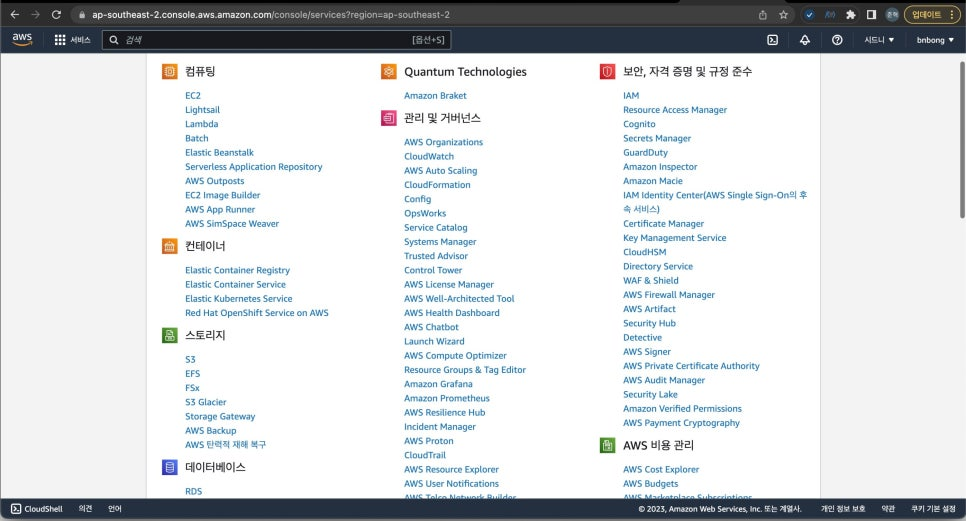
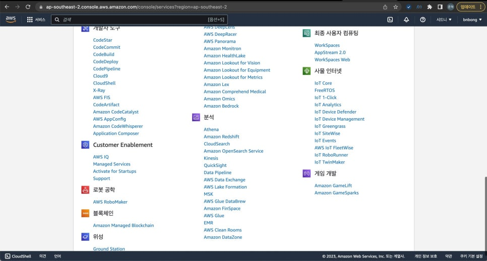
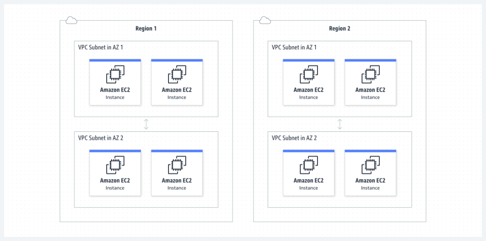
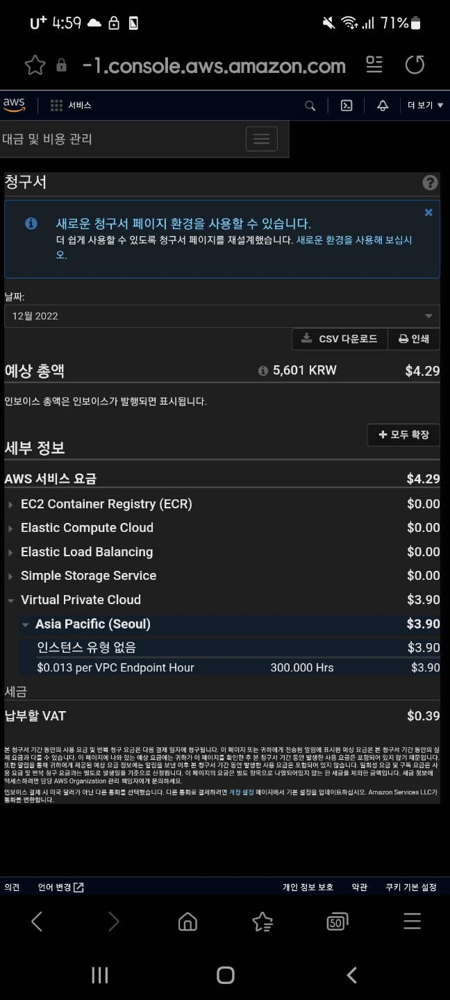
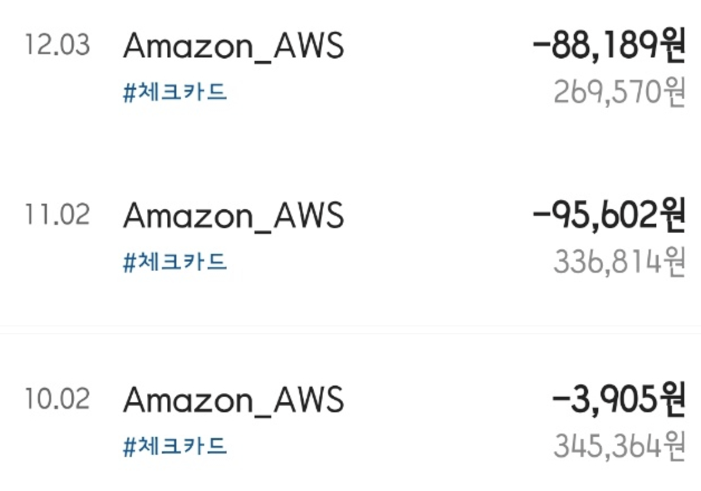
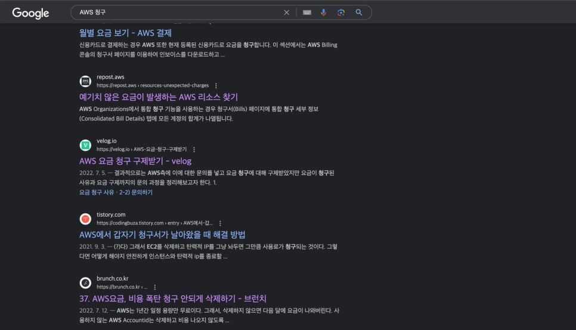
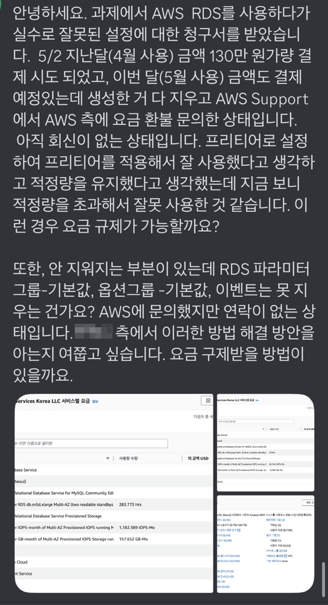
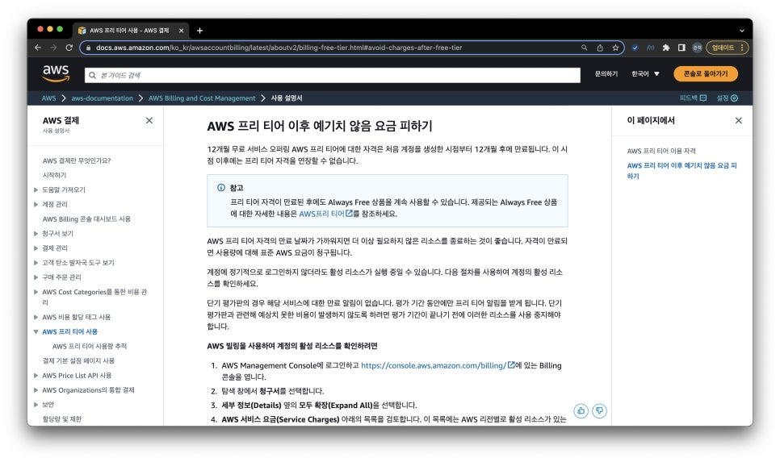

??? note "Series : 무료로 클라우드 개발환경을 구성하기 위한 몸부림"

    [0. 무료로 클라우드 개발환경을 구성하기 위한 몸부림 (1편)](https://bnbong.github.io/blog/2023/06/12/cloud-%EB%AC%B4%EB%A3%8C%EB%A1%9C-%ED%81%B4%EB%9D%BC%EC%9A%B0%EB%93%9C-%EA%B0%9C%EB%B0%9C%ED%99%98%EA%B2%BD%EC%9D%84-%EA%B5%AC%EC%84%B1%ED%95%98%EA%B8%B0-%EC%9C%84%ED%95%9C-%EB%AA%B8%EB%B6%80%EB%A6%BC-1%ED%8E%B8/)

    [1. 무료로 클라우드 개발환경을 구성하기 위한 몸부림 (2편)](https://bnbong.github.io/blog/2023/08/14/cloud-%EB%AC%B4%EB%A3%8C%EB%A1%9C-%ED%81%B4%EB%9D%BC%EC%9A%B0%EB%93%9C-%EA%B0%9C%EB%B0%9C%ED%99%98%EA%B2%BD%EC%9D%84-%EA%B5%AC%EC%84%B1%ED%95%98%EA%B8%B0-%EC%9C%84%ED%95%9C-%EB%AA%B8%EB%B6%80%EB%A6%BC-2%ED%8E%B8/)

나는 어쩔 수 없는 계기로 클라우드라는 것에 손을 대버렸다.

때는 바야흐로 내가 공군 현역병이던 시절, 부대 생활관에는 사이버 지식 정보방(통칭, 사지방)에는 인터넷 컴퓨터를 사용할 수 있었다.

Windows가 깔려있는 컴퓨터도 있었지만 요즘 흔히 볼 수 없는 하모니카OS라는 것이 깔려 있는 컴퓨터가 있었다.

Windows 환경이든 하모니카 환경이든 전산병들이 모여있는 부대이다 보니 어떤 컴퓨터를 키더라도 Visual Studio Code 등의 로컬 개발 환경이 마련이 되어있었다.

그러나, 컴퓨터를 로그아웃이 하는 순간 작업했던 모든 내용이 다 날아가버렸고 사지방 계정마다 클라우드에 저장 공간을 마련해 주긴 했지만 대용량의 작업 폴더를 백업하기에는 턱없이 부족한 용량이었다.

그래서 사지방에서 작업하거나 공부한 내용들과 작업 환경을 그대로 보존할 수 있는 방법이 없을까? 고민하다가 생각난 것이 클라우드 인스턴스였다.

특정 클라우드 서비스에 인스턴스를 생성하고 거기에다가 내 작업 환경을 구축해 놓으면 SSH 접속이나 브라우저를 통해 언제든지, 휴대폰이나 사지방 컴퓨터 등 어떤 머신에서든지 접속을 할 수 있는 환경을 만들면 딱이겠다! 생각이 들어서 바로 클라우드에 대해서 알아보게 되었다.

그런 생각을 하고 나서부터 약 2년정도가 지난 지금도 아직은 클라우드의 '클'자도 제대로 모르는 클라우드 잼민이라고 생각하지만 그동안 겪었던, 지금도 하고 있는 내 삽질과 경험, 클라우드 서비스에 대한 내 느낌들에 대해서 공유해보고자 한다.

<!-- more -->

## AWS에 크게 데다.


AWS(Amazon Web Services)는 클라우드 개발이라는 것을 단 한번이라도 접해본 사람들은 모두 알고 있는 서비스이다.

클라우드 시장에서는 독보적인 점유율을 보유하고 있는 서비스이다.

22년 12월 기사에 따르면 AWS의 클라우드 시장의 점유율은 대략 70% 내외에 육박한다고 한다.
(정보 출처: <https://stock.mk.co.kr/news/view/5183>)

이렇게나 점유율을 독차지할 수 있는 이유는 AWS가 제공하는 정말 다양한 클라우드 인스턴스 덕분일 것이다.

대부분의 이름 있는 기업들은 모두 AWS를 사용하고 있다고 봐도 무방하다. 각 기업들이 구성해놓은 서비스들을 모두 커버할 수 있는 제품과 솔루션의 종류가 정말 방대하기 때문에 많은 기업들이 채택한다.

한마디로 이런 것도 제공해주나? 싶은 것들도 있다고 보면 된다.

이처럼 국내 기업은 물론 MS같은 세계적인 기업들도 AWS가 독차지 하고 있는 클라우드 시장에서 고객층을 확보하기 쉽지 않은 현실이다.

그래서 나도 "사람들이 많이 쓰는 데에는 이유가 있겠지?" 하면서 AWS 프리티어 계정을 파서 AWS를 사용해보기로 했었다.





그런데 앞서 언급하기도 했지만 클라우드 제품들이 많아도 너무 많은 것이었다. 스크롤바를 보면 알겠지만 한페이지에 적어도 수십개의 제품들이 존재한다.

단순히 개발 공부로 쓸 서버 인스턴스 하나만 파서 쓰고 싶은데 여기서 내가 무엇을 선택해야하는지, 그리고 프리티어 수준에서는 어느정도까지의 인스턴스가 무료로 제공되는지 아는 것이 전무했다.

시간의 여유가 생긴 지금은 커뮤니티나 공식 문서등을 찾아보면서 천천히 공부를 했겠지만 이때 당시만 해도 나는 군부대에 있었기 때문에 이것저것 공부하고 뭐 찾아보고 할 수 있는 여가 시간이 그리 많지 않았다.

때문에 나는 군대 자기개발비용으로 AWS에 관련된 책을 하나 구매해서 그 책 가지고 AWS로 클라우드 컴퓨팅 서버를 구성하는 방법을 따라서 공부해보기로 했다. ***그리고 이 선택이 내 뼈아픈 금액 지출을 야기하게 된다.....***

### 1. 사건의 발단


자기개발 비용으로 구매했던 AWS 인스턴스를 다뤘던 모 책에서는 클라우드 서버를 구성하는 방법을 소개하였다.

해당 책은 22년 당시 나름 최신의 AWS 스택들을 사용해서 클라우드 환경을 제대로 구성하는 방법을 소개했다.

클라우드 및 인프라 지식이 그때 당시보다 조금 더 많이 있는 지금은 단순히 클라우드 컴퓨터에 개발환경만 구성하고 싶었던 내 목적을 이루기엔 그렇게까지 복잡하고 본격적으로 클라우드 환경을 구성할 필요가 없다는 것을 알고 있었지만 쉬는 시간 1분 1초가 아까운 군인 시절의 나는 까라는대로 깔뿐, 다른 대안을 생각해보거나 따로 공부할 여유가 없었다.

때문에 책에서 하라는 대로 EC2 컴퓨팅 인스턴스를 팠고, VPC를 사용해서 라우팅, 게이트웨이를 구성하고 심지어 [Identity and Access Management(IAM)](https://us-east-1.console.aws.amazon.com/iam/home?oauthStart=1733053179839&region=us-east-1#/home)(보안 정책을 구성할 수 있는 제품이다)까지 구성하면서 책에서 하라는 대로 다 해본 것이었다.

책에서는 당연히 프리티어 계정 기준으로 설명을 했고, 프리티어에게 주어지는 자원 할당량에 맞춰서 클라우드 환경 구성을 설명했기에 책의 잘못은 없었다.

어느정도 구성 방법을 알게되고 나서 나는 부대 일이 갑자기 바빠져 개발 공부를 할 시간이 없어졌기 때문에 AWS 인스턴스 중에 과금이 발생할 수 있는 인스턴스를 모두 정리하기로 했다.

**__미쳐 발견하지 못한 단 하나의 인스턴스를 제외하고....__**

### 2. 아는 만큼 막을 수 있었지만 알지 못한자의 최후

1번 사진에 나와있는 내용은 VPC가 어떻게 외부와 하위 인스턴스들을 라우팅하는지 나타내는 개요이다.

앞서 내가 발견하지 못했던 인스턴스는 바로 이 'VPC'라는 친구이다.



**VPC(Amazon Virtual Private Cloud)** 는 쉽게 설명하자면 단순한 가상 네트워크 인스턴스이다. 네트워크 트래픽을 모니터링하는 기능도 있고 하위 인스턴스 라우팅은 물론 같은 리전에서 다른 VPC 인스턴스와 통신할 수도 있다. 보안 인스턴스를 추가해서 확장시키면 보안 정책도 같이 관리할 수 있는 인스턴스다.

군대 일이 바빠지면서 개발 공부를 잠시 접었을 때, IAM이나 EC2같은 하위 인스턴스들은 빠짐 없이 모두 제거 및 중단요청을 했지만 정작 그 큰 범주에 있는 VPC인스턴스를 종료하지 못했다. 아니, 정확히 말하면 종료한줄 알고 있었다.



상단의 사진은 개발 공부를 중단하고 2달 뒤에 계속해서 AWS 계정에 과금 청구가 찍히는 것을 보고 과금 요소를 모니터링하기 위해 캡처를 해두었던 사진 중 하나이다.

포스팅을 작성하면서 알게된 사실인데 별 큰 트래픽을 발생시키는 서비스도 만들지 않았던 주제에 로드밸런서까지 구성했구나..

---

#### 20241201 추가

사진에서 유일하게 과금이 나가고 있는 VPC endpoint라는 서비스가 무엇인지 외부 참고 자료를 찾아보았다.

```preview
https://aws-hyoh.tistory.com/73
```

VPC는 일종의 큰 범주의 서브넷 네트워크를 내 계정이 소유하게 배치하는 것이다. 외부에서 내 VPC 내부에 있는 인스턴스와 통신을 하기 위해선 public ip를 할당받은 인스턴스가 있어야 하는데, VPC endpoint는 public ip를 할당할 필요 없이 AWS사가 보유하고 운영하고 있는 백본 네트워크로 트래픽을 흘려서 통신할 수 있게 해준다.

즉, 딱봐도 public ip를 할당해서 사용하는 것보다 더 비싼 서비스를 사용하는 것이다. 아무것도 모르던 이 시절의 나는 그냥 책에서 advance instance placement 같은 것을 따라하다가 무슨 서비스인지도 모르는 상태로 배치해두고 지우지 않은 채 넘어갔던 것이다.

내 기억 상으론 위 사진은 무언가가 잘못되었다는 것을 깨닫고 부랴부랴 급한 불을 끄고 다음 달에 과금이 또 발생하는 서비스는 없는지 확인하기 위해 캡쳐했던 사진이었을 것이다.

으휴 바보

---

상단의 사진에서는 고작 3.9달러정도밖에 찍히지 않았지만 이건 내가 쓰지도 않는 AWS 인스턴스에 17만원 상당의 금액을 뜯기고 나서 급히 VPC에 과금요소가 있다는 것을 발견하고 1월 초에 막 찍었던 모습이다.



10월달이 처음으로 AWS 프리티어 한도를 모두 소모하고 과금 청구가 된 첫 달이다.

당연히 10월 첫달에는 "그동안 내가 쓴게 있으니까ㅎ" 라고 생각해서 넘어갔지만(VPC를 제외한 과금이 청구될 수도 있는 인스턴스를 모두 중단한 채) 11월, 12월에 총 17만원 정도가 청구가 되면서

12월 연말에서야 "어? 나 뭐 쓴것도 없는데 왜이리 돈이 없지?"라고 생각해서 계좌 내역을 확인했고 AWS에서 저렇게 뜯긴 것을 확인하게 되었다.

그제서야 VPC가 꺼지지 않았다는 것을 알게된 것이었다.... 웃긴점은 VPC 인스턴스는 내가 개발 공부를 중단하고 나서 단 한번도 접속하지도 않았고 외부에서 접속 시도 한 흔적들도 하나도 없었는데도 그저 인스턴스가 존재한다는 이유로만 과금이 청구가 된다. 다른 인스턴스도 비슷한 경우가 많다. AWS로 클라우드를 처음 접해보는 사람들이 많이 사용하는 EC2인스턴스도 단순히 인스턴스 '종료'만 하면 안된다. 인스턴스를 삭제해야 요금 청구가 없다.

종료만 한 채로 인스턴스를 그대로 두고 있으면 그 부분에서 요금 청구가 발생할 수 있기 때문에 ***__내가 앞으로 해당 인스턴스를 사용하지 않을 거라면 반드시 삭제하기를 강력히 권고한다!!!!!__***

그걸 모르고 있었던 나는 나도 모르게 내 지갑에서 내 소중한 돈이 뜯기고 있었다.

### 3. 결론



AWS 사용자들 중에 나처럼 미쳐 삭제하거나 종료하지 못한 인스턴스 때문에 요금이 청구되어 과금 폭탄을 맞는 사람이 꽤나 존재한다. 당장 구글에 'AWS 청구'라고만 작성해도 검색되는 두번째 게시물부터 과금 폭탄을 맞지 않게 하는 방법을 소개하니 말 다했다.



위는 내 사례는 아니고 친구가 속해 있는 스터디 그룹원분의 케이스이다. 내 경우에는 십만원대로 끝났지만 저렇게 억울하게 청구되는 돈의 단위가 백만원, 심하면 천만원 단위까지 올라가버리기도 한다. 기업이라면 모르겠지만 개인이 부담하기에는 굉장히 큰 돈이다.

이런 현상은 AWS에서 내가 직접 인스턴스 사용량을 모니터링하고 사용 한도를 넘은 인스턴스를 따로 관리하지 않는 이상 정말 '무한하게' 과금이 청구될 수 있기에 생기는 문제이다. 내 경우에도 동일했고 저기 검색되어 있는 게시물들을 들어가보면 학습 목적으로 AWS 서비스를 사용하는 사용자들이 예기치 못한 부분에서 과금 폭탄을 맞았을 때 AWS에 구제 요청을 하는 방법을 소개하고 있다.

나도 해당 포스팅들을 따라서 '나는 학생이고 학습 목적으로 사용하던 인스턴스 중 사용하지도 않고 있던 VPC 인스턴스에서 예기치 못하게 요금 청구가 발생했다. 사용 내역을 보면 알겠지만 10월달 이후로 단 하나의 인스턴스를 접속한 시도도 없고 새로운 활동 또한 하지 않았다. VPC에서 요금 청구가 될 줄 몰랐다.' 식으로 억울하다(?)고 호소하면서 문의를 넣었다.

물론 내가 생각해도 이친구들이 쉽게 요금 감면을 해줄거라고 생각하진 않았다. 지금은 계정 자체를 폐쇄해서 당시 문의를 넣었던 내용들 모두 날아갔지만 답변 또한 '우리가 제공해 줄 수 있는 서비스는 ~ 뿐이다.' 식으로 답변이 올 뿐, 청구 자체를 없던 일로 해준다는 뉘앙스의 답변을 받지 못했다.

정말 울며 겨자먹기로 "그래... 수강료 지불했다고 생각하자" 라며 현실도피를 했다. 아까운 내돈......



공식 페이지에서는 예기치 못한 과금 요소를 막기위해 인스턴스 '삭제' 가 아니라 인스턴스 '종료' 로 소개하고 있다. 정말로 예기치 못한 과금을 막으려면 단어를 공식 홈페이지 단에서 '종료'라는 단어 보다는 '삭제'라고 명시해 놓는 것이 맞다고 생각하는 편이다.

결국에는 이런 포인트들에 정나미가 떨어져서 1월에는 계정을 아예 폐쇄해버렸다. 나중에 다시 AWS를 사용해서 인프라를 구축해야할 때가 오겠지만 당분간은 사용하고 싶지 않다. 반드시 그런 순간이 오겠지만 정말로 필요해질 때 다시 공부해볼 생각이다.

---

## AWS에 대한 클라우드 입문자 시각에서의 평가

### 장점

1. 정말 많은 종류의 인스턴스가 있다. 때문에 인프라 구축에 익숙하다면 무궁무진하게 자신의 재량껏 원하는 환경을 구성할 수 있다.
2. 가장 높은 점유율을 보유하고 있는 서비스 답게 커뮤니티가 활발하다. 개인 또는 기업 단위로도 서비스 이용에 어려움을 겪었을 때 도움을 받을 수 있다.
3. 문의에 대한 답변이 빠른 편이다. Billing 관련 뿐만 아니라 사소한 질문들도 답변을 곧 잘 해준다.

### 단점

1. 클라우드 서비스에 대해서 처음 접해보는 사람이 사용하기에는 **인터페이스가 불친절한 편이다.** 초보자 가이드 같이 학습용 계정을 처음 생성하여 클라우드 인스턴스를 만드는 가이드에 대한 UX가 부실하다. 인스턴스를 관리하는 페이지 또한 UI/UX가 깔끔한 편이라고 볼 수 없다.
  > 다만, 이 관점은 `초보자`관점에서 바라봤을 때 불편하다는 것이지, 이미 AWS-based dashboard에 절여진 사람들이라면 AWS가 엄청 다양한 옵션을 제공하고 직관적으로 액션을 수행할 수 있도록 해준다는 것이 감사할 것이다.
1. 정말 많은 종류의 인스턴스 때문에 **학습에 많은 시간이 소요된다.** 장점으로 소개되었던 많은 종류의 인스턴스는 단점으로도 작용한다. 앞서 설명했듯, 처음 클라우드를 접해보는 사람은 도대체 무엇부터 다뤄야하는지 감이 잡히지 않는다.
2. **예기치 못한 과금 요소를 막기 위해 지속적으로 인스턴스에 대한 모니터링이 필요하다.** 그동안 설명했듯이, 예상하지 못한 부분에서 과금이 발생할 수 있기 때문에 내가 지속적으로 Billing 페이지에서 요금이 발생하는 인스턴스를 계속해서 모니터링 해야한다. 이건 다른 서비스도 비슷한 경우가 많겠지만 AWS는 특히 각 인스턴스 별로 요금 청구에 대한 설명이 부족하다고 느꼈다. 또한 내가 생성하고 사용하고 있는 인스턴스를 한번에 관리할 수 있는 페이지 또한 부실한 편이다. 만들어놓은 모든 환경이나 인스턴스를 관리할 수 있는 페이지가 조금이라도 더 깔끔했다면 나와 다른 사람들의 사례처럼 원하지 않는 과금 청구를 막을 수 있었지 않나, 싶다.
   > 사실 가장 단점으로 생각이 드는건 **AWS는 비싸다**는 것이다. 뭐 그만큼 사용하고자 하는 워크로드가 명확한 사용자의 경우에는 AWS를 제외하고는 제대로 클라우드 인프라를 구축할 수 있는 CSP가 없는게 현실이라 그러려니할 수 있다..

결론만 이야기 하자면은 **__Amazon Web Service는 클라우드를 처음 접해보는 사람이 사용하기에는 그다지 적합하지 않다고 생각한다.__**

내가 네트워크와 인프라에 대해서 조금이라도 공부를 해봤고, 다른 사람들이 작성해놓은 인스턴스 사용 가이드를 하나하나 따라해보면서 지식을 넓힐 때에는 AWS를 대체할만한 서비스가 없지만 아예 클라우드를 처음 접해보는 사람이 사용하기에는 그다지 추천을 하고 싶지 않다.

또한 나는 UX도 중요하게 생각하는 사람이기에 밋밋하고 불친절한 AWS의 UX는 초보자에게 독으로 작용할 것이다.

하지만 이 조차도 다른 클라우드 서비스들에 비하면 나름 선녀인 것이 아이러니이다ㅋㅋ 나도 돈만 많이 있으면 다시 돌아가고 싶은 곳이 AWS이다.

AWS에 호되게 당하고 나서 나는 다른 클라우드 서비스를 찾게 되는데.... *(2편에서 계속)*
