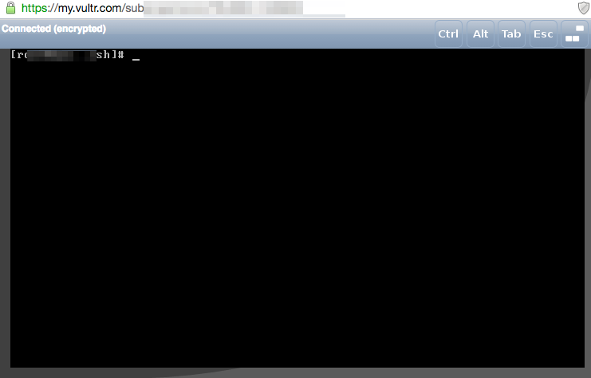

??? note "Series : 무료로 클라우드 개발환경을 구성하기 위한 몸부림"

    [0. 무료로 클라우드 개발환경을 구성하기 위한 몸부림 (1편)](https://bnbong.github.io/blog/2023/06/12/%EB%AC%B4%EB%A3%8C%EB%A1%9C-%ED%81%B4%EB%9D%BC%EC%9A%B0%EB%93%9C-%EA%B0%9C%EB%B0%9C%ED%99%98%EA%B2%BD%EC%9D%84-%EA%B5%AC%EC%84%B1%ED%95%98%EA%B8%B0-%EC%9C%84%ED%95%9C-%EB%AA%B8%EB%B6%80%EB%A6%BC-1%ED%8E%B8/)

    [1. 무료로 클라우드 개발환경을 구성하기 위한 몸부림 (2편)](https://bnbong.github.io/blog/2023/08/14/cloud-%EB%AC%B4%EB%A3%8C%EB%A1%9C-%ED%81%B4%EB%9D%BC%EC%9A%B0%EB%93%9C-%EA%B0%9C%EB%B0%9C%ED%99%98%EA%B2%BD%EC%9D%84-%EA%B5%AC%EC%84%B1%ED%95%98%EA%B8%B0-%EC%9C%84%ED%95%9C-%EB%AA%B8%EB%B6%80%EB%A6%BC-2%ED%8E%B8/)

저번 글 이후로 오랜만에 다시 작성하는 클라우드 관련 포스팅ㅎ

이전 글 링크는 다음과 같다.

[무료로 클라우드 개발환경을 구성하기 위한 몸부림 (1편)](https://bnbong.github.io/blog/2023/06/12/cloud-%EB%AC%B4%EB%A3%8C%EB%A1%9C-%ED%81%B4%EB%9D%BC%EC%9A%B0%EB%93%9C-%EA%B0%9C%EB%B0%9C%ED%99%98%EA%B2%BD%EC%9D%84-%EA%B5%AC%EC%84%B1%ED%95%98%EA%B8%B0-%EC%9C%84%ED%95%9C-%EB%AA%B8%EB%B6%80%EB%A6%BC-1%ED%8E%B8/)

---

## 클라우드 잼민이에게 가뭄의 단비같이 찾아온 Vultr


Vultr는 클라우드 컴퓨팅, 단독 서버 등의 가상 클라우드 서버를 주력으로 서비스하고 있는 서비스이다. 한국어는 '벌쳐'로 대부분 읽는다.


/// caption
Somethin' on your mind?
///

벌쳐하면 자연스럽게 생각나는 그분..

벌쳐는 가격 대비 성능이 상당히 뛰어난 호스팅 업체 중 하나이며, 클라우드에 대해 잘 모르는 사람도 굉장히 친숙하게 사용할 수 있다.

```preview
https://www.vultr.com/
```

우선 홈페이지를 들어가서 회원가입을 하면 바로 대쉬보드 페이지로 넘어가는데,


정말정말 직관적인 UI가 우릴 반겨준다.

<!-- more -->

좌측 shortcut과 상단 탭에서 바로바로 관련 페이지로 이동할 수 있다.


Billing 페이지에서 현재 계정과 연결된 카드 및 계좌를 확인할 수 있고, Support 탭에서 내가 어려움을 겪거나 서비스와 관련하여 궁금한 점에 대한 도움 및 답변을 받을 수 있는 페이지가 존재한다.

군생활을 하면서부터 1년 넘게 Vultr 서비스를 사용하면서 이 페이지에서 많은 도움을 받았었다.


공식 문서 및 블로그 또한 나름 잘 정리되어 있는 편이었다.

</br>

일단 전반적으로 Vultr이라는 클라우드 서비스의 장점은 =='직관적'== 이라는 것이다.

클라우드 서비스를 처음 사용해보거나 이전 서비스의 어려운 UX 혹은 부실한 레퍼런스 및 문서등으로 인해 고통을 받았던 사람들의 경우에는 Vultr 서비스는 훌륭한 대안이 될 수 있다.

포스팅을 작성하고 있는 지금은 Vultr 인스턴스들을 모두 빼버리고 다시 AWS로 돌아왔지만 빠르게 간단한 인스턴스를 배포하거나 타 클라우드 서비스의 UX에 어려움이 있어 아키텍처를 손수 구축하기에는 힘들다 싶으면은 Vultr 서비스로 입문을 해보는 것도 나쁘지 않다고 생각한다.

</br>

단점이라고 생각하는 것이 있다면 가격이다. 클라우드 시장에서 가장 점유율이 높은 서비스인 AWS, Azure의 경우에는 두 서비스 모두 1년 정도 사용할 수 있는 무료티어를 제공하고 있으나, Vultr의 경우에는 내가 해당 서비스를 사용하던 2021, 2022년에는 무료 티어가 없었는데

2023년 3월 7일에 Vultr가 전 세계 개발자들에게 더 나은 경제적 클라우드 컴퓨팅 모델을 제공하고, 클라우드 비용을 줄이기 위한 목적으로 무료 플랜을 발표했다. 현재 무료 플랜은 일부 신청자에 한 해 얼리 액세스로 제공되고 있다. 얼리 액세스 신청은 누구든지 할 수 있으나, 가중치 점수(Weighted Score)라는 것을 종합하여 무작위 선정된다.

그러나 앞서 언급했듯이 모든 사용자가 무료 플랜을 사용할 수 있는 것은 아니고 무작위 선정이라는 점, 인스턴스 OS 선택시 Ubuntu같은 대중적인 리눅스 OS를 선택하면 무료 플랜이 해제되고 데이터 센터 또한 미국, 독일 두 센터 밖에 없다. 또한 Vultr 무료 플랜의 인스턴스 사양은 다음과 같은데,

!!! note ""
    - 1v CPU
    - 512MB RAM
    - 10GB SSD
    - IPv4 주소 제공


프로젝트 배포용으로는 그다지 적합한 사양이 아니다. 테스트 용으로 굴리기에는 손색이 없지만 웹앱 서버 배포용으로 사용하기에는 램 용량이 너무 아쉽다. 그래도 대역폭은 2TB로 굉장히 넉넉한 것이 그나마 위안인 셈.

따라서 결국에는 울며 겨자먹기로 유로플랜을 선택할 수 밖에 없는데


배포를 생각해서 2기가 램 딸려 있고 저장 용량, 대역폭도 적당히 배포 환경에서 굴릴만한 사양으로 선택하면 월에 14달러 정도 청구되는 서비스를 사용하게 될 수 밖에 없다.

물론 그렇게 비싼 가격이 아니라고 느껴질 수 있지만 다른 서비스에서는 비슷하거나 이보다 살짝 떨어지는 사양의 인스턴스를 무료로 사용할 수 있는 반면, Vultr에서는 유로 플랜을 선택해야 사용할 수 있다는 점이 아쉬울 따름이다.

</br>

그럼에도 나는 1년이 넘는 시간 동안 Vultr 서비스를 굉장히 만족하면서 사용했다.


사용 용도로는 인스턴스에 Visual Studio Code-Server를 올려 내 Workspace를 원격으로 구축하기 위함이었다.

```preview
https://github.com/coder/code-server
```

Code-Server는 웹 페이지에서 Visual Studio Code를 실행할 수 있는 서비스이다.

코드 서버를 사용했던 이유는 군대라는 환경의 특성 때문이었다.

군대 사이버지식정보방은 내가 사용하던 컴퓨터에서 로그아웃을 해버리면 내가 작업했던 모든 환경이 날아갔기 때문에 내 작업환경을 보존시킬 솔루션이 필요했다.

그 대안으로 생각한 것이 Code-Server이였고, 언제 어디서든 접속 가능한 클라우드 환경에서 단순히 웹 페이지 URL로 접속만 한다면 모바일이든, PC환경이든 접속이 가능한 당시 내 상황에 정말 적절한 솔루션이었다.


Code-Server가 올라가 있는 인스턴스에 내가 기존에 작업했던 프로젝트나 1일 1커밋을 빡세게 수행하기 위해 알고리즘 문제를 풀기 위한 Workspace를 구축해놓았고 덕분에 군대에서도 코딩 공부를 할 수 있었다.

물론 편하게 웹 페이지 접속을 하기 위해 DNS 설정도 추가로 해주었다.


그러나 3개월마다 한 번 씩 일어나는 알 수 없는 심각한 문제로 인해 1년 넘게 잘 사용하던 Vultr 서비스에 발을 때게 되었는데,


### 1. 이상현상?

현재는 해당 현상을 재현할 방법이 없으나, 겪었던 이상현상에 대해서 서술해보자면

우선 짧게는 3개월, 길게는 6개월에 한번 씩 분명히 하루 전까지만 해도 잘만 들어가졌던 인스턴스가 갑자기 외부 접속이 안되는 것이었다.



ssh든, 내 코드서버 인스턴스로 향하는 그 어떠한 외부 접속이 불가한 상황이었다.

그래서 vultr 서비스에서 제공해주는 내부 console을 열어서 네트워크 인터페이스들을 확인해보았다.


/// caption
도커 네트워크를 제외한 외부 네트워크 연결을 구축하는 핵심 인터페이스가 다 날아가있는 상황
///

그때 당시 머리를 꽁꽁싸매며 고민했던 시절에 해당 현상을 캡쳐한 사진이 위 사진밖에 없다.

외부에서 내부 인스턴스로 접속하는 것과 ping 명령어로 내부에서 외부 사이트에 연결을 시도하는 것도 불가능했었다.

그래서 'ip route show', 'ifconfig' 명령어 등으로 네트워크 상태를 확인해보니

en0번 같이 외부 연결에 핵심 연결을 구축하는 이더넷 포트들의 정보가 싸그리 날아가 있었다.

프로젝트용으로 구축했던 도커 네트워크(172.17.0.X로 되어 있는)만 남아 있고 다른 네트워크 인터페이스들이 다 날아갔다.

연결을 구축할 수 있는 인터페이스 자체가 날아가다 보니 문제를 해결할 수 있는 새로운 외부 패키지를 받을 수 있는 수단 조차 사용할 수 없는 상황이었다.

</br>

도저히 방법이 없어 백업 이미지로 인스턴스 복구를 했던 것이 1년동안 vultr 서비스를 사용하면서 여러번 있었다.

vultr가 백업용 인스턴스 이미지를 1주일 정도의 주기로 자동 생성해주었으나 그 몇일 사이에 있던 작업 내용이 모조리 날아가는 것은 뼈아픈 손실이었다.

포스팅을 작성하는 현재도 이 현상이 어떤 이유로 일어나고, 무슨 현상인지 그 이름조차 알지 못한다. 혹시나 이 현상에 대해 감이 오는 분이 계시다면 공유좀 부탁드립니다ㅠㅠ


### 2. 에이 짜증나

전역을 하고 나서도 5월에 잠깐 Vultr 서비스를 사용하던 때가 있었는데 그 때도 위 현상이 생겨서

도저히 짜증나서 Vultr 서비스를 사용하지 않기로 한다.

위 현상에 대해서는 Vultr 공식문서에도 찾을 수 없었다.

FAQ를 통해 Vultr 팀과 상담을 할 방안도 생각을 했었지만 그럴 바에야 이 기회에 다른 클라우드 서비스를 사용해보면 어떨까? 하고 생각을 하게 되었다.


### 3. 결론

서버 공부는 해야하는데 돈이 좀 덜 드는 다른 클라우드 서비스가 뭐가 있을까 찾아보던 와중,

차라리 우리 집에 안쓰는 머신을 사용해보는건 어떨까? 찾아보다가 발견한 것이 동생이 코딩 학원에서 사용하다가 이제는 안쓰게된 라즈베리파이3 머신을 발견하게 되는데...(3편에서 계속)

---

## Vultr에 대한 클라우드 입문자 시각에서의 평가

### 장점

1. ^^==기본적으로 배포 환경에 굴려야하는 인스턴스가 모두 구비되어 있다.==^^ AWS나 Azure같이 메이저한 클라우드서비스와 비교하면 수가 적긴 하지만 로드밸런서, 데이터베이스 서버, 컴퓨팅 머신, VPC 네트워크, 쿠버네티스 클러스터 등 기본적으로 있을만한 머신들은 다 존재한다.
2. ^^==편의성이 좋다==^^. 클라우드를 처음 접해보는 사람들도 쉽게 인스턴스를 생성해서 배포할 수 있게 할 수 있도록 UI/UX가 굉장히 직관적으로 제공된다. 클라우드 입문자의 경우에는 보통 공식 문서가 아니라 외부 레퍼런스를 따라해보면서 배포를 진행하겠지만 Vultr의 경우에는 공식 문서 및 블로그를 참고하면서 혼자서 만져봐도 문제 없이 배포를 진행할 수 있다. 이 점은 지금까지도 다른 서비스에서는 쉽게 찾을 수 없는 Vultr만의 강점이라고 생각한다.

### 단점

1. ^^==과금 요소가 다른 메이저 서비스에 비해 센편이다.==^^ AWS, Azure는 모든 사람이 무료 플랜을 접할 수 있지만 Vultr의 경우에는 그렇지 못하며 쓸만한 인스턴스를 사용하기 위해서라면 과금을 피할 수 없다. AWS는 프리티어 하나로 배포환경에서도 문제없이 사용 가능할만한 아키텍처를 구축할 수 있는 것에 비해 Vultr는 일정 수준의 과금을 해야 비슷한 아키텍처를 구축할 수 있다. 컴퓨팅 자원이 늘어날 수록 과금 부담 또한 크게 늘어난다.
2. 인스턴스에 알 수 없는 현상으로 인해 불편함이 있을 수 있다. 이 점은 앞서 언급 했듯이, 나만 겪었던 문제일 수도 있으나 인스턴스에 대한 불안정성이 존재한다. 보안 관련된 문제인지 아니면 Vultr의 정책에 내가 몰랐던 어떠한 점이 걸렸기에 인스턴스 사용에 문제가 생긴 것인지는 알 수 없으나, 컴퓨팅 자원에 대한 안정성 및 신뢰성에 의심이 든다.

</br>

결론을 이야기 하자면은 <b>Vultr는 클라우드를 처음 접해보는 사람이 사용하기에 적합한 서비스이며, 테스팅 목적으로 양질의 인스턴스를 구축해보고 싶다면 충분히 접해볼 가치가 있는 서비스이다. 다만, 본격적인 아키텍처 구축과 프로젝트 배포용으로 사용하기에는 비용적인 측면에서 부담이 큰 편이므로 다른 서비스를 고려해야 할 것이다.</b>

</br>

내게 처음으로 클라우드라는 것에 접할 수 있도록 해준 고마운 서비스이다. 나는 지금도 내 주변에서 클라우드를 입문하고 싶지만 복잡한 인터페이스때문에 고통을 받아 주저하는 사람들에게 Vultr 서비스를 추천해주고 있다.

포스팅 제목이 '무료'로 클라우드 개발환경을 구성하기 위한 몸부림이라 이미 과금이 필수인 Vultr 서비스는 에러가 아닐까 싶지만...ㅋㅋ
