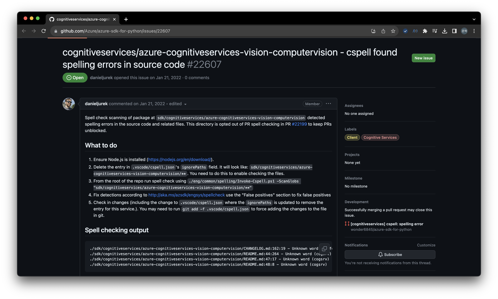
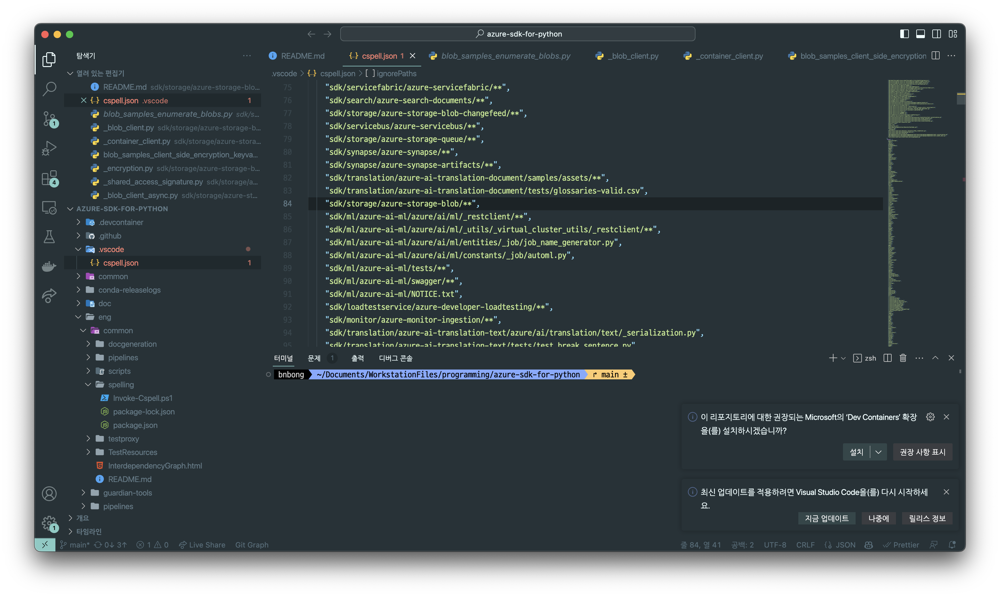
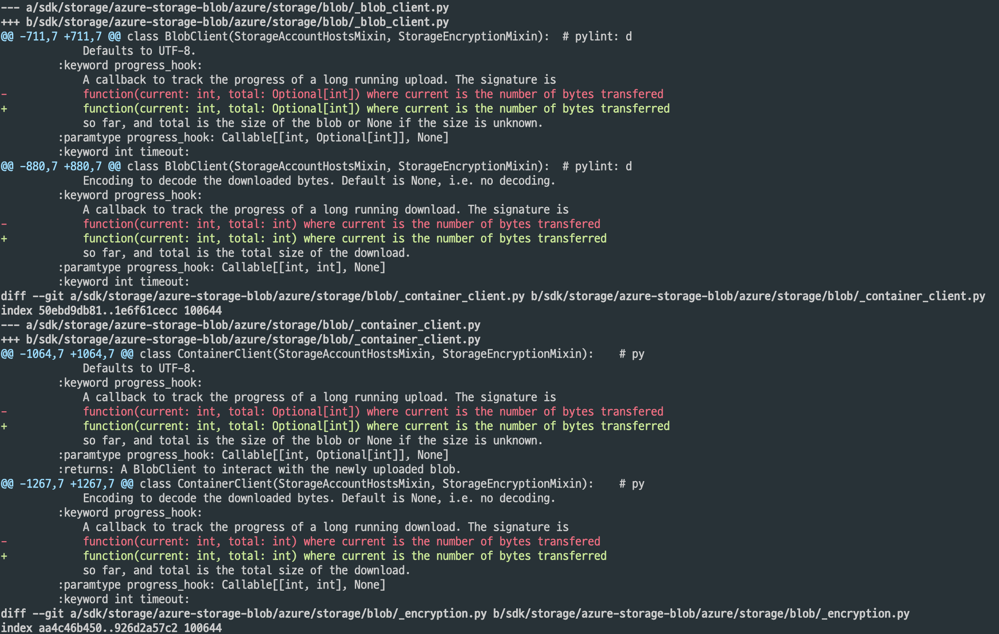
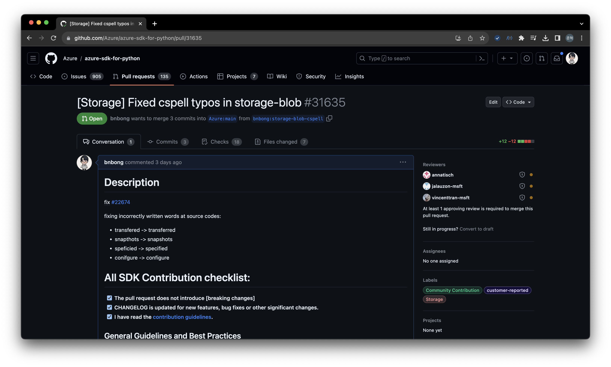

## 개요

친구와 채팅으로 대화를 할 때, 중요 문서를 작성을 할 때 등등 우리는 글을 쓰면서 가끔씩 내가 쓰는 단어가 제대로 된 맞춤법을 지킨건가? 싶을 때가 있다.

이때 가장 좋은 확인 방법은 인터넷에 검색을 해보거나 사전에 검색을 해보거나 아니면 문법잘알 누군가에게 물어보는 것이 적절하다.

그러나 이렇게 일일이 모르는 단어가 생길때마다 검색해보는 것은 여간 귀찮은 일이 아닐 수 없다.

그래서 요즘 타이핑 도구들(한컴의 한글, 구글 Word 등)에서는 자동으로 맞춤법을 교정해주는 기능이 탑재되어 있고 문서 도구들이 나날이 발전해나가면서 그 기능 또한 점점 좋아지고 있다.

프로그래밍 또한 수많은 타이핑이 들어가는 작업이다. 코딩을 할 때에도 변수 이름을 정하거나, 이 코드를 읽는 누군가가 내가 쓴 코드를 더 잘 이해할 수 있게 주석을 달아주는 등 기계가 아닌 사람이 읽을 수 있는 글을 쓰는 때가 많다. 프로젝트 규모가 커질수록 human-readable을 위한 글을 쓰는 시간과 그 규모가 덩달아 커진다.

그러나 코딩을 하는 사람들은 개발자이지 국립국어원이나 국제 언어 문법 관련 직종에 종사하는 사람들이 아니기 때문에 종종 문법 관련 실수를 저지르곤 한다.

그런데 그 많은 단어들의 오탈자를 하나하나 확인하는 것은 모래사장에 바늘찾기만큼 어려운 작업이다. 때문에 똑똑한 형님들이 다른 문서 작업 툴에 있는 문법 교정 도구처럼 코드에서도 문법 관련 오류를 찾아 report해주는 라이브러리를 만들었다.

바로 이번 포스팅에서 소개할 'CSpell' 이라는 라이브러리이다.

<!-- more -->

---

## Installation

!!! question "CSpell이란"
    Q. CSpell은 무엇 인가요?

    A. CSpell은 철자 검사 코드를 위한 명령줄 도구 및 라이브러리입니다.

CSpell 공식 홈페이지는 다음과 같다.

<https://cspell.org/>

앞서 언급 했듯이, CSpell은 라이브러리에 해당되는 도구이다.

공식 문서에서 언급하는 CSpell의 기능은 다음과 같다.

>1. 맞춤법 검사 코드 – 사전을 확인하기 전에 단어로 구문 분석하여 맞춤법 검사 코드를 입력할 수 있습니다.
>2. CamelCase, snake_case 및 복합어 명명 스타일을 지원합니다.
>3. 자체 저장 – Hunspell이나 aspell과 같은 OS 라이브러리에 의존하지 않습니다. 온라인 서비스에도 의존하지 않습니다.
>4. 빠른 속도 – 1000개의 코드 라인을 몇 초 안에 확인합니다.
>5. 프로그래밍 언어별 사전 – 다음을 위한 전용 지원: 자바스크립트, TypeScript, Python, PHP, C#, C++, LaTex, Go, HTML, CSS 등.
>6. 사용자 정의 가능 – 사용자 정의 사전 및 단어 목록을 지원합니다.
>7. 지속적인 통합 지원 – Travis-CI에 대한 설명으로 쉽게 추가할 수 있습니다.

다중 언어를 지원하는 라이브러리이기 때문에 프로젝트 제약이 거의 없는 편이다. 머신에 node가 깔려 있으면 CSpell을 설치할 수 있다.

다음 명령어로 Node 설치 확인 및 CSpell 라이브러리를 설치할 수 있다.

### 설치되어 있는 Node Version 확인

```bash
$ Node -v
```

### CSpell 설치

```bash
$ npm install -g cspell
```

만약 Node 설치가 되어 있지 않다면 (Node -v 명령어를 입력했을 때 Node 명령어를 찾을 수 없다는 등의 오류가 났다면) 머신에 Node를 설치해야한다.

다음 명령어로 Node를 설치할 수 있다.

```bash
# Windows 환경
#https://nodejs.org/ko/download 사이트에서 직접 윈도우 인스톨러를 받거나,
#Powershell 등에 Chocolatey 패키지 관리자가 설치되어 있다면:
$ choco install nodejs


# MacOS 환경 (homebrew)
$ brew update
$ brew install node

# MacOS & Linux 환경 (NVM)
$ curl -o- https://raw.githubusercontent.com/nvm-sh/nvm/v0.38.0/install.sh | bash
$ nvm install node


# Linux 환경 (Debian / Ubuntu 계열)
$ sudo apt-get update
$ sudo apt-get install nodejs npm

# Linux 환경 (CentOS / RHEL 계열)
$ sudo yum install nodejs npm

# Linux 환경 (Fedora 계열)
$ sudo dnf install nodejs npm


# 정상 설치 확인 방법
$ node -v 혹은 npm -v // 9.6.7 혹은 v20.3.1 같은 출력이 나오면 성공적으로 설치된 것이다.
```

CSpell 설치를 완료하면 다음 명령어를 통해 코드 구문 오류를 확인할 수 있다.

```bash
$ cspell "소스코드 경로"
# 또는
$ cspell lint "소스코드 경로"

# 전체 파일 문법 검사
$ cspell "**"
```

---

## Configuration

특정 프로젝트의 경우, spelling checking을 해야하는 파일이 있고 그렇지 않은 파일이 있을 수 있다.

그럴때마다 매번 특정 파일의 이름을 하나하나 쳐가면서 체크를 하면 굉장히 비효율적이고 또 팀 프로젝트나 누구나 기여를 할 수 있는 오픈소스 프로젝트의 경우에는 협업 능력이 매우 저하될 수 있다.

또는 문법 상 틀린 단어라도 팀 변수 네이밍 규칙에 따라 그대로 사용하는 문법도 있을 수도 있다.

그럴때 사용하는 것이 바로 CSpell Configuration이다.

우선 'cspell'이라는 제목의 파일을, 확장자는 하단 목록을 참고하여 생성한다.

다음은 CSpell 공식 문서에서 제공하는 CSpell이 읽을 수 있는 configuration 파일명 목록이다.
!!! note ""
    .cspell.json
    cspell.json
    .cSpell.json
    cSpell.json
    cspell.config.js
    cspell.config.cjs
    cspell.config.json
    cspell.config.yaml
    cspell.config.yml
    cspell.yaml
    cspell.yml
    package.json

위의 파일 명 중 하나를 선택하여 프로젝트 내부에 만들고 해당 파일 내부에 다음과 같은 형식으로 configuration을 설정할 수 있다.

```json
// in CSpell configuration file, ex) cspell.json
// CSpell Settings
{
    // Version of the setting file.  Always 0.2
    "version": "0.2",
    // language - current active spelling language
    "language": "en",
    // words - list of words to be always considered correct
    "words": [
        "mkdirp",
        "tsmerge",
        "githubusercontent",
        "streetsidesoftware",
        "vsmarketplacebadge",
        "visualstudio"
    ],
    // flagWords - list of words to be always considered incorrect
    // This is useful for offensive words and common spelling errors.
    // For example "hte" should be "the"
    "flagWords": [
        "hte"
    ],
    // ignorePaths - this folder or files will be ignored when checking typos
    "ignorePaths": ["node_modules/**"]
}
```

공식 문서에서 더 자세한 Configuration 설정 방법을 확인할 수 있다.

<https://cspell.org/configuration/>

---

## Example Of Use

나는 CSpell이라는 라이브러리를 오픈소스 컨트리뷰션 아카데미에서 처음 접했고,
아카데미 멘토, 멘티분들과 차근차근 가이드라인을 따라 사용해보면서 Azure SDK for python 공식 Repository에 실제로 기여를 해보았다.



Azure SDK for python Repository의 경우, 굉장히 거대한 규모의 오픈소스 프로젝트이다.

프로젝트를 로컬 작업 환경에 받아오는 것부터 상당히 오래걸리고 터미널도 다른 프로젝트에 비해 켜지는 시간이 긴편이다.

때문에 sdk 내부 기능별로 정말 다양한 분량의 코드와 주석이 적혀있다. 그러나 세계적인 기업인 Microsoft의 개발자 분들이더라도 결국에는 사람인지라 타이핑을 하다가 오타를 하는 등의 실수가 있기 마련이다.

이를 Microsoft에서도 인지를 하고 있는지 해당 Repository에 CSpell을 사용해서 오탈자 해결을 위한 이슈를 상단의 사진처럼 각 SDK 기능 별로 여러개 열어놓았다.

Open되어 있는 CSpell 관련 Issue에는 중간에 What to do 탭을 통해 어떻게 CSpell checking을 위한 설정을 하고 typo checking을 하는지 소개하고 있다.

내가 원하는 SDK 기능의 CSpell 관련 issue를 직접 찾아가서 저 이슈 탭을 보면서 작업을 해도 되지만 Azure SDK Korean 공식 github.io 문서에 CSpell 관련 Contribution을 하는 방법이 정의되어 있다.

<https://azure.github.io/azure-sdk-korean/contribution_cspell>

Issue의 What to do 탭을 기계번역한지라 읽을 때 어색함이 느껴질 수 있지만 큰 어려움 없이 가이드라인을 따라할 수 있다.

윈도우 사용자라면 PowerShell이 기본으로 설치되어 있을 것이기 때문에 바로 가이드라인을 따라해도 좋지만,

자신이 MacOS사용자라면 머신에 따로 <b>PowerShell</b>을 깔아주어야한다.

Azure SDK for python프로젝트의 CSpell checking 스크립트는 PowerShell script로 짜여 있기 때문이다.

<https://learn.microsoft.com/en-us/powershell/scripting/install/installing-powershell-on-macos?view=powershell-7.2>

상단의 가이드라인대로 MacOS에 PowerShell을 설치했다면

```bash
$ pwsh
```

터미널에 상단의 명령어를 입력하여 PowerShell을 열 수 있다.

</br>

기본 설정을 마친 나는 PowerShell을 열고 Azure SDK Korean github.io 가이드라인을 쭉 따라하면서 내가 원하는 SDK 소스코드에 typo checking을 수행했다.

내가 체크했던 SDK 기능은 Azure에서 제공하는 ==Azure Storage blob== 기능의 소스코드였다.

!!! question "Azure Storage Blob(Blob Storage)는 뭔가요?"
    Q. Azure Storage Blob(Blob Storage)는 뭔가요?

    A. Azure Blob Storage는 클라우드를 위한 Microsoft의 개체 스토리지 솔루션입니다. Blob Storage는 대량의 비정형 데이터를 저장하는 데 최적화되어 있습니다. 비정형 데이터는 텍스트 또는 이진 데이터와 같은 특정 데이터 모델이나 정의를 따르지 않는 데이터입니다.
    출처: [Microsoft Learn 공식 문서](https://learn.microsoft.com/ko-kr/azure/storage/blobs/storage-blobs-overview)

Azure Storage Blob은 요약하자면 AWS의 S3의 Azure 버전이라고 생각하면 쉽다. 러닝 서버에 저장하기에는 부담이 되는 크기를 가진 미디어파일, 바이너리 파일 등을 보관하기 위한 스토리지 서버이다.

<https://azure.microsoft.com/ko-kr/products/storage/blobs>



상단 사진의 vscode/cspell.json 파일의 84번째 줄 =="sdk/storage/azure-storage-blob/**"== 이 부분을 지우고 typo 체크를 진행했다.

typo checking 결과를 이 포스팅에도 적어놓고 싶었으나 길이가 너무너무 길어서 패스...

typo checking 결과는 다음 형식으로 출력된다.

```bash
...
./sdk/storage/azure-storage-blob/samples/blob_samples_hello_world.py:173:70 - Unknown word (myappendcontainersync)
./sdk/storage/azure-storage-blob/samples/blob_samples_hello_world.py:180:61 - Unknown word (myappendblob)
./sdk/storage/azure-storage-blob/samples/blob_samples_proxy_configuration.py:50:61 - Unknown word (configuation)
...
```

어찌됐든 typo checking을 해보니 Azure SDK Storage Blob 소스코드에 오타가 있는 것을 확인했다.

포스팅을 작성하는 지금은 이미 내가 오타수정을 마쳐 PR을 달아놓은 상태이므로 git diff 명령어를 통해 오타가 존재하던 상태와 현재 상태를 비교했다.



상단의 사진에서 볼 수 있듯이, 대부분의 typo는 주석부분에 작성되어 있었으며, transferred로 적혀 있어야하는 단어가 transfered로 적혀있는 등 주석에 적혀있는 사소한 오타들을 발견했다.

fork한 내 repository에 오타 수정을 하기 위한 branch를 새로파서 오타 수정을 진행했고 Azure SDK for python repository에 Pull Request를 보냈다.

<https://github.com/Azure/azure-sdk-for-python/pull/31635>



총 4개의 단어에 오탈자가 있는 것을 확인하여 수정했고 PR을 보냈으며, 아직 Microsoft 관계자 분들이 리뷰를 진행하지 않은 상태이기에 Merge를 기다리고 있다.

## Conclusion

내가 소속되어 있던 OSSCA의 Azure SDK팀에서 실제 Microsoft에서 근무를 하고 계시는 멘토님께 CSpell 관련 기여를 여쭤보니,

CSpell 관련 이슈는 웬만하면 주석의 오탈자를 수정하는 컨트리뷰션이 거의 대부분이기에 Merge가 빠르게 되는 편이라고 하셨다.

한 5일 정도 기다리면 관계자가 코드리뷰를 진행할 것이라고 말씀하셨다 ㅎㅎ

</br>

이번 기회에 새로운 유용한 라이브러리를 알게되어 기쁘다. 앞으로 내가, 혹은 다른 누군가와 진행할 프로젝트의 질을 좀 더 높일 수 있는 무기를 또 하나 얻게 되었다.
