공모전 출품을 위해 준비했던 웹 SNS 프로젝트.

프로젝트 팀장을 맡았고, 프로젝트 설계 및 개발 방법론 디자인, API document를 비롯한 문서화, 주요 Backend 기능 개발, CI/CD 아키텍처 구축을 맡았다.

!!! quote "Contribution info"
    개발 기간: 2023/06/13 ~ 2023/09/06 
    담당 역할: 팀장, Project Managing, Backend 개발, 문서화, CI/CD 구축, 아키텍처 설계 및 인프라 구축. 디자인 초안 작성 
    프로젝트 주제: 지역 랜드마크와 관련된 내 추억을 공유하는 지도 기반 웹 SNS 서비스 
    출품한 공모전: 제 11회 문화데이터 활용 경진대회, 2023년 공개SW 개발자대회 
    팀 규모: 4명

모든 소스는 Open Source로 공개를 했고, 다음 링크에서 확인할 수 있다.

<https://github.com/bnbong/Project-Pinned>

---

## 프로젝트 개요

한창 공모전을 알아보던 5월, 단순히 아이디어톤 같은 것도 괜찮았지만 뭔가 개발 프로젝트를 해보고 싶은 마음에 여기저기 찾아다니다가

다음 공모전을 발견했다.

<https://www.campuspick.com/contest/view?id=22177>

문화 빅데이터를 활용해서 서비스를 기획하거나 개발, 혹은 데이터 분석을 해서 출전을 하는 공모전이었다.

이 3개의 분야 중 제품*서비스 개발 분야에 출전하기로 결정했고, 바로 프로젝트에 대한 초안을 그려봤다.

자주 가는 카페에서 다음과 같은 표정으로 30분동안 앉아서 고민을 했고, 패드로 간단하게 UIUX 다이어그램도 그려봤다.

/// caption
음... 뭐 만들지
///

그렇게 고민을 끝내고 프로젝트 초안을 다음과 같이 완성했다.

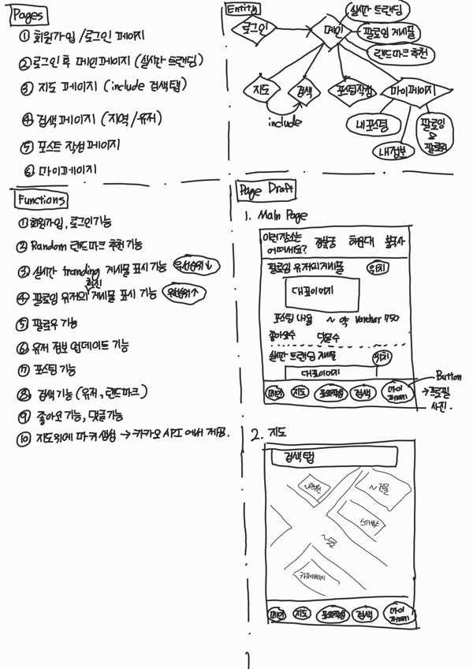
/// caption
프로젝트 브레인스토밍 초안 및 UI/UX 다이어그램 일부
///

피그마 UI를 다룰줄 알고 디자인에 대한 기본 지식이 있었다면 이렇게 비효율적으로 손으로 삐뚤삐뚤하게 그린 다이어그램을 사용하지 않았을 거지만 내겐 그런 능력이 없었기에 이정도로 만족했다..

다만 이번 프로젝트를 끝내고 나서 피그마는 꼭 배워놔야겠다고 생각했다. 추후 얘기를 다시 한번 하겠지만 팀에 디자이너가 없었기에 깔끔한 UI를 뽑기가 너무 어려웠다. 프로젝트를 진행하면서 차라리 내가 이걸 할 줄 알았다면 결과물이 엄청 달랐을텐데... 하는 아쉬움이 너무 컸다.

여튼 아이디어 초고를 간단하게 정리하고 나니 이 프로젝트는 혼자서 모든 것을 개발하기에는 많이 어려울 것 같아서 같이 공모전을 나갈 팀원을 구했다. 기존에 아이디어톤 같은 공모전을 나간 경험이 있는 동기들과 팀을 꾸렸고, 팀장인 내가 팀원들의 개발 분야를 나눴다.

총 4명으로 구성된 팀에서 나를 포함한 2명은 Backend 개발을, 나머지 2명은 디자인 및 Frontend 개발을 맡았고, 추가로 나는 프로젝트 스프린트 구성, 아키텍처 설계 및 구현, 문서화를 맡았다.

개발 Stack은 다음과 같다.

!!! quote "Stack"
    Framework: Backend - Django, Python / Frontend - Next.js, tailwind.css 
    DB: PostgreSQL 
    Cache DB: Redis 
    Notification Server: Firebase 
    Proxy: Nginx 
    Container: Docker 
    CI/CD: Github Action 
    Infrastructure: AWS

<!-- more -->

---

## 문서화

나는 Notion, JIRA Confluence 등 여러 해외 문서화 툴을 사용해본 경험이 있었다. 해외 문서화 툴은 모두 Markdown을 지원해서 자연스럽게 나도 Markdown 문법으로 문서화를 하는 것에 익숙해졌다.

그 중 요즘 다른 오픈소스도 잘 사용하지 않는 Github의 제공 기능 중 하나인 Github wiki 페이지에 눈이 갔다.

이전 협업 프로젝트도 Github Wiki 페이지를 잠깐 이용해본적이 있었는데 당연히 Markdown은 완벽 호환이 되면서 버전 관리 툴과 문서화 툴을 합칠 수 있다는 큰 장점 덕분에 이번 프로젝트도 Github Wiki 페이지를 활용하여 문서를 정리했다.

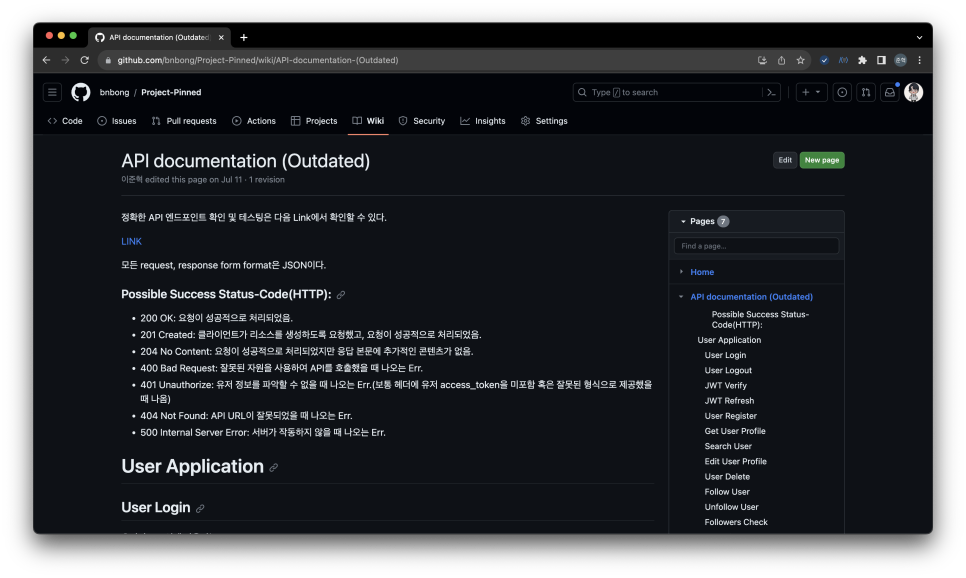
/// caption
API Document 초안
///

가장 먼저 작성한 문서는 API endpoint에 대한 문서였다.

백엔드와 프론트엔드는 API를 통해 통신하기 때문에 Frontend와의 협업을 위해 정형화된 API는 매우 중요하다.

API endpoint 문서가 세밀할수록 위험부담을 크게 줄일 수 있다. 그 중요성을 알고 있기에 프로젝트 초반 문서화 작업을 한창 할 때 가장 신경써서 문서화를 진행했다.

프로토타입도 개발이 안된 상태 임에도 불구하고 이 문서를 바탕으로 Backend, Frontend 모두 각자 기능개발을 원활하게 진행할 수 있었다.

API document가 완성된 시점에서는 협업을 위한 가이드라인을 작성했다. 두 번째로 가장 공들인 문서이다.

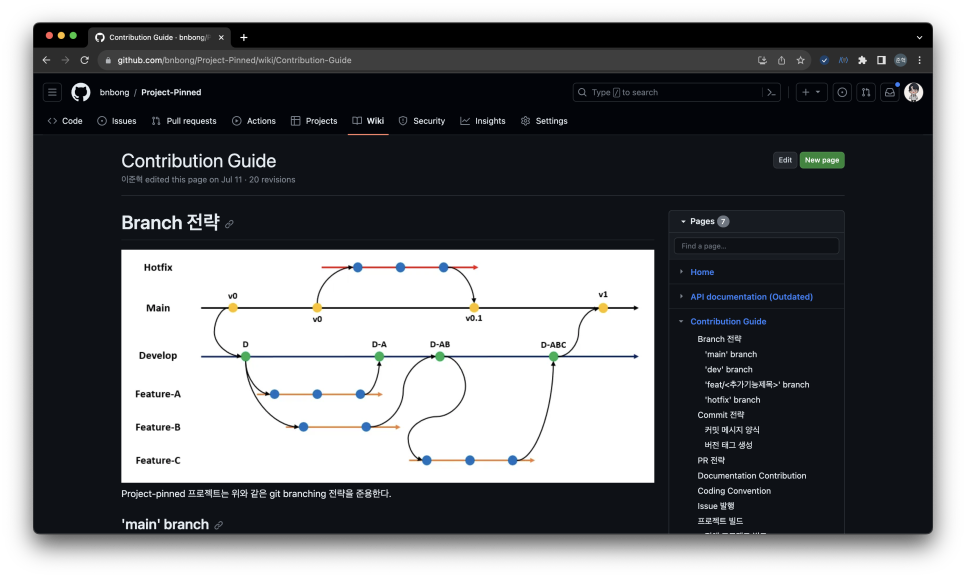
/// caption
Contribution Guide 문서
///

해당 문서에서는 git branching 전략, version tag를 붙이는 전략 및 JIRA Issue와 연동하기 위해 commit message 양식을 통일시키는 전략등을 기재했고, 프로젝트를 진행하면서 Frontend, Backend가 서로 test를 돌리기 위해 참고해야할 설정 및 빌드 명령어 등을 기재했다.

협업에 필요한 가장 중요한 문서는 아마 이 문서가 아닐까 싶다. 나 혼자 개발하는 프로젝트가 아니기 때문에 Code Conflict를 일으키지 않고 개발을 진행하기 위해 필요한 모든 정보를 이 문서에 자세하게 풀어내려고 노력을 했다. 예를 들어, 프로젝트 Backend code의 경우에는 formatting을 하기 위해 Python의 black 이라는 라이브러리를 사용했는데 black formatter로 code format을 통일시켜 커밋하는 방법을 이 문서에 정의했다.

Project-Pinned의 모든 문서는 다음 링크에서 확인할 수 있다.
<https://github.com/bnbong/Project-Pinned/wiki>

---

## 협업을 위한 도구 사용

개발 프로세스를 관리하기 위해 이슈관리 및 스프린트를 관리하는 외부 툴의 사용이 거의 불가피했다. Github도 꾸준히 Github 사이트 내에서 모든 개발 과정을 매니징 할 수 있게 여러 기능을 도입해나가고 있지만 그래도 JIRA, Jenkins같은 기존부터 꾸준히 강력한 기능과 편의성을 제공하는 third party tools의 점유율을 쉽게 뺏기는 어려운 실정이다.

학부 팀프로젝트에서 JIRA로 프로젝트 매니징을 경험해본적이 있는 나는 이번 프로젝트에 JIRA를 도입하여 스프린트 매니징을 진행했다.

JIRA가 제공하는 기본 Template 중 Agile Template를 활용해서 프로젝트탭을 만들었다.

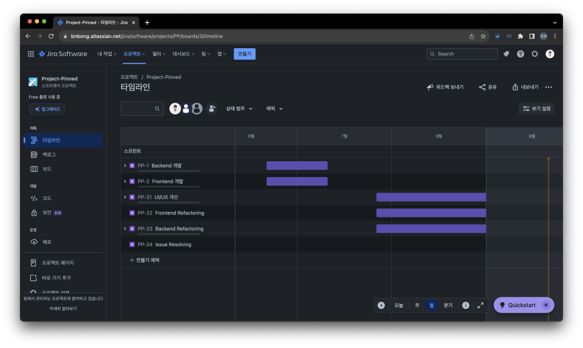
/// caption
JIRA backboard
///

스프린트를 구성하기 위해 개발해야하는 가장 큰 범주를 Epic Issue로 구분하여 설정했고, 각 Epic Issue의 개발 기한을 설정했다. Epic Issue의 life time이 설정되면 사진과 같이 바 그래프 형태로 마감 기한을 볼 수 있다.

Epic Issue를 설정하고 나서 각 Epic Issue별로 개발해야하는 세부 기능들을 하위 Issue로 생성했다.

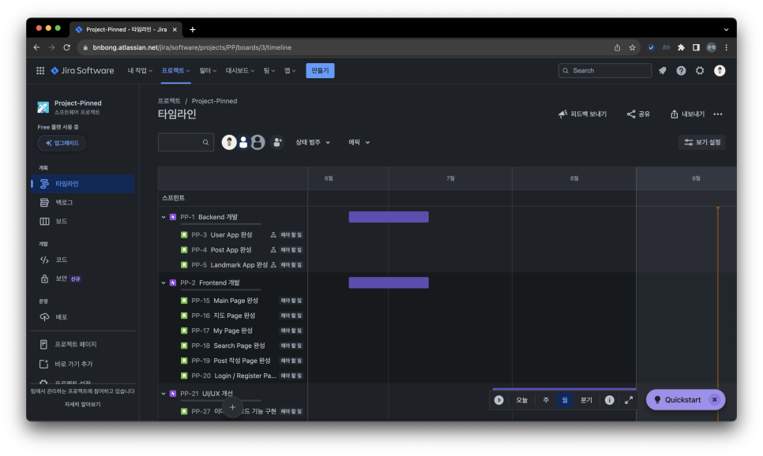

Epic Issue도 포함하여 하위 Issue들도 생성되는 순간부터 'PP-X'로 시작하는 Issue Tag가 붙는다. JIRA page와 Github가 연동이 되어 있다면 Git commit message에 해당 JIRA Issue Tag를 붙여서 커밋하면 JIRA Issue page에서 현재 이슈와 관련있는 commit, branch를 한눈에 볼 수 있다.

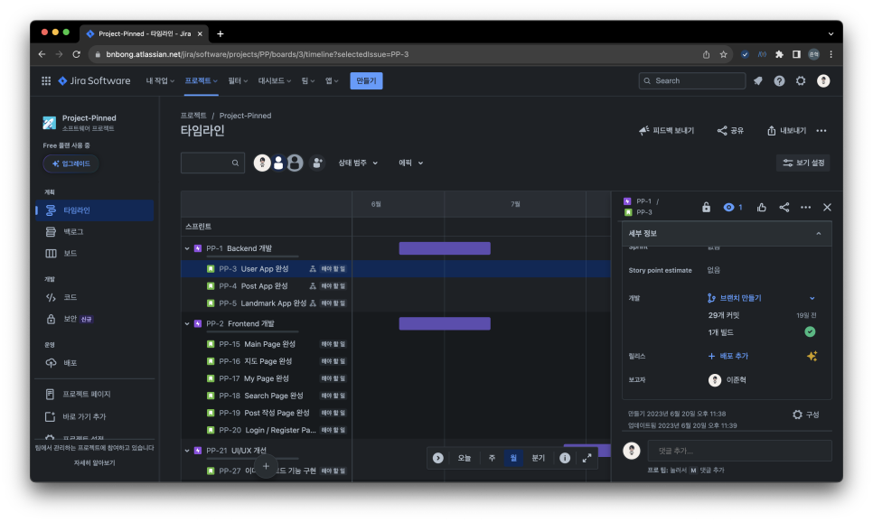
/// caption
JIRA이슈 카테고리에 속하는 모든 contributions
///

JIRA 덕분에 프로젝트 매니징을 편하게 할 수 있었다.

스프린트 계획까지 모두 마친 후 6월 중순부터 개발에 들어갔다.

---

## Backend 개발

본격적으로 프로젝트를 개발하기 시작하기 전에 Backend Stack을 고민했다.

일단 나는 Python이 굉장히 익숙했기 때문에 Python Framework로 Backend를 구축하고자 했다.

다만, 언어를 고르면서 Python의 single thread가 마음에 걸렸다. 기획한 프로젝트는 다수의 사용자가 동시 접속, Data 실시간 반영이 적용되어야하는 대규모 사용자를 고려한 프로젝트였기 때문에 특정 시점에 하나의 python code만 실행하게 되어 있는 Global Interpreter Lock(GIL)이 병목현상으로 작용할까 걱정이 되었다.

그러나 요즘 나오는 Python Web framework들은 이런 파이썬의 단점을 해소하기 위해 WSGI (Web Server Gateway Interface)를 도입하여 multi-threaded 또는 multi-process 방식으로 웹앱 서버를 띄울 수 있게 나온다. WSGI 덕분에 single thread에서만 작동하는 Python 코드도 실제 프로덕션 환경에서는 thread 병목 현상을 크게 신경쓸 필요 없이 Backend를 구축할 수 있는 것이다.

또한 Python threading 라이브러리같이 multi-thread를 구현할 수 있는 라이브러리가 존재하기 때문에 문제 없이 Python 언어를 선택했다.

언어 선택을 하고 나서 다음으로 Framework를 고민했다.

Flask, FastAPI, Django를 모두 사용해본적이 있는 나는 어떤 프레임워크를 고르든 괜찮았다. 그러나 이 프로젝트에서 나는 Django를 선택했다.

<https://www.djangoproject.com/>

Django를 선택한 이유는 다음과 같다.

>1. 방대한 양의 레퍼런스와 세밀하고 정리가 매우 잘되어 있는 공식 문서
>2. 강력한 기본제공 기능: 인증, URL 라우팅, 관리자 인터페이스, ORM, 템플릿 엔진, Admin 페이지
>3. Python-base라는 엄청난 접근성 및 방대한 커뮤니티
>4. 확장성

Django는 현재 우리 팀의 상황을 모두 적절하게 충족시킬 수 있었다. 나와 같이 Backend를 담당한 팀원은 Backend 개발이 처음이었기 때문에 쉽게 개발에 접근이 가능하면서도 learning curve가 매우 완만한 Backend Framework가 필요했고, 또 해당 Framework를 학습할만한 레퍼런스의 양과 질이 모두 좋아야 했다.

2005년 부터 꾸준히 업데이트가 이루어지고 있는 Django는 약 20년 가까이 되어 가는 User-Reference와 꾸준히 업데이트 되면서도 초보자도 읽기 쉽게 제공되는 좋은 공식 문서가 존재한다. 때문에 Backend 개발을 처음 해보는 팀원이 어렵지 않게 Django에 뛰어들 수 있었다.

또한 Django는 기본적으로 제공해주는 기능들도 매우 많았다. 개발 기한이 널널한 편이 아니었던 우리 프로젝트는 빠르게 MVP를 만들고 꾸준히 테스팅을 통해 성능 검증 및 개선 작업을 했어야 했다. 따라서 MVP 개발에 소요되는 시간이 길면 길수록 프로젝트가 쉽게 늘어질 수 있었다. 그래서 Django를 선택했다.

이 점에 대해서는 FastAPI도 선택지에 포함이 될 수 있었다. 그러나 FastAPI를 체택하게 된다면 ORM, Admin page 등을 모두 일일이 개발을 해야했다. 거의 Go언어로 개발된 서버만큼이나 빠르고 최적화된 성능을 자랑하는 FastAPI이지만 Backend를 처음 접하는 사람에게는 learning curve가 가파른 편이었다. 초보자가 참고할만한 레퍼런스도 많지 않은 편이었다.

Backend 개발에 필요한 거의 모든 기능을 기본적으로 제공해주는 Django의 강력함 덕분에 개발 기한 내로 원하는 요구사항을 모두 충족시킬 수 있는 Backend를 구축할 수 있었다. Django를 선택한 것은 정말 잘한 선택이었다.

개발 후반에는 API document를 실제 개발되어 있는 API endpoint의 양식에 맞게 자동화를 시키기 위해 swagger library를 도입했다. 이런 소소한 확장도 가능하다는 것은 Python-base Framework의 강력한 장점이었다.

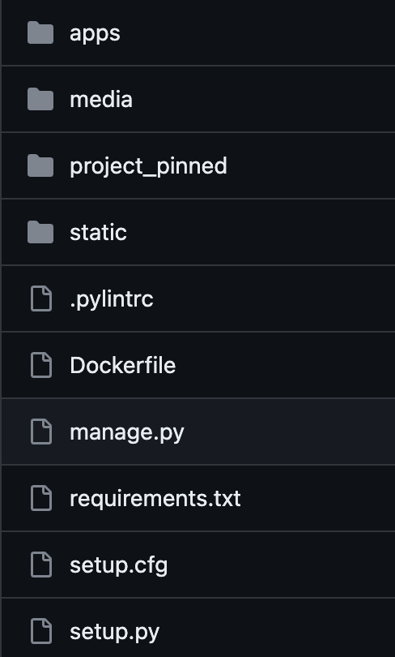
/// caption
최종 Backend Directory Tree
///

Django는 오로지 Backend 구축을 위해 체택한 Framework라서 정적 파일들을 제공할 필요가 없었다고 생각했다. 정적 파일 Serving은 Nginx를 통해서 제공되기 때문이다. 그러나, Admin 페이지는 Django가 auto-create해주는 static 파일들이 다수 존재했기 때문에 Django가 제공하는 static 파일들을 모두 collect해서 'static/' 이라는 폴더에 따로 저장했고, Nginx가 이 static 파일들을 참조하게 했다.

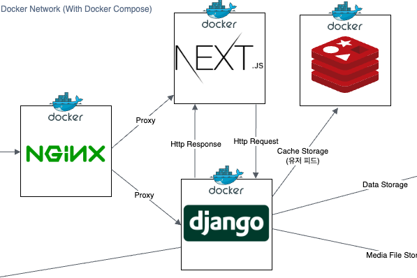
/// caption
주요 컨테이너
///

인스턴스를 구성하는 핵심 기능들은 모두 Docker를 활용하여 Container화 시켰다.

인스턴스의 Forwarding을 담당하는 Nginx 컨테이너가 외부로의 모든 접속 및 입출력을 담당하고 Frontend, Backend Container에게 Proxy를 쏴서 컨테이너 간 통신을 이루도록 구성했다.

HTTPs certification을 구축하기 위해 certbot을 도입해서 nginx 내부 컨테이너에 인증서와 인증 관련된 로직을 때려 박으려고 했으나 여러 시행착오를 겪었고 답이 없다는 결론을 내서 그냥 EC2 instance 내부에 인증서를 직접 발급하여 저장했다. 이 부분은 https 인증을 자동화 할 수 있는 다른 좋은 방법이 있을 것 같은데 내 능력 부족으로 인해 차후 학습을 통해 개선 방법을 찾고자 한다.

서비스를 모두 컨테이너화를 시킨 덕분에 실제 Deployment로 올라갈 환경과 거의 유사한 환경에서 testing을 진행할 수 있었고 어려움 없이 바로 deploy가 가능했다.

컨테이너 이미지는 모두 DockerHub에 업로드 하여, CI/CD 자동화를 구축하는 과정에서 observer가 자동으로 DockerHub 이미지를 참조해서 컨테이너를 빌드하도록 설정했다.

데이터베이스로는 유저 데이터, 빅데이터를 가공한 데이터 등 무결성이 중요한 데이터를 저장하기 위해 RDBMS를 체택했고 PostgreSQL을 체택했다.

<https://www.postgresql.org/>

MySQL도 체택할 수 있었지만 그렇지 않았던 이유는 우리 서비스가 위치 및 지리정보를 포함한 빅데이터를 가공하여 사용하기 때문에 PostGIS와의 연동성을 고려한 선택이었다. 현재 버전에서는 PostGIS기능까지 요구하여 지리 탐색을 요하는 알고리즘이 포함되어 있지는 않다. 빅데이터에서 이미 지역 랜드마크에 대한 위치 정보를 모두 제공해주고 있기 때문에 빅데이터 정보만으로도 위치 정보에 대한 문제를 해결할 수 있었지만 추후 새로운 랜드마크가 생겨 업데이트를 해야하는 경우를 고려한 것이다.

유저 피드같이 실시간으로 데이터 수정이 이루어지고 caching이 요구되는 데이터는 NoSQL을 체택하여 데이터를 저장하기로 했고, 직관적으로 Key-Value로 값의 입출력을 할 수 있는 Redis를 체택했다.

<https://redis.io/>

---

## CI/CD 아키텍처 구축

개발에는 큰 어려움이 없었다. 이 것을 배포하는 과정이 조금 난관이 있었다.

지금은 인프라로 AWS를 사용하고 있지만 처음에는 Azure를 사용했다. 그 당시 작성했던 아키텍처 초안이 조금 날아가 있는 상태지만 초반 아키텍처는 다음과 같이 설계했었다.

>1. Docker images registry - Azure Container Registry
>2. CI/CD - Github Action
>3. Machine - Azure Container Instance
>4. 로그 수집 - ELK(Elasticsearch: indexing & storage, Logstash: log aggregation & processing, Kibana: Analysis & Visualization)
>5. 고가용성을 위한 DB 이중화 및 샤딩 - PostgreSQL용 Azure Cosmos DB

실제로 설계를 마치고 나서 인프라 구축까지도 완료했으나 일주일 만에 모든 아키텍처를 버리고 AWS에서 처음부터 구축을 하게 되었는데, Azure에서 AWS로 넘어가게 된 이유는 다음과 같다.

개인적으로 느꼈던 Azure의 장점은 직관적이면서도 가시화된 인프라 상태를 한눈에 확인할 수 있는 좋은 UI였다. 대시보드 창에서 현재 내가 생성한 인스턴스들을 구독 별로, 인스턴스 그룹 별로 정말 직관적으로 확인이 가능했다. 또한 기본 제공 기능 중 하나로 가시화된 자료로 현재 구성되어 있는 인스턴스 설정을 바탕으로 인스턴스의 관계를 볼 수 있는 자료를 만들어 주는 탭도 존재했다. 해당 탭을 바탕으로 내가 인스턴스 간에 어떤 구성을 빠뜨렸는지 확인할 수 있었다.

그러나 초보자가 참조할만한 공식 문서에 대한 질이 그리 좋은 편이 아니었다. AWS의 경우에는 기업이 아니라 개인도 정말 많이 사용하는 인프라이기 때문에 개인 블로그 같은 외부 레퍼런스도 굉장히 정리가 잘 되어 있는 편이라 그냥 그 문서 그대로 따라만 해도 100% functional한 인프라를 구축할 수 있지만 Azure의 경우에는 그렇지 않다. Outdated되어 있는 문서도 꽤나 존재하는 편이고 가독성 또한 떨어지는 문서가 많다. 이를 MS에서 인지하고 있는지 Microsoft Learn 같은 무료 레퍼런스를 제공하면서 Azure 사용법에 대한 지식을 학습 할 수 있는 세션을 운영중이지만, 해당 세션들을 모두 수강할만한 시간이 많지도 않았을 뿐더러 AWS로 갈아타게된 가장 큰 계기는 그냥 어느날 갑자기 Azure Computing Instance가 접속 불가(....)가 되어버려서 였다.

그냥 어느날 갑자기 ssh든 컨테이너 내부 접속이든 모두 먹통이 되어서 써먹을 수 없는 상황이었다. 또한 Region 문제도 발목을 잡았었는데 한국 region으로 인스턴스 생성은 가능했으나 각 region 별로 인스턴스 제공 기능에 차이가 있었고 이를 알아차린건 인스턴스를 만들고 나서 한참 뒤였다...

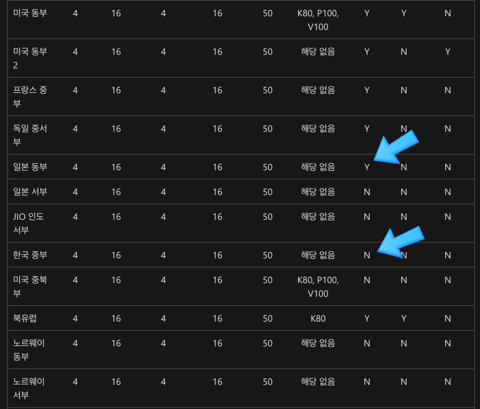
/// caption
ACI 생성 가능 region 중 일본 지역 일부는 가용성 영역을 지원하지만 한국은 그렇지 않다.
///

실제로 한국 region으로 사용해보면서 인스턴스에게 할당할 수 있는 최대 CPU, Memory의 할당량도 공식문서에 기재되어 있는 설명과 차이가 있었다.

결국 진짜 오랜만에 AWS로 돌아가서 인프라를 구축하게 되었다.

외부 레퍼런스를 참고하면서 구축했고 성공적으로 인프라를 구축했다. 현재까지도 작동하면서 이슈가 생긴적 단 한번도 없이 잘 작동한다. 완성된 인프라 아키텍처는 다음과 같다.

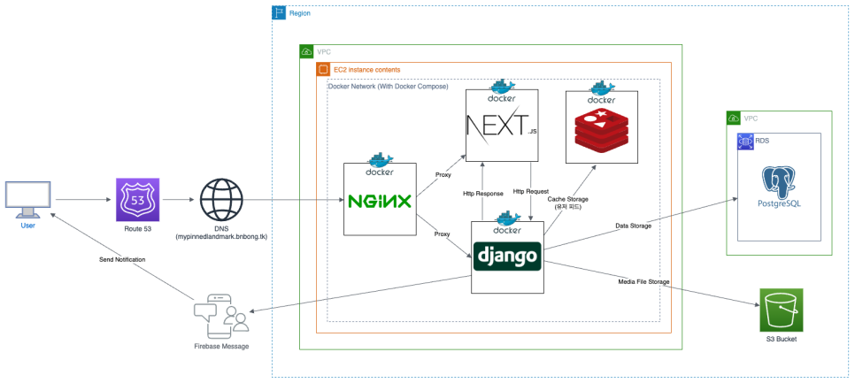
/// caption
인프라 구성
///

이제 인프라를 구축했으니 계속 버전 업데이트가 이루어지는 코드를 실제 프로덕션 환경에 반영할 CI/CD 파이프라인 자동화 작업이 남았다.

사용해봤던 CI/CD 툴로는 Jenkins가 있었지만, 이번에 나는 Github Actions를 사용해보기로 했다.

<https://docs.github.com/ko/actions>

Jenkins가 아니라 Github Actions를 선택한 이유는 다음과 같다.

Jenkins는 따로 인프라 어딘가에 직접 Jenkins를 설치하고 초기 설정까지 하나하나 다 해줘야 한다. 이는 유지 관리 측면에서 보안 측면이라던지, 파이프라인 구축 전반에 대한 이해를 요하기 때문에 CI/CD 구축에 더 많은 시간이 소요될 수도 있겠다는 생각이 들었다. 가장 많이 사용되면서도 Github Actions보다 상대적으로 생긴지 오래된 툴이기 때문에 다수의 플러그인이 존재한다는 장점이 있으나 딱히 필요성을 못느꼈기 때문에 체택하지 않았다.

Github Actions의 경험은 정말 만족스러웠다. GitHub 저장소와 직접 통합되어 있기 때문에 별도의 CI 서비스를 설정할 필요가 없었고 YAML 파일 기반의 워크플로우를 사용하여 CI/CD 파이프라인을 손쉽게 정의할 수 있었다. 또한 도커 컨테이너와도 유연한 연결을 보여줘서 빌드 중 다른 앱과의 Conflict 없이 배포가 가능했다. 공식 레퍼런스도 자세하고 다양하게 제공되어 있는 편이라 참고도 쉬웠다.

완성된 CI/CD 파이프라인은 다음과 같다.

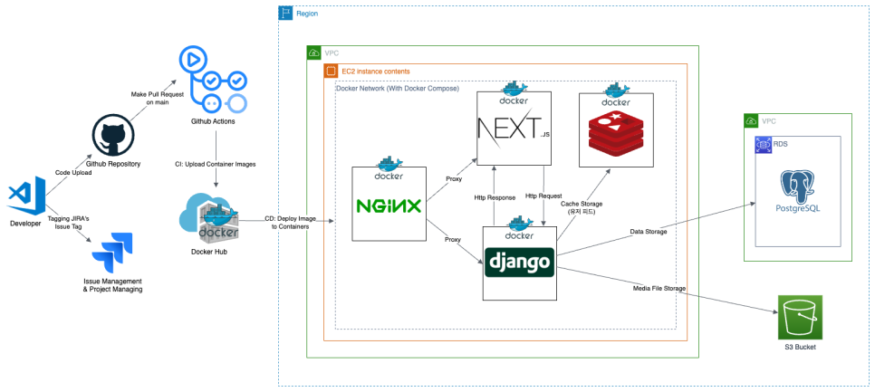
/// caption
CI/CD
///

---

## 좋았던 점

이번 프로젝트에서 좋았던 점은 다음과 같다고 생각한다.

!!! success
    1. 구성한 프로젝트 스프린트 대로 알파 빌드 별 태그를 부여한 버저닝
    2. Git branch를 적극 활용한 버전 관리
    3. Github wiki 페이지를 활용한 문서 정리
    4. Github actions를 활용한 문제 없이 작동하는 CI/CD의 성공적인 구축

프로젝트 초기에 내가 정의한 개발 방법론 및 가이드라인을 최대한 준용하여 개발을 진행하였고, 정형화된 가이드라인을 정의한 덕분에 협업에 대한 모니터링을 수월하게 할 수 있었다.

브랜칭, 버전 태그 부여로 인해 각 버전의 스프린트가 끝나면 개발을 더 진행했더라도 해당 버전의 코드를 토대로 스프린트 회고를 할 수 있었다.

Git branch의 장점을 그대로 녹인 개발 방법론 덕분에 협업을 성공적으로 진행할 수 있었고 개발 마감까지 프로젝트를 완성할 수 있었다.

또한 제대로된 CI/CD를 온전히 내가 구현한 적은 이번이 처음이었는데 문제 없이 파이프라인을 구축하여 배포 자동화를 할 수 있었던 것이 굉장히 뿌듯했다. 처음 써보는 인프라와 아키텍처, 툴이 적지 않았음에도 불구하고 다양한 레퍼런스를 참고하여 개발을 완료할 수 있었다.

그리고 가장 좋았던 것은 내 아이디어가 협업을 통해 생각했던 기능 거의 그대로 개발이 되어 나온 것이었다. 몇달 전까지만 해도 그냥 끄적이면서 내 머릿속에 생각했던 아이템이 실제로 그대로 구현되어 나왔다는 것이 신기했다. 비록 공모전 출품용으로 세상에 나오게된 아이템이지만 이번 경험을 토대로 앞으로의 프로젝트들을 더욱 완벽하게 완성할 수 있을 것 같다.

---

## 어려웠던 점

개발 과정중에서는 크게 어려운점이 없었다. 하나 있었다면 뉴스피드 알고리즘을 구현하는 것이 어려웠다. 처음 해보는 뉴스피드 개발이기도 하고 뉴스피드에서 현재 여러가지의 알고리즘이 개발되어 있다는 것을 이번 프로젝트를 통해서 처음 알게 되었다. 뉴스피드 알고리즘을 아키텍처에 적용시켜 최적화 하는 작업이 어려웠다.

그러나 레퍼런스를 통해 알고리즘 구현에 대한 힌트를 얻을 수 있었고 이를 통해 뉴스피드 알고리즘 최적화 및 뉴스피드 구현을 할 수 있었다.

처음 난관을 겪었던 부분은 Docker Compose를 활용해 빌드한 컨테이너 이미지를 실제 프로덕션에서 배포하는 과정중에 겪었던 문제였다.
내가 작업하는 머신은 MacBook, 즉 OS 환경이 Linux도 아니고 Windows도 아니고 MacOS였다. 당연히 로컬에서 작업하는 머신에서 컨테이너 이미지를 빌드하고 있었고 amd64 환경이 아니라 M1 아키텍처에 맞는 이미지가 빌드가 되었다.

이 이미지를 그대로 DockerHub에 올렸다. 그러나 CD Observer가 이미지를 DockerHub에서 다운 받아 컨테이너로 빌드하는 과정이 자꾸 실패했다.

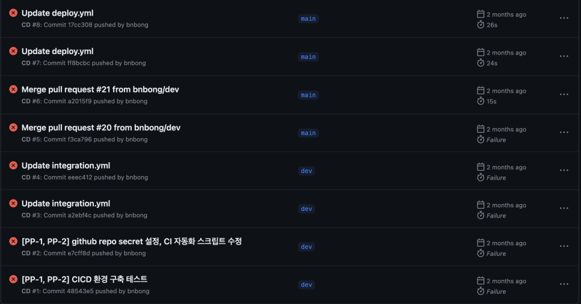
/// caption
수 많은 CD failures
///

머신 아키텍처 문제라고는 전혀 생각을 못했기 때문에 이 문제에 많은 시간을 쏟아서 해결하려고 노력했고, 다행이 원인을 찾을 수 있었다.

이미지 빌드 환경을 m1 아키텍처가 아닌 linux/amd64환경으로 설정하고 빌드해서 해결할 수 있었다.

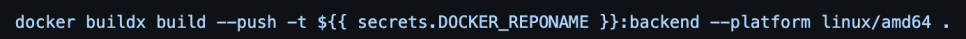
/// caption
명령어의 추가로 CI/CD를 성공적으로 할 수 있었다.
///

빌드 명령어를 위와 같이 수정함으로써 프로덕션에 성공적으로 새로운 버전을 올릴 수 있었다.

 

그리고 가장 어려웠고 가장 많은 시간을 잡아 먹었던 것은 버전 1.0 배포 단계에 있었던 트러블 슈팅이었다.

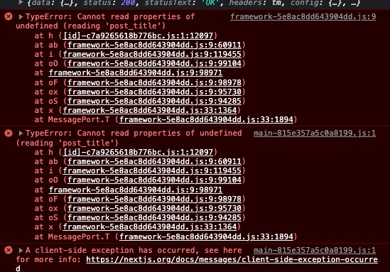
/// caption
Issue Error 내용
///

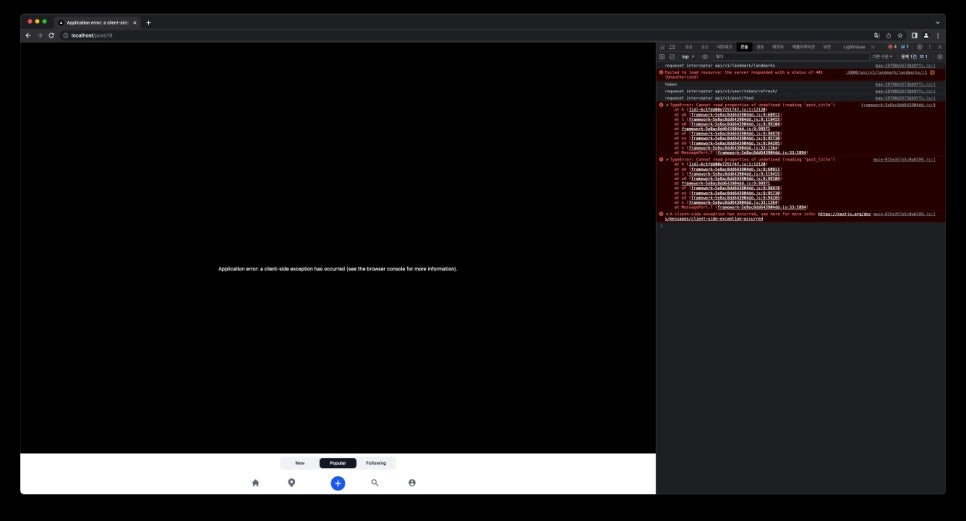
/// caption
이슈가 나는 페이지
///

버전 1.0 배포를 눈앞에 두고 있던 날, 즉 프로젝트 배포 마감일 하루 전에 다같이 모여서 Frontend Page를 로컬에서 빌드해보면서 이슈가 나는 페이지는 없는지 확인을 하던 중이었다.

그러다가 피드에 게시물 렌더링은 문제 없이 되지만 게시물을 클릭해서 게시물 세부 내용을 보는 페이지가 작동이 되지 않는 것을 확인했다.

Frontend code 로직 상으로 post_title부분에 undefined 토큰이 넘어갈 이유가 없음에도 불구하고 거의 7시간 넘게 왜 자꾸 post_title이 undefined가 뜨는지 찾지를 못했다.

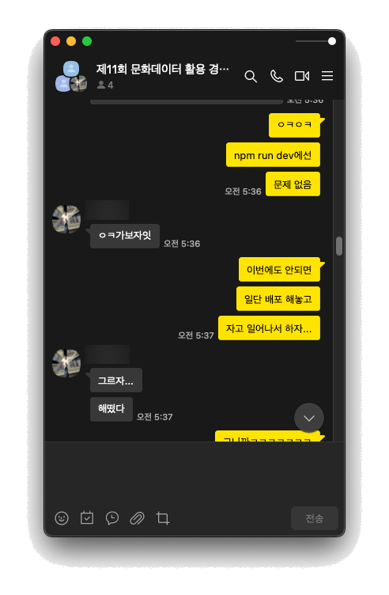
/// caption
고생한 흔적..
///

결국 배포 1시간 전까지 이유를 찾지 못했고 일단 시간이 없으므로 이 버전을 배포하기로 했다.

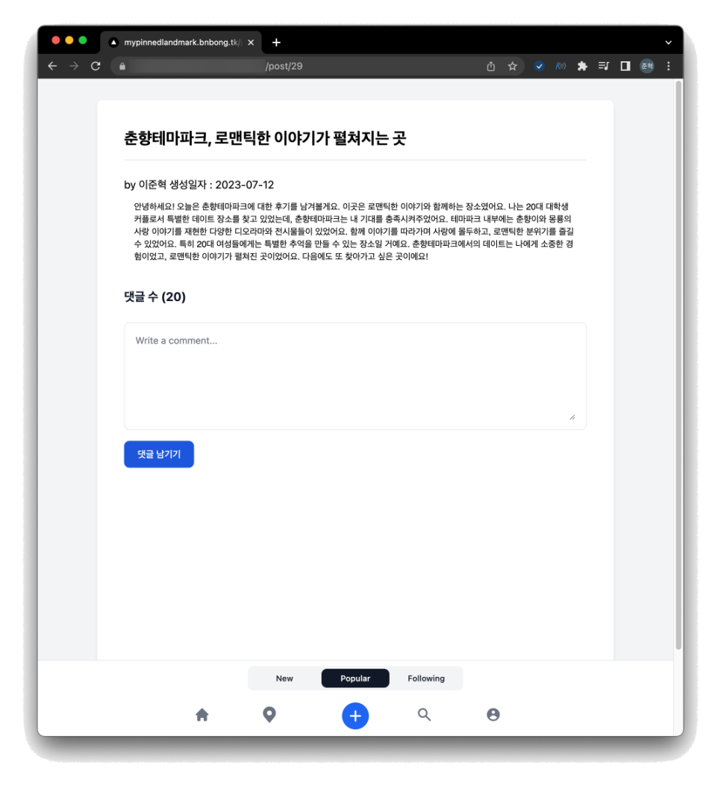

그리고 놀랍게도 배포를 했더니 작동이 문제 없이 잘 되는 것이었다(....)

이 이슈를 트러블 슈팅하느라 이날 밤을 샜는데 이렇게 허무하게 해결이 된 것이 너무 허탈했다.

뭐, 결론적으로 작동이 되는 코드가 프로덕션에 올라가서 다행이지만 아직도 찜찜함이 남아있다...

---

## 아쉬웠던 점

프로젝트를 완성을 하긴 했지만 회고를 해보니 아쉬운점이 여럿 있었다.

일단 팀에 PM이 없어서 팀장인 내가 PM의 역할까지도 맡았는데, 공모전 개발이 아니라 다른 여러 일 때문에 일정이 바빠져서 버전 1.0 배포를 마치고 나서 1.1을 배포할 때 까지 팀원들의 개발 프로세스 모니터링 및 리뷰를 할 시간이 별로 없었다.

시간이 부족해지면서 자연스럽게 JIRA 페이지에 대한 신경을 쓰지 못하게 되었고 백로그 관리가 조금 소홀해졌다.

1달동안 좀 더 노력해서 계속 이슈를 해결하고 개발 프로세스를 더 검토하면서 기능 발전을 이뤄내고 버전 업을 꾸준히 이루었어야 했는데 그러지 못하고 버전 1.1로 최종 빌드를 마무리해서 제출한 것이 아쉬웠다.

그리고 Github repo설계부분이 조금 아쉬웠다. Github organizations를 만들어서 팀 repo를 꾸려 backend, frontend, 환경 설정용 repo를 따로따로 분류하면 이슈 관리 및 backend, frontend application 버전 관리를 좀 더 깔끔하게 할 수 있었을 것 같았는데 프로젝트 구성 초기에 이를 좀 더 깊게 고려하지 못하고 저장소 하나에서 해결하려고 했던 것이 아쉬웠다.

그리고 가장 뼈져리게 아쉬웠던 것은 역량 부족으로 인해 UIUX 디자인을 좀 더 깔끔하고 세련되게 수정하지 못한 점이었다. 디자이너의 부재로 frontend 팀과 스켈레톤 디자인을 개발했던 내가 디자인까지 설계를 했었는데 이 때문에 UI 페이지 결과물이 조잡한 수준으로 뽑혀서 너무 아쉬웠다. 디자이너가 한명이라도 팀에 있었다면 더 나은 UIUX 설계를 통해 좀 더 예쁘고 인터렉티브한 디자인을 뽑을 수 있었을 텐데 말이다. 결국 출전했던 두 공모전 모두 수상을 하진 못했던 것이 아마 이 부분 때문이 아닐까 싶기도 하다.

문서화 단계에서도 아쉬운 점이 있었다. 나 혼자 개발하는 프로젝트가 아니었기에 코딩 컨벤션 구성에 신경을 써서 문서화를 진행했다고는 하지만, 나는 Frontend 개발자가 아니었기 때문에 Frontend 컨벤션은 Backend만큼 자세하게 풀진 못했다.. Frontend 관련 지식이 부족했기 때문에 Backend와는 달리 Frontend 컨벤션은 그리 세밀하지 못했다. Frontend도 컨벤션을 Backend만큼이나마 자세하게 풀었다면 리펙토링도 하기 쉬웠을거라고 생각한다.

---

## 마무리

거의 처음으로 교내 프로젝트가 아니라 공모전을 위한 프로젝트, 심지어 아이디어 공모전도 아니라 아이템 개발 프로젝트를 처음으로 개발 전반을 내가 주도해서 완성시킨 프로젝트이다.

아쉬운 점도 많았던 프로젝트지만 그보다 더 뿌듯했던 점이 많았던 프로젝트였다. 약 3달동안의 경험으로 정말 많은 것을 얻어갈 수 있었던 프로젝트였다. 회고를 통해 아쉽다고 느껴진 점들은 모두 다음 프로젝트에서 개선해서 더 발전된 아이템으로 만들어나갈 것이다.
