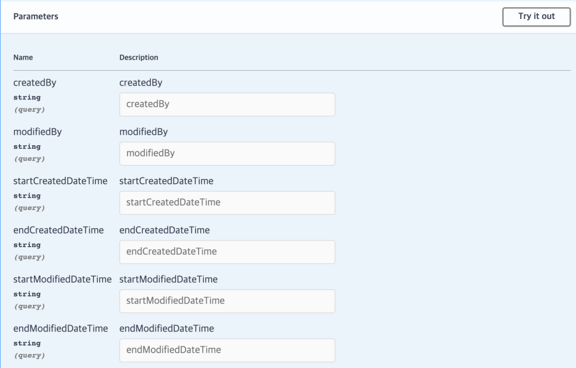
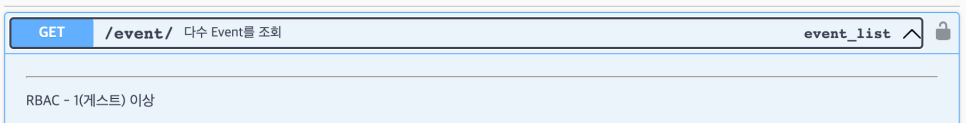
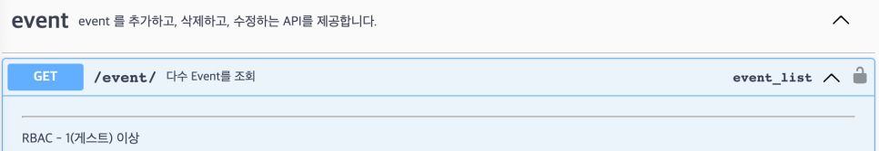

## API와 API 문서?

개발을 하다 보면, API 라는 단어를 적어도 한번 혹은 정말 질리도록 마주칠 것이다. 그런데 이 단어를 처음 접해서 인터넷에 검색을 해보면 당황을 하는 사람이 더러 있을 것이다.

Application Programming Interface, 줄여서 ==API는 다양한 소프트웨어나 애플리케이션 간의 상호작용을 가능하게 해주는 인터페이스==라고 설명이 되어 있는데 이렇게 설명만 듣고 보면 무슨 말인지 감이 잘 안올 것이다. 나도 최근에 공모전 등의 협업 프로젝트를 진행하면서 같은 SW학부생인데도 불구하고 API라는 것이 어렵고, 또 잘 와닿지 못해 하는 친구들을 더러 봤다.

API라는 단어가 주는 압박감, 이해하기 힘든 의미 때문에 API가 어렵게 느껴질 수 있지만 이 것은 정말로 어렵게 생각할 것이 전혀 아니다.

</br>

API를 예시를 들어 설명하자면 다음과 같다.

여러분 앞에 데스크톱 본체가 있다고 하자. 이 데스크톱을 모니터에 연결해서 컴퓨터 화면을 볼 수 있고, 또 유선키보드나 유선 마우스를 연결해서 인터넷 검색을 하거나 유튜브를 볼 수 있다.

우리는 유선 마우스를 주문해서 마우스 클릭질을 하면서 유튜브를 보고 싶다. 노트북이라면 따로 마우스를 구매하지 않아도 되었겠지만 데스크톱 본체만 달랑 있다면 우리는 아무것도 할 수 없기에 마우스를 구매하기로 했다. 얼마 후, 마우스가 배송이 되어서 왔고 드디어 우리는 컴퓨터 화면에서 클릭을 하면서 유튜브 동영상을 볼 수 있게 되었다.

그런데 가만히 생각해보면 데스크톱 본체와 마우스는 제조사가 다르다. 그럼에도 불구하고 우리는 이들을 문제없이 연결해서 쓸 수 있다. 우리가 유선 마우스를 택배로 받았을 때, 데스크톱 본체와 다른 제조사에서 다른 날짜에 배송된 물건을 받았음에도 유선마우스를 연결할 수 있는 동일한 USB 포트가 데스크톱에 포함되어 있어 컴퓨터에 연결해서 마우스 클릭 액션을 할 수 있다. 이게 어떻게 가능할까?

이 것은 데스크톱 본체와 마우스를 만드는 회사가 같은 포트 '규격'을 보고 제품을 만들었기 때문이다. USB라는 표준 규격을 참고하여 두 회사가 제품을 만들었기 때문에 마우스와 데스크톱 본체를 문제 없이 연결을 할 수 있고 마우스 클릭, 휠 스크롤 등의 동작의 결과를 컴퓨터 화면에서 볼 수 있는 것이다. 만약 마우스 회사가 자기들만의 독자적인 포트 규격을 사용해서 제품을 만들었다고 하면 그 마우스는 우리 집에 있는 데스크톱과 연결할 수 없을 것이다.

이 예시 중 API의 의미에 대해서 우리가 주목을 해야햐는 부분은 'USB 포트'이다. 컴퓨터 없이 마우스만 달랑 있다고 해서 우리가 아무리 클릭을 한다 한들, 유튜브 화면을 띄워서 동영상을 클릭할 수 없을 것이고 데스크톱 본체만 달랑 있다고 해서 우리가 아무리 보고 싶은 동영상이 있어도 클릭해서 그 영상의 내용을 볼 수 없다. ==컴퓨터와 마우스를 연결해서 우리가 '클릭' 이라는 마우스 액션을 데스크톱 본체로 전달을 해주는 것이 이 'USB 포트'라고 생각할 수 있다.== 즉, <b>USB 포트는 컴퓨터와 마우스가 상호작용을 할 수 있도록 해주는 일종의 징검다리 역할</b>을 해주는 것이다. 컴퓨터를 맨 처음 발명한 회사는 이 징검다리를 ^^USB라는 <b>'규격'</b>^^으로 설명해놨기에 이 행동이 가능한 것이다.

API도 USB 포트의 역할과 동일하다. ==다양한 애플리케이션, 서비스, 시스템들이 서로 상호작용을 할 수 있도록 통신할 수 있는 ^^징검다리^^ 역할을 해주는 것이 API==다. 방금전 예시로 들었던 USB 규격의 설명 처럼 이 API라는 것을 개발자가 써먹을 수 있게 설명을 해놓은 설명서가 API 문서이다.

API 문서는 어떤 프로그램이나 앱이 아니라 말 그대로 글로 적혀 있는 메뉴얼이다. 어떤 소프트웨어 제품을 개발하려고 할 때, 개발자는 이 API 문서를 오랫동안 들여다보면서 서로 다른 분야에 있는 개발자라고 하더라도 하나하나 다 물어보면서 서로를 귀찮게하거나 내가 알고 있는 분야가 아닌 처음 보는 분야를 공부하는 등의 비효율적인 작업 필요 없이 굉장히 효율적인 협업을 할 수 있다.

API 문서를 잘 작성하는 것은 API 서비스를 성공적으로 만드는 역할 뿐만 아니라 성공적인 협업으로의 결정적인 역할을 할 수 있다. Backend 개발의 경우에는 Backend 개발자가 서비스를 만듦과 동시에 API 문서를 작성하게 되는데, 기존에는 API 문서를 하나하나 손으로 작성해야했기에 비효율적이었고, 작성했다 하더라도 실제 API 서비스와 문서에 적혀있는 기능이 다른 경우가 많았다. 이를 해결하기 위해 따로 문서를 작성할 필요 없이 API 문서를 자동으로 만들어주는 라이브러리 및 규격들이 만들어졌다. 이번 포스팅에 소개할 Swagger가 그 중 하나이다.

<!-- more -->

---

## Swagger

<https://swagger.io/>

==Swagger는 API 설계, 구축, 문서화, 그리고 사용에 관한 도구 및 규약의 모음==이다. Swagger는 OpenAPI Specification (OAS)의 초기 이름으로, 현재는 OpenAPI로 더 잘 알려져 있다. OpenAPI 규격이라고 하면 Swagger에서 제공하는 규격이라고 생각해도 문제 없다.

Swagger는 어느 특정 언어나 프레임워크에 제한되어 있지 않기 때문에 내가 어떤 언어로 개발을 하더라도 Swagger를 적용시킬 수 있다. Swagger가 API 문서 작성을 자동화해주는 덕분에 API 문서에 투자하는 시간을 확실하게 줄일 수 있다. 또한 API 서비스에 변화가 생기더라도 즉시, 자동으로 반영해주기 때문에 수고를 많이 덜 수 있다.

Swagger/OpenAPI 규격은 여러개가 나와있고, 이 Swagger 규격을 Python의 Django framework에서도 적용시킬 수 있다. 바로 **drf-yasg**라는 라이브러리를 통해 할 수 있다.

## drf-yasg

### 1. 설치

<https://drf-yasg.readthedocs.io/en/stable/readme.html>

다음 명령어로 drf-yasg 라이브러리를 프로젝트에 설치할 수 있다.

```bash
$ pip install drf-yasg
```

drf-yasg는 라이브러리 이름 답게 Django Rest Framework(DRF)와의 유연한 연결을 할 수 있다. DRF가 제공하는 [camel-case renderer인 djangorestframework-camel-case](https://github.com/vbabiy/djangorestframework-camel-case)와의 통합도 기본적으로 지원하고 다른 drf관련 기능 통합도 기본적으로 지원하는 기능이 많다. 자세한 방법은 다음 drf-yasg 공식 문서에서 확인할 수 있다.

<https://drf-yasg.readthedocs.io/en/stable/readme.html#third-party-integrations>

### 2. 초기 설정

drf-yasg를 django 프로젝트에 설치를 했다면 다음 코드를 settings.py에 추가해줘야한다.

```python
# in settings.py

INSTALLED_APPS = [
   ...
   'django.contrib.staticfiles',  # required for serving swagger ui's css/js files
   'drf_yasg',  # 추가
   ...
]
```

urls.py에도 다음 코드를 추가해주면 여러분의 django 프로젝트에 swagger를 적용시킬 준비가 끝난다.

```python
# in urls.py

...
from django.urls import re_path
from rest_framework import permissions
from drf_yasg.views import get_schema_view
from drf_yasg import openapi

...

schema_view = get_schema_view(
   openapi.Info(
      title="Snippets API",  # API 문서의 제목
      default_version='v1',  # API 문서의 버전
      description="Test description",  # API 문서의 설명
      terms_of_service="https://www.google.com/policies/terms/",
      contact=openapi.Contact(email="contact@snippets.local"),  # 개발자 연락처
      license=openapi.License(name="BSD License"),  # API 라이선스 내용(생략 가능)
   ),
   public=True,
   permission_classes=(permissions.AllowAny,),
)

urlpatterns = [  # 하단의 urlpatterns로 접속을 하면 Swagger가 자동생성해주는 API 문서를 볼 수 있다.
   path('swagger<format>/', schema_view.without_ui(cache_timeout=0), name='schema-json'),
   path('swagger/', schema_view.with_ui('swagger', cache_timeout=0), name='schema-swagger-ui'),
   path('redoc/', schema_view.with_ui('redoc', cache_timeout=0), name='schema-redoc'),
   ...
]
```

urlpatterns에 추가해준 내용을 바탕으로 여러분의 django 프로젝트는 다음 4개의 엔드포인트에서 swagger 문서를 볼 수 있다.

!!! note ""
    /swagger.json
    /swagger.yaml
    /swagger/
    /redoc/

내가 작성한 예제에서는 별다른 조건 없이 urlpatterns에다가 swagger endpoint를 그대로 연결해놓고 있지만 실제 배포 환경에서 API 문서를 public에 노출시키는 것은 내가 만들 API가 private인 경우에는 곤란해질 수 있다. 따라서 다음 내용 처럼 DEBUG 환경에서만 API 문서를 랜더하도록 조건을 걸 수 있다.

```python
# in urls.py

if settings.DEBUG:
    urlpatterns = [  # 하단의 urlpatterns로 접속을 하면 Swagger가 자동생성해주는 API 문서를 볼 수 있다.
       path('swagger<format>/', schema_view.without_ui(cache_timeout=0), name='schema-json'),
       path('swagger/', schema_view.with_ui('swagger', cache_timeout=0), name='schema-swagger-ui'),
       path('redoc/', schema_view.with_ui('redoc', cache_timeout=0), name='schema-redoc'),
       ...
    ]
```

Django 공식 문서에서도 프로덕션 빌드가 아닌 이상 DEBUG 옵션을 DEBUG=True로 설명을 하고 있기에 위 코드가 문제 없이 실행될 수 있다.

### 3. 추가 환경 설정

settings.py에 SWAGGER_SETTINGS 문단을 추가해서 drf-yasg가 읽어들이는 swagger/redoc settings를 기재할 수 있다. 예시는 다음과 같다.

```python
# in settings.py

SWAGGER_SETTINGS = {
    'SECURITY_DEFINITIONS': {
        'basic': {
            'type': 'basic'
        }
    },
    ...
}

REDOC_SETTINGS = {
   'LAZY_RENDERING': False,
   ...
}
```

다음 공식 문서에서 확인할 수 있다. 내용이 많은 편이다.

<https://drf-yasg.readthedocs.io/en/stable/settings.html>

### 4. 내 API에 적용

drf-yasg 설정을 끝내면 이제 내가 작성한 Django application의 views.py와 연결된 엔드포인트에 대해 Swagger 문서에 자동화시켜 띄울 수 있다. 이번 포스팅에서는 DRF의 generic views class를 바탕으로 설명을 할 것이다.

<https://www.django-rest-framework.org/api-guide/generic-views/>

다음과 같이 어떤 Django Application에 CRUD 기능을 하는 view를 정의해놓았다고 하자.

```python
# in someapp/views.py

from rest_framework import generics, mixins

from .serializer import SomeAppSerializer


class SomeAPI(
    mixins.RetrieveModelMixin,  # get methods
    mixins.CreateModelMixin,  # post methods
    mixins.UpdateModelMixin,  # put methods
    mixins.DestroyModelMixin,  # delete methods
    generics.GenericAPIView,
):
    queryset = SomeModel.objects.all()
    serializer_class = SomeAppSerializer
    lookup_field = "id"
    lookup_url_kwarg = "some_id"
    permission_classes = AllowAny

    def get(self, request, *args, **kwargs):
        return self.retrieve(request, *args, **kwargs)

   def post(self, request, *args, **kwargs):
        return self.create(request, *args, **kwargs)

    def put(self, request, *args, **kwargs):
        return self.update(request, *args, **kwargs, partial=True)  # 부분 put method 기능 지원.

    def delete(self, request, *args, **kwargs):
        return self.destroy(request, *args, **kwargs)
```

이 앱의 view 로직을 연결하는 router는 다음과 같이 someapp폴더의 urls.py에 정의했다.

```python
# in someapp/urls.py

from . import views

from django.urls import path

urlpatterns = [
    # Read, Delete, Update operations
    path("<int:some_id>/", views.SomeAPI.as_view(), name="some_routers"),
]
```

이 앱의 엔드포인트로 request, response가 오고 가는 데이터를 serializing해주는 serializer는 다음과 같다.

```python
# in someapp/serializer.py

from .models import SomeApp

class SomeAppSerializer(serializers.ModelSerializer):
    class Meta:
        model = SomeApp
        fields = '__all__'
```

이 API endpoint는 SomeApp의 models.py에서 정의해놓은 Model 객체 형식대로 data를 serializer하여 서버에 CRUD 작업을 수행할 것이다.

이렇게만 해주어도 Swagger 문서는 자동으로 SomeAPI class에 정의해놓은 serializer, permission class 등을 읽어서 문서를 생성해준다.

이 상태로 python manage.py runserver 명령어를 입력해 localhost:8080에 서버를 띄운 후, localhost:8080/swagger/ 로 들어가 보면 다음과 유사한 페이지가 보일 것이다.


/// caption
drf-yasg 공식 문서 제공
///

자동화된 API 문서에 실제 API 서비스와 유사한 request, response parameter를 랜더하기 위해서는 내가 만든 views.py에 있는 serializer_class같은 _class 설정 요소를 잘 정의해두는 것이 중요하다. 이 값을 바탕으로 drf-yasg가 문서를 만들어주기 때문이다.

serializer 뿐만 아니라 API endpoint에서 데이터를 필터링하는 query parameter 또한 API 문서에 정의해둘 수 있다. 다음과 같이 View class 내부에 filterset_class를 정의해두면 된다.

```python
# in someapp/views.py

from rest_framework import generics, mixins

from utils.filters import SomeFilter

from .serializer import SomeAppSerializer


class SomeAPI(
    mixins.RetrieveModelMixin,  # get methods
    mixins.CreateModelMixin,  # post methods
    mixins.UpdateModelMixin,  # put methods
    mixins.DestroyModelMixin,  # delete methods
    generics.GenericAPIView,
):
    queryset = SomeModel.objects.all()
    serializer_class = SomeAppSerializer
    lookup_field = "id"
    lookup_url_kwarg = "some_id"
    permission_classes = AllowAny
    filter_backends = (DjangoFilterBackend,). # 추가
    filterset_class = SomeFilter  # 추가

    def get(self, request, *args, **kwargs):
        return self.retrieve(request, *args, **kwargs)

   def post(self, request, *args, **kwargs):
        return self.create(request, *args, **kwargs)

    def put(self, request, *args, **kwargs):
        return self.update(request, *args, **kwargs, partial=True)  # 부분 put method 기능 지원.

    def delete(self, request, *args, **kwargs):
        return self.destroy(request, *args, **kwargs)
```

이렇게 filter을 적용시킬 query parameter의 class를 정의해두었다면 API 문서에서는 다음과 같이 랜더링된다.



이제 API 기능에 대한 자동화를 마쳤다면, 이 API endpoint에 대한 설명을 기재해야한다.

이때, ==@swagger_auto_schema==를 사용하면 각 GET, POST, PUT, DELETE function 별로 설명을 넣거나 request body, response body paramter를 custom 할 수 있다.

예시는 다음과 같다.

```python
# in someapp/views.py

from rest_framework import generics, mixins

from utils.filters import SomeFilter

from .serializer import SomeAppSerializer

from drf_yasg import openapi
from somewhere.serializer import AnotherSerializer


class SomeAPI(
    mixins.RetrieveModelMixin,  # get methods
    mixins.CreateModelMixin,  # post methods
    mixins.UpdateModelMixin,  # put methods
    mixins.DestroyModelMixin,  # delete methods
    generics.GenericAPIView,
):
    queryset = SomeModel.objects.all()
    serializer_class = SomeAppSerializer
    lookup_field = "id"
    lookup_url_kwarg = "some_id"
    permission_classes = AllowAny
    filter_backends = (DjangoFilterBackend,). # 추가
    filterset_class = SomeFilter  # 추가

    @swagger_auto_schema(operation_description="GET Method 입니다.")  # 문서에 GET method에 대한 설명 추가
    def get(self, request, *args, **kwargs):
        return self.retrieve(request, *args, **kwargs)

   @swagger_auto_schema(operation_description="POST Method 입니다.", responses={201: '성공적으로 생성'})  # 문서에 POST method에 대한 설명과 Response message 추가
   def post(self, request, *args, **kwargs):
        return self.create(request, *args, **kwargs)

    @swagger_auto_schema(request_body=AnotherSerializer)  # PUT method 문서에서 request body를 다른 파라미터 형식으로 추가
    def put(self, request, *args, **kwargs):
        return self.update(request, *args, **kwargs, partial=True)  # 부분 put method 기능 지원.

    @swagger_auto_schema(manual_parameters=[openapi.Parameter(
                name="uid",
                in_=openapi.IN_HEADER,
                type=openapi.TYPE_STRING,
                description="유저의 UID 입니다.",
            ),])  # Header로 받는 파라미터에 대한 설명을 API 문서에 추가.
    def delete(self, request, *args, **kwargs):
        return self.destroy(request, *args, **kwargs)
```

@swagger_auto_schema에 대한 자세한 설명은 공식 문서에서 확인할 수 있다.

<https://drf-yasg.readthedocs.io/en/stable/custom_spec.html#custom-spec-swagger-auto-schema>

@swagger_auto_schema 데코레이터를 통한 endpoint 설명이 아니라 주석 형식으로 엔드포인트 설명을 달고 싶다면 다음과 같은 주석 형식을 사용하면 된다.

```python
# in someapp/views.py

from rest_framework import generics, mixins

from utils.filters import SomeFilter

from .serializer import SomeAppSerializer


class SomeAPI(
    mixins.RetrieveModelMixin,  # get methods
    mixins.CreateModelMixin,  # post methods
    mixins.UpdateModelMixin,  # put methods
    mixins.DestroyModelMixin,  # delete methods
    generics.GenericAPIView,
):
    """
    다수 Event를 조회

    ---
    RBAC - 1(게스트) 이상
    """
    queryset = SomeModel.objects.all()
    serializer_class = SomeAppSerializer
    lookup_field = "id"
    lookup_url_kwarg = "some_id"
    permission_classes = AllowAny
    filter_backends = (DjangoFilterBackend,). # 추가
    filterset_class = SomeFilter  # 추가

    def get(self, request, *args, **kwargs):
        return self.retrieve(request, *args, **kwargs)

   def post(self, request, *args, **kwargs):
        return self.create(request, *args, **kwargs)

    def put(self, request, *args, **kwargs):
        return self.update(request, *args, **kwargs, partial=True)  # 부분 put method 기능 지원.

    def delete(self, request, *args, **kwargs):
        return self.destroy(request, *args, **kwargs)
```

상단의 내용 처럼 API View class 하단에 큰 따옴표 3개 붙어있는 주석을 작성하게 되면 다음과 같이 API 문서 중 각 endpoint에 대한 내용이 다음과 같이 적용된다.



'---' 기호 상단에 있는 내용이 각 endpoint에 대한 제목이고, 하단에 있는 내용은 설명을 펼쳐 나오는 세부 설명으로 렌더링이 된다.

만약 Django application을 여러개 정의해놓아서 각 application 별로 공통 description이 필요하다면 다음과 같이 코드를 추가해서 설정해줄 수 있다.

```python
from drf_yasg.generators import OpenAPISchemaGenerator


class CustomOpenAPISchemaGenerator(OpenAPISchemaGenerator):
    def get_schema(self, request=None, public=False):
        """Generate a :class:`.Swagger` object with custom tags"""

        swagger = super().get_schema(request, public)
        swagger.tags = [
            {"name": "someapp", "description": "어떤 django application endpoint에 대한 설명입니다."},
            {"name": "anotherapp", "description": "다른 django application endpoint에 대한 설명입니다."},
            ...
        ]

        return swagger
```

drf-yasg는 각 Django application 별로 tag를 부여해서 문서를 만드는데, 이 태그에 대한 description을 dictionary로 넣어주는 로직이다.
위 class를 정의해놓은 뒤, urls.py로 넘어가서 다음과 같이 설정을 추가해주면 된다.

```python
# in urls.py

...
from django.urls import re_path
from rest_framework import permissions
from drf_yasg.views import get_schema_view
from drf_yasg import openapi

from path_your_custom_api_schema_generator import CustomOpenAPISchemaGenerator

...

schema_view = get_schema_view(
   openapi.Info(
      title="Snippets API",  # API 문서의 제목
      default_version='v1',  # API 문서의 버전
      description="Test description",  # API 문서에 설명
      terms_of_service="https://www.google.com/policies/terms/",
      contact=openapi.Contact(email="contact@snippets.local"),  # 개발자 연락처
      license=openapi.License(name="BSD License"),  # API 라이선스 내용(생략 가능)
   ),
   public=True,
   permission_classes=(permissions.AllowAny,),
   generator_class=CustomOpenAPISchemaGenerator,  # 추가
)

urlpatterns = [  # 하단의 urlpatterns로 접속을 하면 Swagger가 자동생성해주는 API 문서를 볼 수 있다.
   path('swagger<format>/', schema_view.without_ui(cache_timeout=0), name='schema-json'),
   path('swagger/', schema_view.with_ui('swagger', cache_timeout=0), name='schema-swagger-ui'),
   path('redoc/', schema_view.with_ui('redoc', cache_timeout=0), name='schema-redoc'),
   ...
]
```

이렇게 정의를 해두었다면 다음과 같이 application 별로 description이 붙여서 문서가 생성된다.



이 외의 다른 내용들은 다음 공식 문서 링크에서 확인할 수 있다.

<https://drf-yasg.readthedocs.io/en/stable/rendering.html>

## 마무리

개발에서의 문서화는 코드를 작성하는 것 만큼이나 매우 중요한 작업이다. 코드를 작성하는 시간보다 문서를 다듬고 모니터링하는 과정이 더 많은 시간을 잡아먹을 수 있는 만큼 문서는 개발에서 큰 비중을 차지한다.

이 작업에 대해 대단한 편의성을 제공해주시는 멋지고 대단한 개발자분들 항상 존경합니다 (_ _)
