내가 만든 소스코드를 배포하거나 또는 외부로 공유를 시킬 때 README 파일을 작성함으로써 이 코드가 무엇을 하는 코드이고 무엇을 위해 작성된 코드인지 서술할 수 있다.

어떤 제품이든 처음 써보는 제품이라면 반드시 설명서를 펼쳐보듯이, 소프트웨어 개발에서 README는 소프트웨어의 설명서에 해당한다. 나만 알아보면 되는 코드라면 중요도가 떨어지지만 내가 쓴 코드를 남이랑 공유해야한다면 원활한 협업을 위해 리드미 문서를 포함하여 탄탄한 문서화는 필수다.

요즘에는 대부분의 소스코드 저장소로 Git과 Github를 사용하고 있다. 특히 오픈소스 관련해서는 Github에 올라가 있는 오픈소스의 양이 다른 버전관리 툴과 비교하여 압도적인 점유율을 가지고 있다. 오픈소스 뿐만 아니라 다른 대규모 프로젝트도 다수가 Git과 Github를 도입하여 버전관리를 하고 있으므로 개발자라면 Github를 적어도 한번이라도 써봐야 한다.

프로젝트 소스코드 저장소로 Github를 사용하게 되면 README.md 파일을 소스코드에 포함시켜 커밋을 시키면 해당 저장소에 맨 처음으로 들어갔을 때 README.md에 있는 내용을 대문짝만하게 볼 수 있다. 이러한 UX는 앞서 언급했던 README 파일의 역할을 충실하게 이행한다.

그런데 Github에서는 이 REAMDE.md 파일을 소스코드 소개가 아니라 내 프로필 소개, 즉 자기소개 용도로도 사용할 수 있다. 이번 포스팅에서는 ==README.md를 활용하여 본인의 깃허브 프로필을 예쁘게 꾸미는 방법== 에 대해 다룰 것이다.

<!-- more -->

---

## 나를 소개하는 README

먼저 내 깃허브 프로필 링크로 들어가서 내 소개 내용을 담은 README.md를 띄우려면 내 깃허브 계정 이름과 동일한 저장소를 만들어야한다.

내 이름으로 된 저장소를 만들지 않은 상태의 계정은 프로필로 들어가게 되면 다음과 같이 아무 소개도 뜨지 않고 바로 내가 만든 저장소들의 목록이 뜬다.


/// caption
출처: 내 모 친구의 깃허브 프로필
///

깃허브 페이지 상단의 Repositories 버튼을 눌러 우측의 New 버튼을 눌러 새로운 저장소를 만든다.

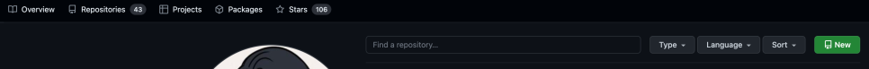

그러면 다음과 같이 Repository(저장소)의 이름을 기입하는 란이 있는데 이 부분에 내 깃허브 닉네임을 넣으면 된다. 필자의 깃허브 닉네임은 'bnbong'이므로 bnbong으로 적어주었다.

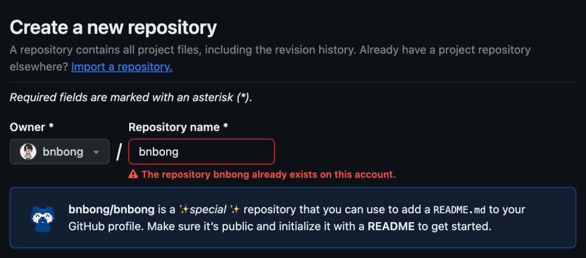
/// caption
이미 만들어둔 저장소가 있기 때문에 위처럼 오류가 나지만 처음 만드는 경우라면 정상적으로 저장소를 만들 수 있다.
///

그리고 스크롤을 살짝 내리면 하단에 Add a README file 체크박스가 있는데 해당 부분을 체크하면 저장소가 생성될 때 자동으로 REAMDE.md 파일이 만들어진다.

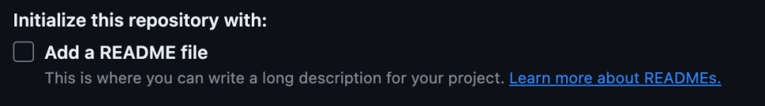

위 체크박스에 체크를 한 후 하단의 Create repository 버튼을 눌러 저장소를 생성한다.

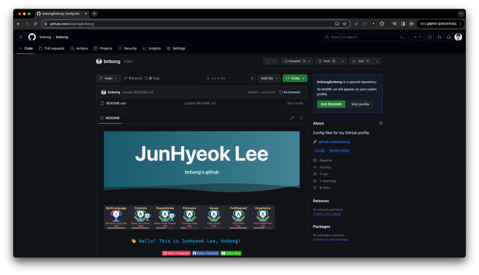
/// caption
필자는 이미 프로필을 꾸며놓았기 때문에 뭐가 많이 보임..
///

생성이 완료되면 위와 같이 생성된 저장소의 페이지가 뜨고 우측 상단에 다른 소스코드 저장소에서는 볼 수 없던 설명이 보일 것이다.

다음과 유사한 설명이 저장소에 뜬다면 성공이다.

!!! success
    <유저닉네임>/<유저닉네임> is a special repository.

    Its README.md will appear on your public profile.

그렇게 되면 내 프로필 링크로 들어갔을 때 다음과 같이 자기 소개를 쓸 수 있는 README.md가 보인다.

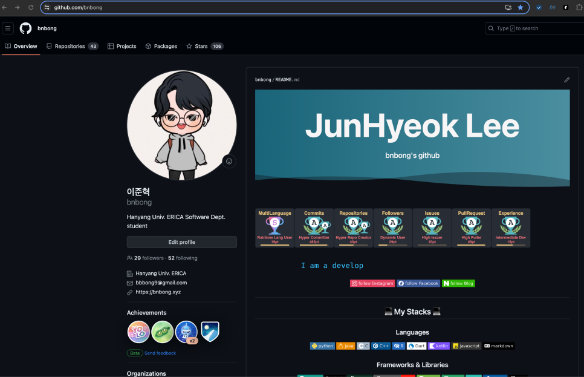

자, 이제 자기소개를 꾸며보자.

## README 꾸미기

우리가 작성하는 문서는 .md 파일, 마크다운 파일이다.

위에서 만든 README 파일은 마크다운 파일이기 때문에 당연히 마크다운 문법이 적용될 수 있으며 HTML의 다양한 태그 또한 정상적으로 .md 파일에서 렌더가 된다.

우리는 이러한 특성들을 이용해서 README 파일을 예쁘게 꾸며볼 것이다.

### 1. 뱃지 달기

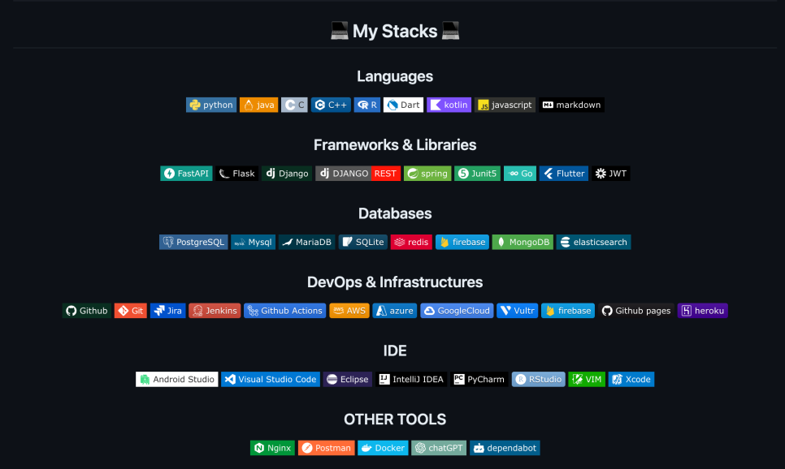

내가 어떤 도구, 언어, 인프라를 다룰 수 있는지 일일이 글로 적는 것 보다 때로는 한눈에 들어오는 로고나 그림 등으로 기재하는 것이 효과적일 때가 있다.

특히 자신의 기술 스택이 나날이 쌓여가면 글로 적기엔 가독성 측면이든 여러모로 애매해질 수 있다. 이때 사용하기 좋은 것이 바로 뱃지이다.

```preview
https://shields.io/badges
```

위 링크는 뱃지 이미지를 적용하는 방법이 기술된 공식 문서이다. 대충 요약하자면 shields.io의 뱃지는 글자, 아이콘, 아이콘 색, 배경 색 뱃지의 테두리 등을 수정할 수 있다.

예를 들어 다음과 같이 뱃지의 글자는 'python', 아이콘은 Python 모양으로, 배경 색은 HEX 값 ffdd54, 아이콘 색은 3670A0, 뱃지 테두리는 flat-square옵션을 준 뱃지는 다음과 같이 코드를 넣어서 만들 수 있다.

```html

```

그러면 README.md 파일에서 해당 뱃지는 다음과 같이 렌더가 된다.

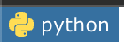

색이나 아이콘, 글자 등 모든 옵션이 다 자유롭게 설정할 수 있다.

다만 뱃지를 만들다보면 너무 자유로운 나머지 뭔가 표준을 찾고 싶을 때가 오는데 이 때 참고하기 좋을만한 자료가 있다.

```preview
https://github.com/alexandresanlim/Badges4-README.md-Profile
```

위 저장소는 정말 다양한 뱃지 양식을 제공하고 있다. 언어 뿐만 아니라 이메일 뱃지, 게임 뱃지 등 정말 다양한 카테고리의 뱃지들이 만들어져 있다.

필자는 위 링크에 만들어져 있는 뱃지의 아이콘, 배경 색, 아이콘 색 등을 참고하여 기술 Stack 부분에 기재할 도구 및 언어 들의 뱃지를 만들고 있다.

shields.io사이트의 뱃지는 기술 Stack 기재용 뿐만 아니라 다른 목적으로도 다양하게 사용될 수 있다. 뱃지를 좀 더 다양하게 활용하는 방법에 대해서는 다음 링크를 참고하면 좋다.

```preview
https://github.com/Naereen/badges
```

### 2. 더 화려하게

'나'라는 사람이 할 수 있는 것을 좀 더 효과적으로 표현하기 위해서 내가 해왔던 것들의 전반적인 상태창(?)같은 것이 필요해질 수 있다.

그럴때 사용하기 좋은 것은 바로 readme-stats이다.

```preview
https://github.com/anuraghazra/github-readme-stats
```

이걸 활용하면 README.md에 내 코드 기여 상태를 요약한 위젯 등을 마크다운 파일에 띄울 수 있다.

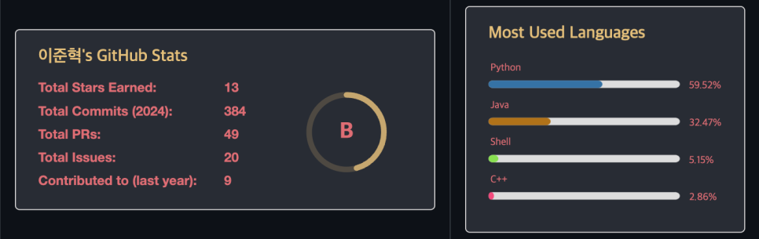

위 링크에서 설명해주는 대로 이것 저것 위젯들을 만지다 보면 특정 기간 동안의 내 코드 기여를 정량적으로 분석하여 Rating이 매겨질 수 있고, 내가 업로드한 저장소의 소스코드들의 언어의 종류를 바탕으로 어떤 언어를 제일 많이 커밋하는지도 표시할 수 있다.

이 또한 자세한 내용은 위 공식 문서를 바탕으로 차근차근 따라하는 것이 좋다.

</br>

만약 내가 알고리즘 덕후라면 <b>알고리즘 문제 해결 능력</b>에 대해서도 이 README에 기재하고 싶을 때도 있을 것이다.

이 것도 readme-stats 양식의 위젯으로 띄울 수 있다.

```preview
https://github.com/hyp3rflow/github-readme-solvedac
```

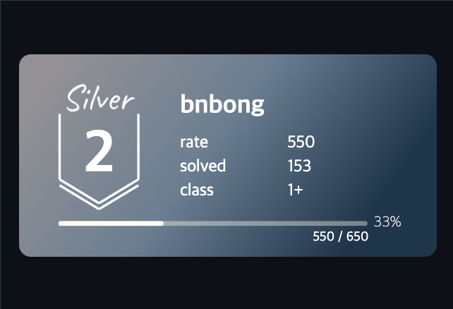
/// caption
난 알고리즘하고는 안친하고 친해지고 싶지 않아서....
///

위처럼 내 알고리즘 티어를 보여줄 수 있다.

우선 solved.ac 계정이 있어야한다.

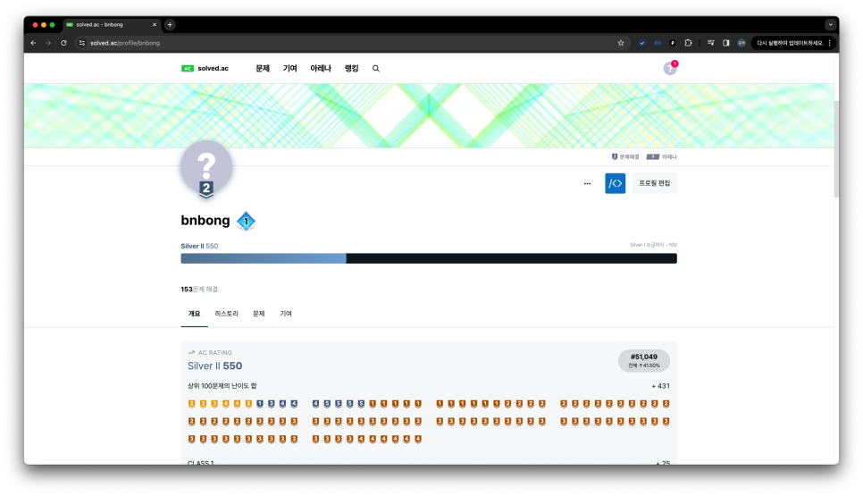

백준 계정이 있으면 solved.ac 계정 연동은 매우 간편하다. 요즘 MZ한 개발자들은 모두 백준을 풀어요 홍홍

계정의 존재까지 확인했으면 위의 링크로 들어가서 설명해준대로 그대로 README.md에 때려박으면 된다. <b>readme-stats 기능과 똑같다.</b>

### 3. 더더 화려하게!!

README.md 파일은 문서 파일이므로 정적일 수 밖에 없다. 그러나 이 삭막한 마크다운 파일에 동적인 인터렉션을 줄 수 있다.

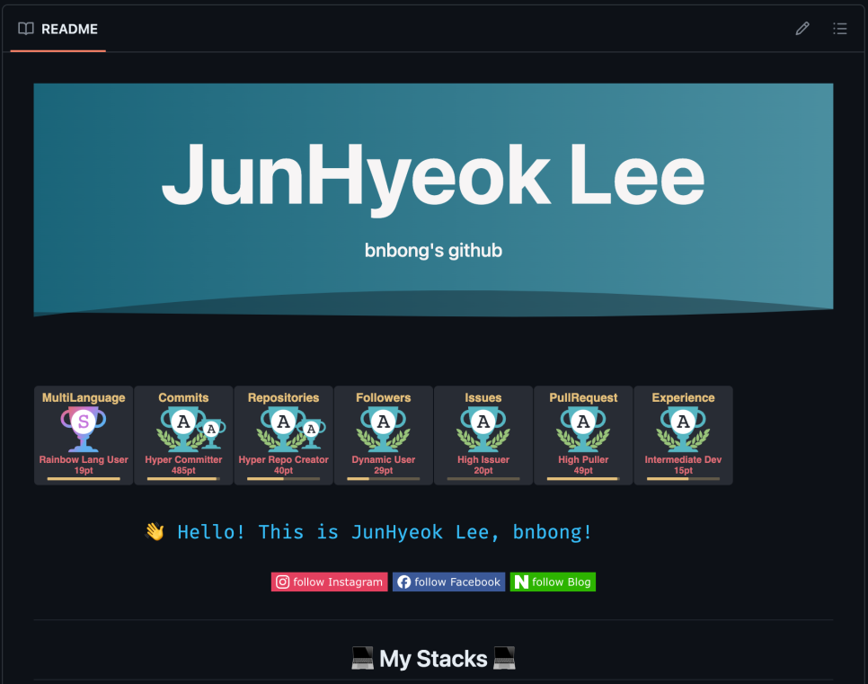

캡처한 사진으로는 재현할 수 없지만 위에있는 JunHyeok Lee 헤더의 배경은 물결마냥 흘러가는 인터렉션이 적용되어 있다.

또한 아래의 파란 글자로 Hello World를 외치는 문자도 지 마음대로 나타났다 사라졌다를 반복하고 있다. 차례차례 짚고 넘어가보자.

```preview
https://github.com/kyechan99/capsule-render
```

위 링크에서 설명하는 대로 따라하면 <b>헤더와 푸터 부분에 인터렉션</b>을 넣을 수 있다.

현재 내 프로필에 설정되어 있는 헤더의 코드는 다음과 같다.

```html

```

HTML, CSS 작성에 익숙한 사람이라면 위의 공식 문서의 설명을 바탕으로 어렵지 않게 자신의 입맛대로 헤더, 푸터의 인터렉션을 꾸밀 수 있다.

글자를 사라졌다, 나타났다 하는 인터렉션은 Typing SVG를 사용하면 된다.

```preview
https://github.com/DenverCoder1/readme-typing-svg
```

인터렉션을 넣어줄 문장을 테스트하고 싶다면 다음 사이트에서 할 수 있다. 편리하게 문장을 입력하면 해당 문장의 인터렉션을 적용할 수 있는 소스코드를 클립보드로 편리하게 복사할 수 있는 코드를 즉시 제공해준다.

```preview
https://readme-typing-svg.demolab.com/demo/
```

내 프로필에 적용되어 있는 인터렉션 문장의 코드는 다음과 같다.

```html
<h2 align="center"><a href="https://git.io/typing-svg"></a><p align="center">
```

### 4. 더더더더더더더 화려하게!!!!!!!!!!

지구에서 제일 예쁜 깃허브 프로필로 세상을 뿌셔버리고 싶다면 다음 링크를 참고하면 된다. 앞서 설명한 뱃지 적용 방법부터 별의별 신기한 인터렉션을 리드미에 넣는 방법들도 기재되어 있다.

```preview
https://github.com/rzashakeri/beautify-github-profile
```

천천히 문서를 핥아보면서 자신의 프로필을 예쁘게 꾸며보길 바란다.

---

이번 포스팅에서 참고 사진으로 쓰인 필자의 깃허브 프로필 링크는 다음과 같다.

```preview
https://github.com/bnbong
```

필자의 프로필 저장소의 README.md 파일을 클릭하면우측에 Raw라는 버튼이 보일텐데, 이 버튼을 누르면 내 README.md 파일의 날 것의 소스코드를 볼 수 있다.

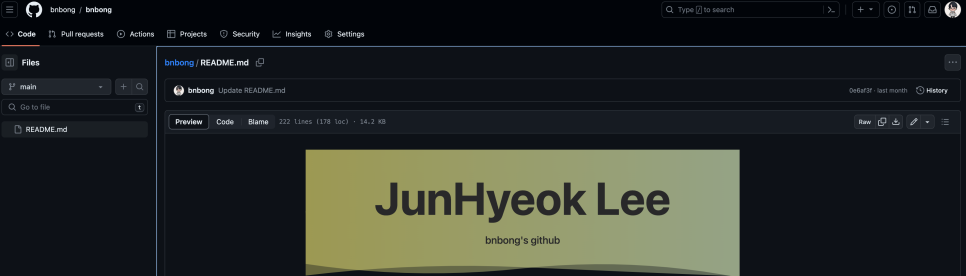

사진에 보이는 것처럼 우측에 있는 Raw 버튼을 클릭하면 다음과 같이 코드 전문을 볼 수 있다.

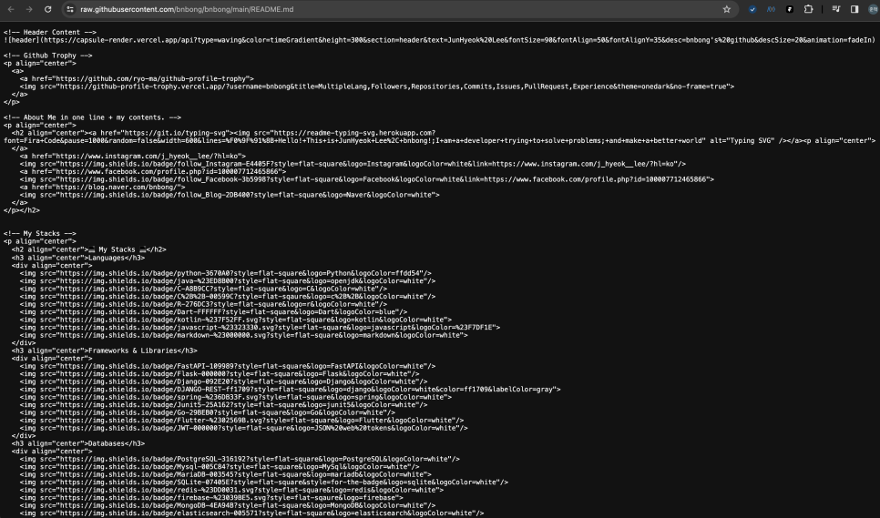

__고기는 구워 먹는 것도 맛있지만 날로 먹는 것도 맛있듯__ 이 필자의 README.md를 날것 그대로 돚거해가며 여러분들의 프로필을 잘 꾸며보길 바랍니다ㅎㅎ

</br>

그런데 요즘 자신의 깃허브 프로필 README를 이력서마냥 빡세게 정리해놓는 사람들이 늘고 있다.

이 이유는 요즘 스타트업을 포함한 여러 기업들이 이력서로 깃허브 프로필 README를 참고하고 있기 때문이다.

우리나라는 잘 모르겠는데 해외 기업들은 깃허브 프로필의 리드미나 깃허브 저장소에 있는 코드 기여 내역들을 유의미한 평가 지표로 활용하고 있다고 한다. 노션 이력서와 비슷한 느낌이다.

단순히 꾸미기 용도가 아니라 실제 이력서 작성을 위한 목적으로 깃허브 프로필 리드미를 꾸미고자 한다면 다음 외부 레퍼런스를 참고하면 매우 좋을 듯 하다.

```preview
https://justinchronicles.net/ko/2023/07/07/github-profile-as-resume/
```

만약 리드미 프로필에 무엇을 적어야하는지 막막하다면 다음 Template를 기반으로 채워나가면서 시작해도 좋다. 하단에 필자가 첨부한 링크 뿐만아니라 검색을 통해 다양한 리드미 프로필 양식을 찾을 수 있으니 본인이 원하는 탬플릿으로 리드미 프로필 꾸미기를 시작해보자.

```preview
https://gist.github.com/wonhyeongseo/fe09e0e625fb8b6d86a1adb90f211469
```
