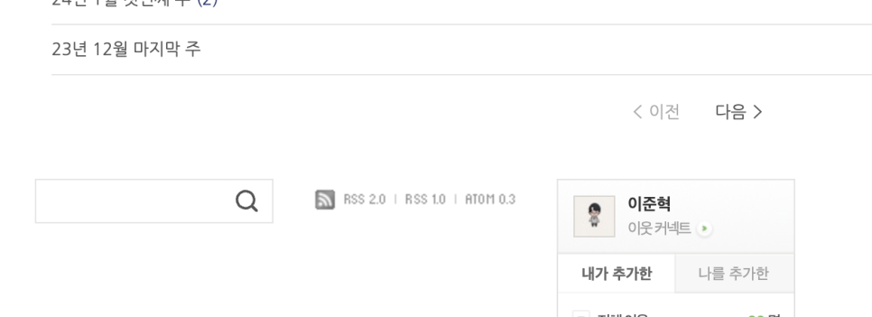
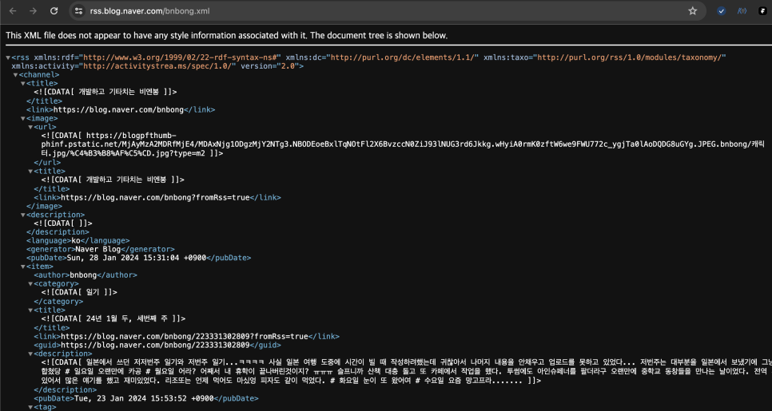
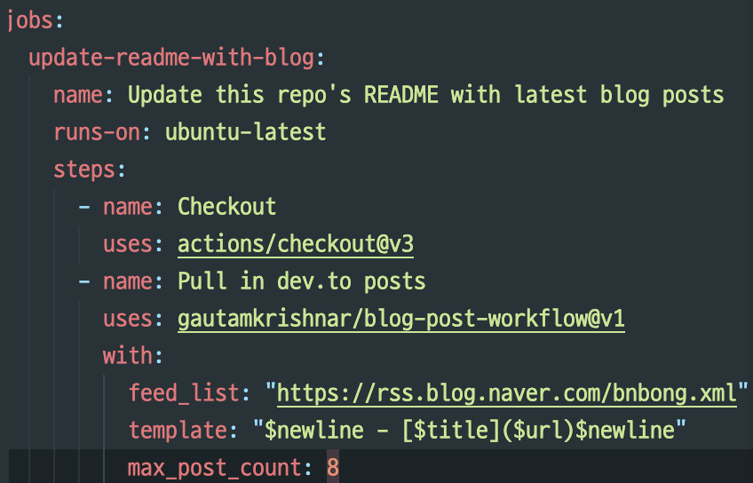
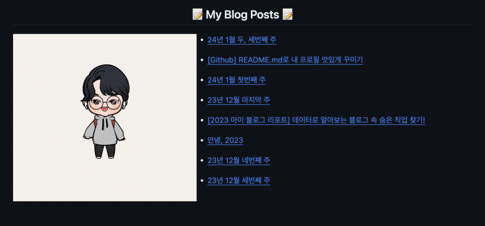
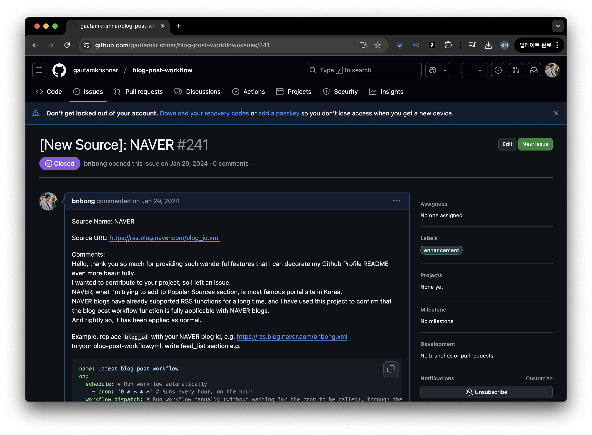
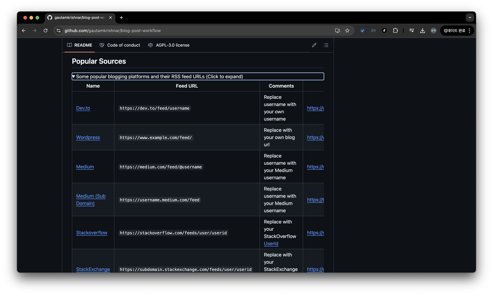
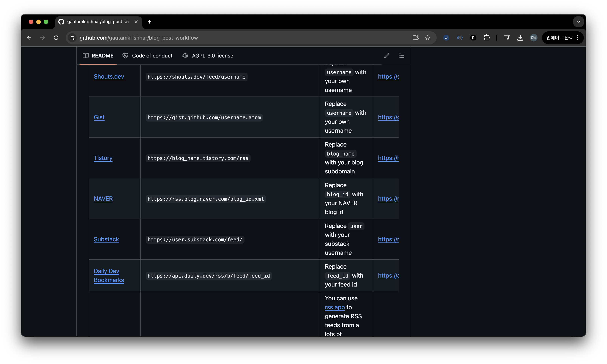
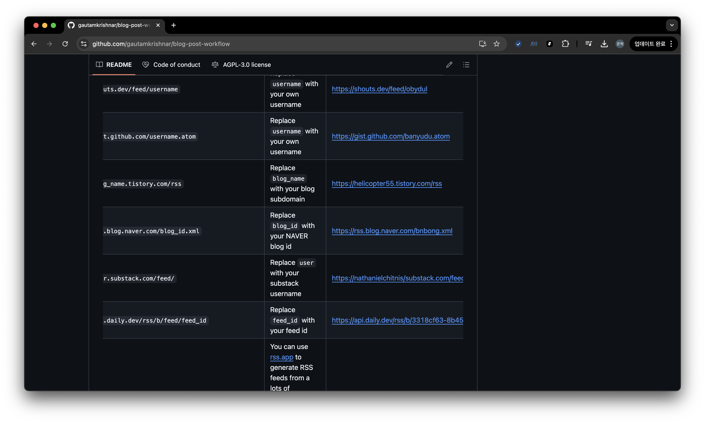
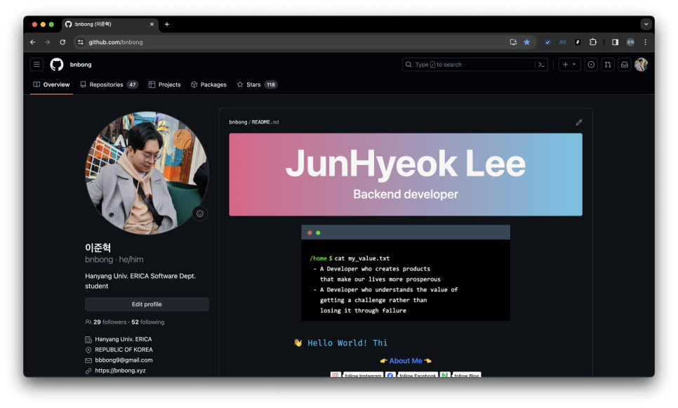
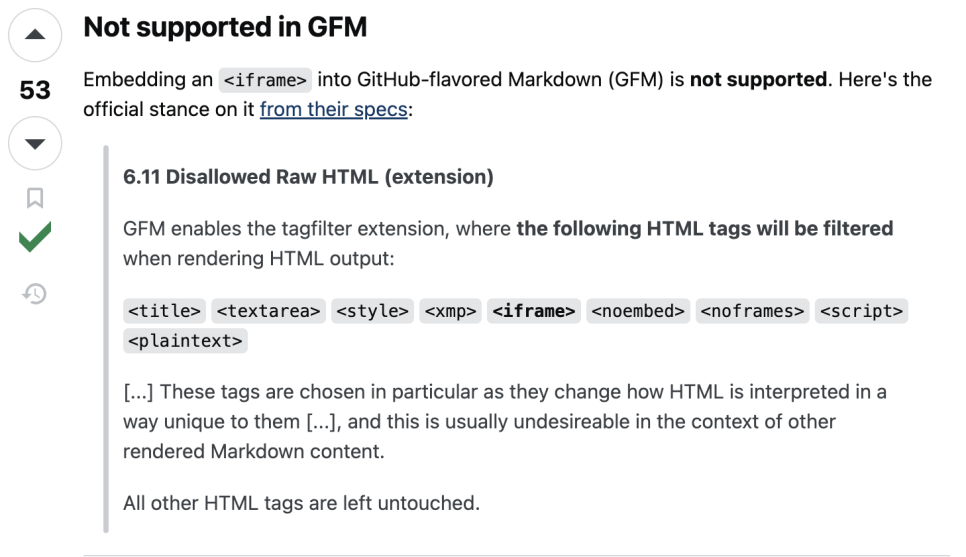

지난 포스트에서는 깃허브 저장소의 README.md를 활용하여 내 소개를 프로필에 띄우는 방법에 대해서 다뤘었다.

```preview
https://bnbong.github.io/blog/2024/01/12/github-readmemd%EB%A1%9C-%EB%82%B4-%ED%94%84%EB%A1%9C%ED%95%84-%EB%A7%9B%EC%9E%88%EA%B2%8C-%EA%BE%B8%EB%AF%B8%EA%B8%B0/
```

그동안 사업 일 때문에 코딩을 못하고 있다가 깃허브 잔디에 자꾸 빈공간이 생기는게 마음에 걸려서 내 깃허브 프로필 소개를 업데이트를 하고자 내가 작성했던 포스팅을 참고하면서 프로필을 업데이트 하는 과정을 지난 3일간 진행했다.

다음 깃허브 저장소에 소개된 README를 꾸미는 방법을 꼼꼼히 참고하면서 수정을 거쳤다.

```preview
https://github.com/rzashakeri/beautify-github-profile
```

정말 많은 분량의 리드미 꾸미는 방법이 소개되어 있는데, 그 중 내가 작성했던 블로그 포스팅을 실시간으로 README에 반영하는 방법이 소개되어 있어서 신기해서 이걸 적용시키는 방법에 대해서 이번 포스팅에서 다뤄보고자 한다.

먼저, 본문에 들어가기 전에 __RSS의 개념__ 에 대해서 인지를 하고 있을 필요가 있다.

---

## RSS란?

RSS의 표준 개념은 다음과 같다.

!!! info "RSS 개념"
    RSS(Rich Site Summary)는 뉴스나 블로그 사이트에서 주로 사용하는 콘텐츠 표현 방식이다.<br>

    <https://ko.wikipedia.org/wiki/RSS>

단순 명료한 개념이다.

이 RSS가 탄생하게 된 이유는 ==사용자의 편의성을 고려하기 위해서== 이다.

RSS가 등장하기 전에는 원하는 정보를 얻기 위해 해당 사이트를 직접 방문하여야 했으나, RSS 개념이 탄생하고 규격이 확립되면서 정보를 자동으로 편리하게 수집할 수 있게되었다.

마치 우리가 자주 보는 유튜브에 자주 보는 채널을 구독해서 해당 채널의 최신 영상을 내가 직접 찾아갈 필요 없이 유튜브 피드에서 바로 볼 수 있는 것과 동일하다.

즉, ==**RSS의 의의는 사용자는 각각의 사이트 방문 없이 최신 정보들만 골라 한 자리에서 볼 수 있는 것**== 에 있다.

## README에 내가 작성한 블로그 포스트 실시간 연동시키기

<!-- more -->

이제 본문으로 들어와서, 깃허브 README에 내가 블로그 포스팅으로 작성한 게시물들을 실시간으로 띄울 수 있는 기능은 다음 Repo에 소개되어 있다.

```preview
https://github.com/gautamkrishnar/blog-post-workflow
```

적용 방법은 상단의 링크에 잘 소개 되어 있고 가이드 영상까지 존재하기에 영상을 보면서 차근차근 따라할 수 있다.

[](https://www.youtube.com/watch?v=ECuqb5Tv9qI&t=272s)
/// caption
가이드 영상
///

상단의 설명 중간부분에 보면 RSS 블로그 피드를 `.github/workflows/<내 블로그 workflow yml 파일>`의 **feed_list** 항목에 URL로 넣어줘야한다고 설명이 되어 있다.

여기서 넣어야할 RSS 피드의 링크 또한 설명서를 좀 더 내려가다 보면 Popular sources에서 확인할 수 있다.

Tumblr나 Velog 블로그를 운영중이라면 상단 Repo에서 **Popular sources** 에 RSS 피드 링크가 소개되어 있는 것을 볼 수 있다.

```preview
https://github.com/gautamkrishnar/blog-post-workflow
```

그러나 네이버 블로그는 한국에서 자주 사용하는 블로그 서비스이다 보니 소개되어 있지 않다.

그럼에도 네이버 블로그는 이미 오래전부터 RSS 기능을 지원했고, 당연히 내 블로그의 RSS 피드도 확인할 수 있어 상단의 가이드라인을 따라하며 내 블로그 포스트들을 README에 적용시킬 수 있다.

네이버 공식 문서에서 RSS 가이드라인을 확인할 수 있다.

```preview
https://searchadvisor.naver.com/guide/request-feed
```

</br>

필자의 블로그를 기준으로 내 블로그의 RSS 피드 링크를 확인하는 방법은 다음과 같다.



내 블로그 메인 페이지나 혹은 설정 페이지에서 잘 찾아보면 사진과 같이 RSS 2.0, RSS 1.0 ATOM 0.3 이라는 텍스트링크가 보일텐데 저걸 누르면 다음과 같이 XML 소스코드가 나온다.



상단에서 볼 수 있는 링크가 바로 네이버 블로그의 RSS 피드 링크이다.

저 링크를 복사한 후 `.github/workflows/<내 블로그 workflow yml 파일>` 항목에 붙여넣어주면 된다.



그러고 나서 가이드라인대로 Github Actions Workflow를 돌려주면 Github가 알아서 내 네이버 블로그 포스팅 피드를 가져와준다.

따로 블로그 포스트 링크를 하나하나 가져와서 작성해줄 필요 없이 그냥 자동으로 연동이 된다.


/// caption
왼쪽의 프로필 사진은 내가 따로 추가한 사진이다. workflow는 블로그 포스트 데이터만 가져와준다.
///

이렇게 내 깃허브 프로필 README에 새로운 방식으로 남들에게 내 TMI를 주절거릴 수 있게 되었다.

## 25.01.02 업데이트

NAVER 블로그 RSS 피드를 사용하여 상단의 blog-post-workflow 오픈소스에 적용하는 방법에 대해 필자가 직접 공식 문서에서 가이드 하도록 기여하였다.

```preview
https://github.com/gautamkrishnar/blog-post-workflow/issues/241
```



24년 1월에 이슈로 등록하여 5월에 merge 되어 공식 README.md 가이드의 [Popular Sources](https://github.com/gautamkrishnar/blog-post-workflow?tab=readme-ov-file#popular-sources)에 추가되었다.



위 탭을 확장하여 내리다보면 NAVER 적용법이 보인다.



그리고 NAVER 항목 우측에 예시로 적혀 있는 RSS 피드 링크로 필자가 운영하고 있는 일상용 블로그 RSS 피드 링크가 기재되어 있다.



작지만 재미있던 오픈소스 기여였다ㅎ

---

## 번외

필자의 깃허브 프로필 README가 업데이트 되었다.



```preview
https://github.com/bnbong
```

현재 블로그에서 사용하고 있는 프로필사진을 좀 오래썼기에 좀 식상해서 프로필 사진도 바꾸고 이것저것 꾸며보았다.

그러던 중 겪었던 사소한 시행착오와 팁이 생겨서 번외로 살짝 다뤄보고자 한다.

### 1. 터미널 스타일의 TMI 넣기

```preview
https://www.terminalgif.com/
```

위 Terminal Gif Maker은 말 그대로 Terminal 스타일의 Gif를 만들어주는 사이트이다.

터미널에 작성할 텍스트 내용과 텍스트 속도, 폰트, 배경 색 등 다양하게 커스터마이징이 가능해서 본인의 입맛대로 터미널 Gif를 꾸밀 수 있다.

필자는 기존 README 프로필 하단에 작성했던 TMI가 너무 투머치해서 내가 개발자로서 추구하는 가치를 서술할 용도로 사용했다.

### 2. Github Markdown은 iframe HTML 태그를 지원하지 않는다.

README 프로필을 꾸미다가 iframe로 이미지 임베딩을 넣어주고 싶어서 iframe HTML 태그를 붙여 커밋했던 적이 있었는데
내 깃허브 프로필에 해당 이미지가 렌더링되지 않는 현상을 발견했다.

다른 뷰어에서는 정상적으로 보이는 이미지가 Github README에서만 나오지 않길래 찾아봤는데 결론은 Github Markdown은 ==iframe 태그를 지원하지 않는다== 고 한다.

```preview
https://stackoverflow.com/questions/48402823/embed-openstreetmap-iframe-in-github-markdown/54613247#54613247
```



상단의 stackoverflow 답변을 발췌하자면 상단에서 소개된 태그들은 Github에서 필터링하여 렌더링이 된다고 한다.

따라서 iframe 태그도 필터링이 되어 렌더링이 됐기 때문에 보이지 않았던 것이었다.

README 프로필 꾸미기를 할 때 참고하면 좋을 것 같다.

---

깃허브에 잔디를 심기엔 프로필 꾸미기 만큼 좋은 것이 없다ㅋㅋ
