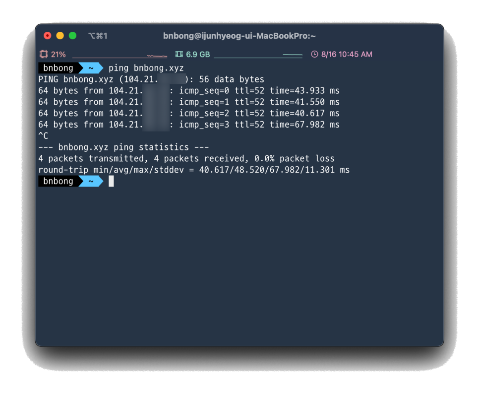
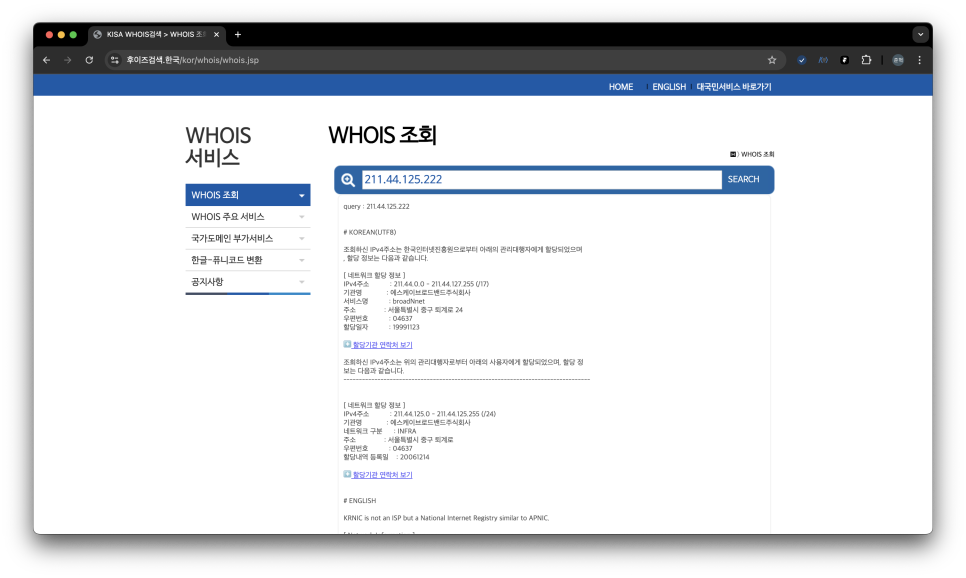
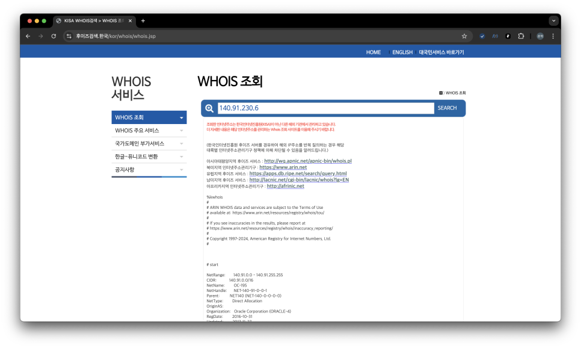
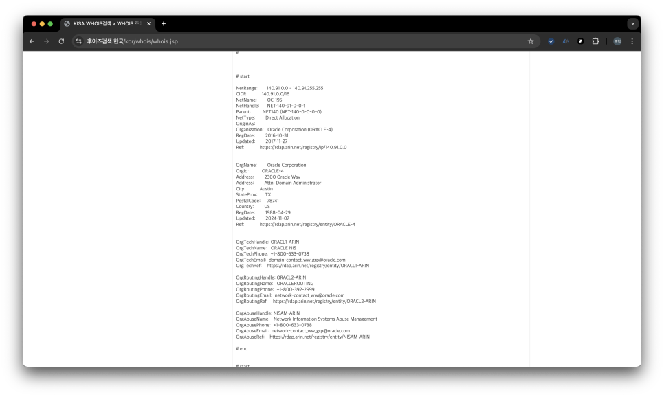

필자는 현재 외부에서 내 개인 클라우드 서버에 접속할 수 있도록 도메인 + DNS 서비스에 인스턴스 퍼블릭 IP를 물려서 도메인 URL로 타겟 인스턴스에 접근할 수 있도록 구성을 해두었다.

많고 많은 DNS 서비스 중 CloudFlare을 사용하게 되었는데 가장 큰 이유는 보안적인 측면에서 좋다고 검증이 되어 있는 기능들을 많이 제공하고 있기도 하고, 개인은 무료로 사용할 수 있다는 장점 덕분에 사용하게 되었다.

CloudFlare의 DNS 기능 중 흥미로운 기능이 있는데, 바로 DNS 레코드에 프록시를 설정할 수 있는 기능이다.


레코드 우측에 프록시 상태 부분을 체크하면 타겟 인스턴스의 Public IP가 숨겨지기 때문에 외부에서 내 인스턴스의 Public IP를 알 수 없게 되는 장점이 있다고 한다.

이게 어떻게 숨겨지는지 궁금해서 명령어를 통해 CloudFlare DNS 레코드 프록시 기능이 켜져 있는 내 인스턴스로 네트워크 접근 경로를 찍어보았다.

다만 모든 서비스의 기능 동작을 완벽하게 이해한 것이 아니라서 일부 추측성 내용을 가미하여 삽질한 과정을 포스팅하고자 한다..

<!-- more -->

## Traceroute 명령어를 통한 인스턴스 접근 시도 (첫 번째 시도)
CloudFlare DNS는 캐시기능이 존재하기 때문에 기존에 접속 요청을 보낸 IP(source IP)를 일정 시간 보관하고 있을 것이다. 즉, 내 집에서 보낸 요청은 이미 캐싱이 되어서 traceroute로 찍히는 네트워크 경로 중 일부가 생략되어 표시될 가능성이 존재하다는 말이다.

따라서 No-Cache 환경에서 테스트를 수행하기 위해 다른 라우터 환경으로 맥북을 가지고 이동하여 집에서 보내는 source ip와 다른 ip로 traceroute 명령어를 입력해보았다.

traceroute 명령어는 target 머신이 ICMP 프로토콜을 허용하고 있어야 제대로 네트워크 경로가 찍히기 때문에 당연히 ICMP 포트를 열어주었고 동일하게 ICMP 프로토콜을 사용하는 ping 명령어로 통신에 문제가 없음을 확인했다.



이번 포스팅 전체를 훑어보면 알 수 있는 내용이나 ping 명령어에서부터 destination IP가 인스턴스의 실제 Public IP와 다르게 나와 있다
-> CloudFlare DNS가 열일하고 있다는 증거 벌써 발견
하단 footage에서 계속해서 소개될 destination이 되는 내 인스턴스의 Public IP는 `158.180.{비밀이양}.{안알려줌}`로 가릴 예정이다. 이 destination IP가 계속해서 등장할 예정이니 기억하자.

DNS를 물려서 도메인 이름으로 인스턴스에 접속이 가능하나 우선 인스턴스의 Public IP, 즉 destination IP를 그대로 traceroute에 찍어보았고 그 결과는 다음과 같다.

```bash
MacBookPro ~ % traceroute 158.180.{비밀이양}.{안알려줌}
traceroute to 158.180.{비밀이양}.{안알려줌} (158.180.{비밀이양}.{안알려줌}), 64 hops max, 52 byte packets
 1  172.25.{보면안돼}.{떽} (172.25.{보면안돼}.{떽})  6.126 ms  2.668 ms  3.125 ms
 2  172.25.{보면안돼}.{떽} (172.25.{보면안돼}.{떽})  5.110 ms  3.761 ms  5.473 ms
 3  172.28.{보면안돼}.{떽} (172.28.{보면안돼}.{떽})  4.842 ms  6.053 ms  6.574 ms
 4  172.28.{보면안돼}.{떽} (172.28.{보면안돼}.{떽})  5.451 ms  5.093 ms  5.265 ms
 5  121.78.{보면안돼}.{떽} (121.78.{보면안돼}.{떽})  6.482 ms  4.254 ms  7.719 ms
 6  192.168.{보면안돼}.{떽} (192.168.{보면안돼}.{떽})  5.686 ms
    192.168.{보면안돼}.{떽} (192.168.{보면안돼}.{떽})  5.817 ms  6.650 ms
 7  203.246.{보면안돼}.{떽} (203.246.{보면안돼}.{떽})  6.738 ms
    203.246.{보면안돼}.{떽} (203.246.{보면안돼}.{떽})  6.147 ms
    203.246.{보면안돼}.{떽} (203.246.{보면안돼}.{떽})  4.757 ms
 8  140.91.{보면안돼}.{떽} (140.91.{보면안돼}.{떽})  9.709 ms
    140.91.{보면안돼}.{떽} (140.91.{보면안돼}.{떽})  10.413 ms  10.040 ms
 9  * * *
10  * * *
11  * * *
12  * * *
13  * *^C
```

트래픽을 보내는 source 환경이 어떻게 구성되어 있냐에 따라서(라우터의 개수 차이 등...) 인터넷 게이트웨이로 접근하게 되는 경로 홉에 차이가 생길 수 있어서

다른 destination으로 같은 traceroute 명령어를 입력해여 추측해본 결과 7~8번 홉부터 인터넷 게이트웨이를 통과하여 destination으로 접근한다는 것으로 파악을 하였다.

상단의 로그에서도 동일하게 7번 홉까지는 내부 라우터를 경유하는 것으로 보이고 8번 홉부터 인터넷 게이트웨이를 경유하여 인스턴스로의 접근을 시도하는 것으로 판단할 수 있었다.

그러나 destination 인스턴스에 CloudFlare DNS를 물렸기 때문에 9번 홉부터 네트워크 경로가 마스킹된 것을 볼 수 있었다. CloudFlare DNS가 접근을 차단한건지, 아니면 경로 자체는 잘 거쳐서 트래픽이 이동중이나 CloudFlare DNS가 마스킹한건지는 알 수 없었다.

추측하건데 9번 홉 경로부터는 정상적인 도메인 기반 접근 방식이었다면 DNS 라우팅 테이블을 거쳐 destination IP를 찾아야하나, 상기 시나리오에서는 DNS 라우팅 테이블을 bypass하여 destination IP에 직접 접근을 시도했기 때문에 CloudFlare가 접근 자체를 차단 한 것으로 생각했다.


다음 테스트는 도메인으로 traceroute를 찍어보았다. destination 도메인 이름은 bnbong.xyz이다(만원이 약간 안되는 저렴이 도메인ㅎ).

```bash
MacBookPro ~ % traceroute bnbong.xyz
traceroute: Warning: bnbong.xyz has multiple addresses; using 104.21.{보면안돼}.{떽}
traceroute to bnbong.xyz (104.21.{보면안돼}.{떽}), 64 hops max, 52 byte packets
 1  172.25.{보면안돼}.{떽} (172.25.{보면안돼}.{떽})  9.159 ms  2.419 ms  2.558 ms
 2  172.25.{보면안돼}.{떽} (172.25.{보면안돼}.{떽})  3.312 ms  5.225 ms  4.778 ms
 3  172.28.{보면안돼}.{떽} (172.28.{보면안돼}.{떽})  5.751 ms  4.516 ms  4.098 ms
 4  172.28.{보면안돼}.{떽} (172.28.{보면안돼}.{떽})  6.361 ms  3.721 ms  4.205 ms
 5  121.78.{보면안돼}.{떽} (121.78.{보면안돼}.{떽})  3.409 ms  3.653 ms  3.141 ms
 6  192.168.{보면안돼}.{떽} (192.168.{보면안돼}.{떽})  4.086 ms
    192.168.{보면안돼}.{떽} (192.168.{보면안돼}.{떽})  6.097 ms  6.330 ms
 7  203.246.{보면안돼}.{떽} (203.246.{보면안돼}.{떽})  6.485 ms  5.721 ms  6.482 ms
 8  139.150.{보면안돼}.{떽} (139.150.{보면안돼}.{떽})  5.062 ms  7.109 ms  6.553 ms
 9  * * *
10  be4409.ccr71.sel01.atlas.cogentco.com (154.54.{보면안돼}.{떽})  9.445 ms  7.215 ms  6.703 ms
11  be3010.ccr71.tyo01.atlas.cogentco.com (154.54.{보면안돼}.{떽})  39.728 ms  39.126 ms  49.597 ms
12  be3011.ccr21.hkg02.atlas.cogentco.com (154.54.{보면안돼}.{떽})  90.038 ms  91.866 ms  87.871 ms
13  be2226.ccr21.hkg02.atlas.cogentco.com (154.54.{보면안돼}.{떽})  96.386 ms  92.822 ms  93.049 ms
14  be2414.rcr51.hkg01.atlas.cogentco.com (154.54.{보면안돼}.{떽})  94.670 ms  92.585 ms
    cloudflare.demarc.cogentco.com (154.18.{보면안돼}.{떽})  90.797 ms
15  103.22.{보면안돼}.{떽} (103.22.{보면안돼}.{떽})  110.033 ms
    cloudflare.demarc.cogentco.com (154.18.{보면안돼}.{떽})  87.376 ms
    103.22.{보면안돼}.{떽} (103.22.{보면안돼}.{떽})  137.730 ms
16  104.21.{보면안돼}.{떽} (104.21.{보면안돼}.{떽})  86.471 ms  86.773 ms  90.538 ms
```

상기한 명령어는 3일 동안 환경을 달리하면서 명령어를 찍어보았다. 매 시도마다 로그로 찍히는 네트워크 경로에 살짝 차이가 있어서 로그 중 유의미하다고 판단이 된 로그를 들고왔다.

앞서 언급한대로 7~8번 홉 이후 부터 인터넷 게이트웨이를 경유하여 내 인스턴스로 접근을 하게 된다고 판단하였고 상기 로그에서도 비슷하게 9번 홉부터 경로가 마스킹되었으며 10번홉부터 IP주소가 아니라 도메인 주소가 찍히는 것을 볼 수 있었다.

이 시행은 destination으로 연결을 한 번도 수행한적이 없는 환경에서 시행한 것이기 때문에 당연히 DNS cache가 없을것이다. 따라서 10 ~ 15번홉은 DNS 서버들의 라우팅 테이블을 계속 거치면서 탐색하여 destination을 찾는 과정일 것이다.

15번 홉에서 경유한 DNS 서버의 라우팅테이블에서 힛을 쳐서 destination을 찾은 것으로 보이고 16번 홉에서 traceroute 명령어가 종료되었다.

그러나 destination IP가 내 인스턴스의 실제 Public IP와 차이가 있었다.

- **실제 Public IP** : 158.180.{비밀이양}.{안알려줌}
- **traceroute에 찍힌 destination IP** : 104.21.{보면안돼}.{떽}

DNS 레코드 프록시 기능이 꺼져있는 상황이라고 가정해보면 15번 홉부터는 내 인스턴스까지의 라우팅을 발견하여 인스턴스가 들어있는 VPC(실제로는 오라클 클라우드를 사용하고 있기 때문에 실제 명칭은 VCN)에 도달하고 그 이후부터 Public Subnet에 있는 내 인스턴스에 도착해야 할 것이다.

하지만 DNS 레코드 프록시 기능이 켜져 있었기에 VPC gateway 주소와 다르게 찍힌 것을 볼 수 있었고 심지어 로그에 찍힌 destination IP와 내 인스턴스 Public IP는 완전히 달랐다.

이를 통해 CloudFlare DNS 레코드 프록시가 열일하고 있다는 것을 알 수 있었다.

---

뇌피셜이 일부 가미된 삽질이라 틀린 부분이 있을 수 있다

결국 '다 해주는' 클라우드 플레어 쵝오

---

## 11월 17일 수정 내용

MacOS 환경에서 터미널에 traceroute를 수행할 때 별 다른 옵션을 넣지 않으면 traceroute를 ICMP 프로토콜로 보내지 않고 UDP 프로토콜로 수행한다.

때문에 traceroute 수행 시 icmp 옵션을 명시하지 않으면 ICMP 프로토콜을 사용하는 ping 명령어로 response를 받더라도 traceroute의 response가 도달하지 않고 계속해서 wildcard response가 도달할 수 있다. 이는 경로 사이에 UDP를 허용하지 않는 구간 때문에 traceroute로 건너가는 홉이 다음 홉으로 건너가지 못하는 현상이다.

이에 대한 예시로 잠비아 대학의 사이트로 traceroute 명령어를 입력해보겠다.

잠비아 대학은 현재 내 로컬 머신이 있는 대한민국과 많이 떨어져 있으며, 대략 30개가 안되는 굉장히 많은 경로(홉)를 거쳐 패킷이 도착한다.

www.unza.zm url로 ping 명령어를 날리면 다음과 같이 response가 정상적으로 도달하는 것을 확인할 수 있고, 대략 500ms의 응답시간을 가진다:

```bash
$ ping www.unza.zm
PING www.unza.zm (41.63.1.33): 56 data bytes
64 bytes from 41.63.1.33: icmp_seq=0 ttl=230 time=545.147 ms
64 bytes from 41.63.1.33: icmp_seq=1 ttl=230 time=572.705 ms
64 bytes from 41.63.1.33: icmp_seq=2 ttl=230 time=479.648 ms
64 bytes from 41.63.1.33: icmp_seq=3 ttl=230 time=447.379 ms
64 bytes from 41.63.1.33: icmp_seq=4 ttl=230 time=530.917 ms
^C
--- www.unza.zm ping statistics ---
5 packets transmitted, 5 packets received, 0.0% packet loss
round-trip min/avg/max/stddev = 447.379/515.159/572.705/45.419 ms
```

www.unza.zm url로 icmp 옵션 없이 traceroute 명령어를 입력하면 다음과 같이 특정 홉 이후로 다음 홉으로 넘어가지 않는다:

```bash
$ traceroute www.unza.zm
traceroute to www.unza.zm (41.63.1.33), 64 hops max, 40 byte packets
 1  172.30.1.254 (172.30.1.254)  7.374 ms  11.150 ms  2.782 ms
 2  * * *
 3  119.207.199.13 (119.207.199.13)  10.126 ms  7.807 ms  6.384 ms
 4  112.189.168.17 (112.189.168.17)  8.511 ms  5.639 ms  4.680 ms
 5  112.189.162.225 (112.189.162.225)  18.180 ms
    112.189.162.129 (112.189.162.129)  8.226 ms
    112.189.162.53 (112.189.162.53)  6.180 ms
 6  112.174.49.5 (112.174.49.5)  15.211 ms
    112.174.47.5 (112.174.47.5)  33.532 ms
    112.174.49.137 (112.174.49.137)  16.400 ms
 7  112.174.91.170 (112.174.91.170)  11.750 ms
    112.174.91.22 (112.174.91.22)  18.940 ms
    112.174.91.130 (112.174.91.130)  11.571 ms
 8  112.174.87.46 (112.174.87.46)  145.483 ms  136.282 ms
    112.174.89.22 (112.174.89.22)  136.372 ms
 9  * * *
10  be3243.ccr41.lax01.atlas.cogentco.com (154.54.27.117)  144.050 ms
    be3359.ccr42.lax01.atlas.cogentco.com (154.54.3.69)  149.354 ms  169.500 ms
11  be2931.ccr31.phx01.atlas.cogentco.com (154.54.44.85)  151.816 ms  150.621 ms
    be2932.ccr32.phx01.atlas.cogentco.com (154.54.45.161)  149.161 ms
12  be5471.ccr21.elp02.atlas.cogentco.com (154.54.166.57)  156.898 ms
    be5473.ccr22.elp02.atlas.cogentco.com (154.54.166.69)  154.570 ms
    be5471.ccr21.elp02.atlas.cogentco.com (154.54.166.57)  160.477 ms
13  be3821.ccr31.dfw01.atlas.cogentco.com (154.54.165.25)  168.644 ms
    be3846.ccr32.dfw01.atlas.cogentco.com (154.54.165.29)  173.254 ms
    be3821.ccr31.dfw01.atlas.cogentco.com (154.54.165.25)  165.138 ms
14  be5027.ccr42.atl01.atlas.cogentco.com (154.54.163.53)  192.953 ms
    be5024.ccr41.atl01.atlas.cogentco.com (154.54.163.41)  179.036 ms
    be5027.ccr42.atl01.atlas.cogentco.com (154.54.163.53)  190.912 ms
15  be2112.ccr41.dca01.atlas.cogentco.com (154.54.7.157)  203.845 ms  207.255 ms
    be2113.ccr42.dca01.atlas.cogentco.com (154.54.24.221)  200.839 ms
16  port-channel5042.ccr92.dca04.atlas.cogentco.com (154.54.162.221)  204.531 ms  201.597 ms
    port-channel5927.ccr92.dca04.atlas.cogentco.com (154.54.163.101)  198.770 ms
17  be4155.ccr41.jfk02.atlas.cogentco.com (154.54.30.42)  198.546 ms
    be4188.ccr42.jfk02.atlas.cogentco.com (154.54.30.122)  206.326 ms  203.244 ms
18  be2490.ccr42.lon13.atlas.cogentco.com (154.54.42.86)  290.433 ms  306.085 ms  307.406 ms
19  be2382.rcr21.b015533-1.lon13.atlas.cogentco.com (154.54.61.162)  415.013 ms
    be2375.rcr21.b015533-1.lon13.atlas.cogentco.com (154.54.61.158)  303.665 ms
    be2382.rcr21.b015533-1.lon13.atlas.cogentco.com (154.54.61.162)  273.959 ms
20  149.14.80.210 (149.14.80.210)  278.502 ms  300.481 ms  374.252 ms
21  xe-11-2-0-cape-town-ua-cpt1-ldn1-01.ubuntunet.net (196.32.210.14)  504.173 ms  548.861 ms  508.686 ms
22  xe-0-0-0-johannesburg-ua-jnb1-cpt1-01.ubuntunet.net (196.32.210.4)  519.498 ms  440.771 ms  491.002 ms
23  xe-3-0-0-harare-ua-hre1-jnb1-01.ubuntunet.net (196.32.210.35)  500.799 ms  525.788 ms  486.061 ms
24  xe-1-1-0-lusaka-ua-lun1-gbe1-01.ubuntunet.net (196.32.210.115)  465.269 ms  509.617 ms  527.577 ms
25  lusaka-zamren-ua-lun1-01.ubuntunet.net (196.32.209.37)  494.399 ms
    xe-1-2-0-lusaka-ua-lun1-lun2-01.ubuntunet.net (196.32.210.40)  473.234 ms  608.929 ms
26  * lusaka-zamren-ua-lun1-01.ubuntunet.net (196.32.209.37)  493.494 ms *
27  * * *
28  * * *
29  * * *
30  *^C
```

10번 ~ 19번, 21번 ~ 26번 홉까지 DNS 관련 라우팅이 경로에 들어가 있는 것으로 보인다. 그러나 26번 홉 구간부터는 경로 진행이 불가하여 unza.zm 사이트까지 트래픽이 닿지 않는다.

ping 명령어를 통해 분명히 ICMP 트래픽이 잠비아 대학으로 도달해야하는 것이 분명하지만 위의 traceroute는 경로가 제대로 이어지지 않는다. 이는 앞서 언급한대로 현재의 traceroute가 UDP protocol을 사용하기 때문이며 traceroute에 icmp protocol을 사용하도록 명시하여 다시 traceroute를 보내면 다음과 같이 정상적으로 경로가 드러나는 것을 볼 수 있다:

```bash
$ traceroute -P icmp www.unza.zm
traceroute to www.unza.zm (41.63.1.33), 64 hops max, 48 byte packets
 1  172.30.1.254 (172.30.1.254)  11.018 ms  14.365 ms  6.659 ms
 2  * * *
 3  119.207.199.13 (119.207.199.13)  8.506 ms  5.036 ms  4.558 ms
 4  112.189.168.17 (112.189.168.17)  23.922 ms  12.590 ms  4.364 ms
 5  112.189.160.217 (112.189.160.217)  5.403 ms  4.214 ms  8.814 ms
 6  112.174.49.5 (112.174.49.5)  10.866 ms  10.441 ms  9.986 ms
 7  112.174.86.250 (112.174.86.250)  21.726 ms  10.254 ms  10.019 ms
 8  112.174.87.18 (112.174.87.18)  135.586 ms  138.139 ms  152.352 ms
 9  * * *
10  be3243.ccr41.lax01.atlas.cogentco.com (154.54.27.117)  135.892 ms  133.166 ms  144.694 ms
11  be2931.ccr31.phx01.atlas.cogentco.com (154.54.44.85)  174.897 ms  149.847 ms  155.414 ms
12  be5471.ccr21.elp02.atlas.cogentco.com (154.54.166.57)  169.544 ms  163.407 ms  155.929 ms
13  be3821.ccr31.dfw01.atlas.cogentco.com (154.54.165.25)  170.946 ms  166.045 ms  168.133 ms
14  be5024.ccr41.atl01.atlas.cogentco.com (154.54.163.41)  179.651 ms  179.450 ms  189.009 ms
15  be2112.ccr41.dca01.atlas.cogentco.com (154.54.7.157)  208.993 ms  198.063 ms  201.083 ms
16  port-channel5042.ccr92.dca04.atlas.cogentco.com (154.54.162.221)  198.767 ms  209.359 ms  199.452 ms
17  be4155.ccr41.jfk02.atlas.cogentco.com (154.54.30.42)  200.291 ms  204.074 ms  205.547 ms
18  be2317.ccr41.lon13.atlas.cogentco.com (154.54.30.186)  269.938 ms  406.382 ms  293.865 ms
19  be2375.rcr21.b015533-1.lon13.atlas.cogentco.com (154.54.61.158)  359.822 ms  270.719 ms  285.073 ms
20  149.14.80.210 (149.14.80.210)  363.509 ms  298.203 ms  306.758 ms
21  xe-11-2-0-cape-town-ua-cpt1-ldn1-01.ubuntunet.net (196.32.210.14)  572.192 ms  417.702 ms  421.501 ms
22  xe-0-0-0-johannesburg-ua-jnb1-cpt1-01.ubuntunet.net (196.32.210.4)  443.505 ms  445.635 ms  438.983 ms
23  xe-0-0-1-gaborone-ua-gbe1-jnb1-01.ubuntunet.net (196.32.210.102)  447.360 ms  459.479 ms  544.743 ms
24  xe-1-1-0-lusaka-ua-lun1-gbe1-01.ubuntunet.net (196.32.210.115)  487.729 ms  451.809 ms  455.562 ms
25  lusaka-zamren-ua-lun1-01.ubuntunet.net (196.32.209.37)  451.137 ms  452.593 ms  452.378 ms
26  41.63.1.33 (41.63.1.33)  460.417 ms  447.904 ms  456.500 ms
```

MacOS의 traceroute 명령어는 윈도우와는 다르게 default protocol로 UDP를 사용하는 것 같아, 이전에 작성한 158.180.{비밀이양}.{안알려줌} ip로의 traceroute 결과에 wildcard가 나오는 원인이 다른 원인이지 않을까해서 프로토콜을 icmp로 설정하여 다시 명령어를 입력해보았다:

```bash
traceroute -P icmp 158.180.{비밀이양}.{안알려줌}
traceroute to 158.180.{비밀이양}.{안알려줌} (158.180.{비밀이양}.{안알려줌}), 64 hops max, 48 byte packets
 1  172.30.1.254 (172.30.1.254)  38.273 ms  2.335 ms  1.778 ms
 2  * * *
 3  119.207.199.13 (119.207.199.13)  15.069 ms  16.147 ms  13.124 ms
 4  * 112.189.168.17 (112.189.168.17)  12.193 ms  8.884 ms
 5  112.189.162.125 (112.189.162.125)  7.187 ms  8.545 ms  10.597 ms
 6  * * *
 7  112.174.9.38 (112.174.9.38)  17.187 ms  7.932 ms  17.031 ms
 8  211.44.125.222 (211.44.125.222)  9.167 ms  6.939 ms  92.323 ms
 9  * * *
10  * * *
11  * * *
12  140.91.230.6 (140.91.230.6)  17.724 ms  9.915 ms  11.469 ms
13  158.180.{비밀이양}.{안알려줌} (158.180.{비밀이양}.{안알려줌})  10.940 ms  9.539 ms  12.501 ms
```

결과는 어느정도 예상한 바와 같이 UDP protocol 때문에 재대로된 결과가 나오지 않았던 것이었다...

해당 클라우드 인스턴스에 icmp port 또한 열어두었고 아무리 클라우드플레어 proxy가 켜져있다고 해도 중간에 trace가 새는 것이 말이 안된다고 생각했더니 실험 자체를 잘 못 하고 있던 것이었다. 애초에 경로를 못찾는데 네트워크 트래픽이 왔다갔다 한다는게 말이 안됨..

실험 환경이 달라져서(traceroute를 날리는 장소가 달라져서) 2번 홉 구간은 내 로컬 네트워크 범위 내부이며, 8번 홉 구간부터 인터넷 게이트웨이를 통과하는 것으로 추측된다. 8번 홉 IP가 SK 브로드밴드 IP range이기 때문이다.



9, 10, 11번 홉은 마스킹 되어 있으며, 중간에 12번 홉부터 IP 주소가 다시 표시되기 시작한다. 이 IP가 클라우드 플레어가 관리하는 IP이거나(가능성 매우 낮음) 오라클 클라우드가 가지고 있는 VPC(정확히는 오라클 클라우드 VCN)들 혹은 인터넷 게이트웨이의 Public IP range일 것이다.





whois 검색 결과 후자의 추측이 맞았다. whois info에 Oracle Baremetal로 나와있는 것으로 보아, 오라클 클라우드가 관리하는 테넌시 머신의 인터넷 게이트웨이의 인터페이스와 관련되어 있는 IP range로 추정된다.

도메인 네임으로 traceroute 명령어를 입력하였을 때 문제가 없던 이유는 DNS는 UDP 프로토콜을 사용하기 때문이다. UDP packet으로 DNS 도메인 네임을 포함한 필요 정보를 받아오고 나서 라우팅을 하는 방식이기 때문에 bnbong.xyz으로 입력한 traceroute는 문제가 없던 것을 알 수 있다.

---

전공으로 컴퓨터 네트워크에 대해 좀 더 심화되어 배우면서 traceroute에 대해 실습을 진행해본 김에 블로그에도 이 포스트를 업데이트ㅎ
