개발자에겐 자투리 시간이 생길때마다 해야하는 중요한 행동들이 있다.

우선 가장 중요한건 개발자 몸뚱아리의 생명을 늘려주는 클라이밍 같은 운동과 가벼운 조깅, 헬스이며 그 다음으로 중요한건 자기계발인데 이 시간을 본인의 취미활동을 하면서 보내는 것도 좋으나 개발자로써 몸값을 올리기 위해서라면 사이드 프로젝트를 소화하는 것이 좋다.

그러기 위해서 개발자는 물론이고 개발자 지망생들도 쉽게 머리를 들이밀어 보는 것이 블로그 프로젝트이다. 블로그 프로젝트의 특징이라면 핵심 기능으로 포스트를 업로드하고 이를 웹페이지에 렌더해주는 정말 단순한 작업밖에 없기 때문에 프로젝트 수행 접근성이 뛰어나다는 점이 있다.

그러나 블로그 프로젝트를 집중적으로 수행하다보면 생각보다 블로그 프로젝트에 신경써야하는 사이드 기능들이 많다는 것을 알 수 있다. 페이지네이션이나 댓글 기능, 검색 기능 등 다양한 사이드 기능들을 추가하다보면 신경쓸게 기하급수적으로 늘어나면서 잘못하다가는 블로그 프로젝트 자체를 폐기할 수도 있다.

진성 개발자라면 시간을 계속 쏟아부어 이를 해결할 수 있다. 이런 문제들을 해결하면서 체급을 올리는 것도 마냥 나쁘다고만 할 수 없으나 우리의 시간은 많지 않다.

이런 고민은 우리만 하는 것이 아니다. 이미 똑똑한 형님들이 이런 기능들을 이미 구현해주고 우리가 쉽게 사용하도록 오픈소스로 공개해놨다. 이걸 사용하면 우리는 더 많은 시간을 자기계발에 쏟을 수 있고 더 많은 시간을 사이드 프로젝트에 쏟을 수 있다.

이번 포스팅은 그런 도구들 중 하나인 [MKDocs-materials](https://squidfunk.github.io/mkdocs-material/)를 활용하여 개발 블로그 & 포트폴리오 사이트를 배포하는 방법에 대해 서술한다.

---

## MKDocs-materials 소개

먼저 MKDocs-materials를 소개하기 전에 이녀석의 부모라고 할 수 있는 MKDocs에 대해 짧게 소개해보면 다음과 같다.

!!! info "MKDocs란?"

    MKDocs는 마크다운 파일(.md)로 부터 정적사이트를 생성할 수 있는 도구이다.

    <https://en.wikipedia.org/wiki/MkDocs>

위 설명을 보다 보면 정적사이트가 무엇인지 궁금해질 것이다. 개념을 짧게 설명하자면 ==정적사이트란 웹페이지를 렌더링하는 방식이 아닌 미리 렌더링된 웹페이지를 제공하는 방식을 말한다.== 즉 웹페이지를 렌더링하는 방식이 아닌 미리 렌더링된 웹페이지를 제공하는 방식을 말한다.

그러나 위처럼 말해도 잘 와닿지 않을 것인데, 좀 더 설명을 깊게 들어가자면 우리는 보통 2가지 종류의 웹사이트를 보게 된다.

<!-- more -->

네이버 같은 포털 사이트는 물론 여러 다양한 웹사이트들은 기본적인 뼈대를 구성하고 있는 HTML을 바탕으로 CSS나 Javascript같은 도구들을 끼얹어서 우리에게 예쁘게 보여진다.

컴퓨터가 막 발명되었을 초기에는 HTML만 사용한 사이트가 많았다.

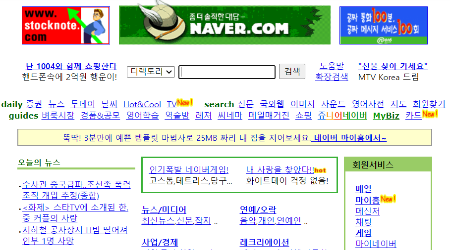
/// caption
사진 출처 : <https://blog.naver.com/rhdwlgjs/222648633998>
///

2000년대 초반에 인터넷을 사용해본 사람이라면 위 사진 처럼 퍼런색 하이퍼링크들로 떡칠되어 있고 간단한 input box들로 이루어진 레이아웃을 많이 봤을 것이다. 이 사이트는 기본적인 HTML로만 구성되어 있는 사이트이다.

위 사이트는 거의 대부분 뼈대 역할을 하는 HTML만 사용되었기 때문에 별 다른 인터렉션이 보이지 않는다.

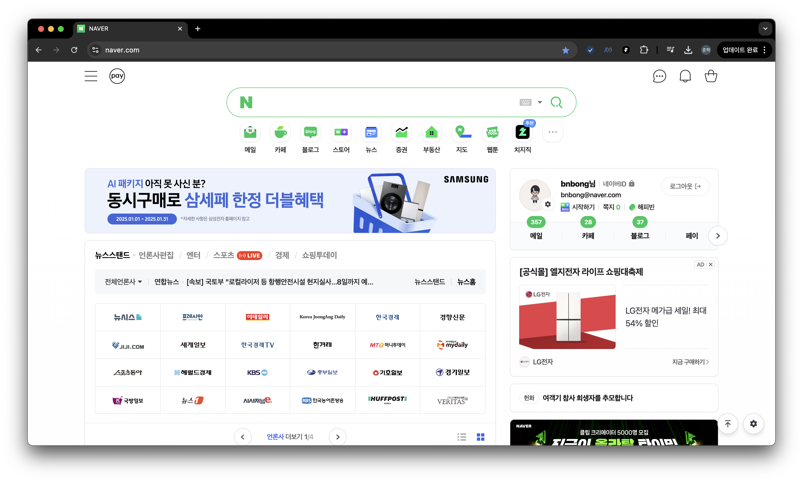

위 사진은 25년 1월 2일 오늘 찍은 네이버 포털 사진이다. 로고에 마우스 커서를 올리면 로고가 바뀌고 버튼을 클릭하면 효과가 뜨는 여러 인터렉션이 추가된 것을 볼 수 있다.

이런 인터렉션은 CSS와 Javascript덕분인데, 이런 효과를 내기 위해선 HTML과 CSS, Javascript 파일이 우리에게 도달해야한다.

==즉, 우리 컴퓨터는 네이버 같은 웹페이지를 호스팅해주는 서버로부터 HTML, CSS, Javascript 파일을 다운로드하여 웹 사이트를 예쁘게 렌더링하는 것이다.==

다시 정적 웹사이트와 동적 웹사이트의 차이로 돌아와서, 서버가 우리한테 위 3개의 파일을 가져다 주기 위해서는 미리 서버가 고정되어 있는 3개의 파일을 가지고 있다가 우리 컴퓨터가 달라고 할 때 주는 방식<sup>1</sup> 이 있고, 반대로 우리가 달라고 할 때 위 3개의 파일을 직접 만들어서 가져다 주는 방식<sup>2</sup> 이 있다.

전자(1번)가 바로 정적 웹사이트의 특징이고 후자(2번)가 동적 웹사이트의 특징이다.

</br>

이번 포스팅은 동적/정적 웹사이트의 특징을 설명하는 것이 아니라서 두 사이트의 특징 설명은 여기까지 하고 MKDocs와 MKDocs-materials 도구가 바로 이 정적 웹사이트를 만들어주는 도구라는 것이다.

정확히는 MKDocs가 **정적 웹사이트를 생성해주는 도구**이고 MKDocs-materials는 구글 material design의 **예쁜 테마를 제공해주는 도구**이다.

google material design이 나오고 나서 웹사이트 디자인이 모던하고 트랜디하게 바뀌었는데 MKDocs-materials이 이 디자인 테마를 제공해준다. 우리는 이 도구들을 사용하여 모던하고 예쁜 블로그 사이트를 만들 수 있다.

## MKDocs-materials 셋업

프로젝트 구성은 간단하다. 설치부터 꾸미는 방법까지 [공식 문서](https://squidfunk.github.io/mkdocs-material/getting-started/)에서 나름 잘 설명되어 있다.

### 설치

```bash
pip install mkdocs-material
```

이번 포스팅에서는 설치 방법이나 배포 방법에 대해 깊게 다루지 않고 이 개발 블로그를 MKDocs-materials를 사용하여 배포	 얼마나 효율적인 시간 절감을 이뤄줬는 지 팁과 함께 소개하려고 한다.

나머지 설치 가이드는 공식 사이트를 참고하길 바란다:

<https://squidfunk.github.io/mkdocs-material/getting-started/>

## Huge Time-saving

MKDocs-materials는 빌트인 플러그인으로 다양한 기능을 제공해주는 특징이 있다.

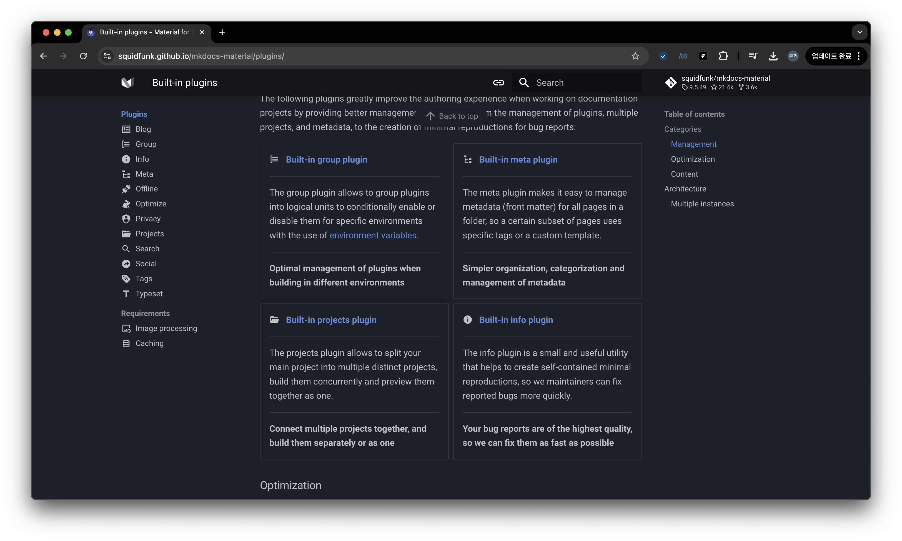

블로그 플러그인을 프로젝트에 넣어주면 블로그 웹사이트를 꾸밀 수 있고 MKDocs-materials 스폰서(insiders)의 경우 project 플러그인으로 본인의 포트폴리오에 프로젝트에 대한 내용을 넣어줄 수 있다.

</br>

이 플러그인들을 잘 활용하면 우리가 손수 구현해야하는 기능들 하나 없이 정말 빠르게 우리 입맛의 사이트를 배포할 수 있다.

내용이 방대하므로 우선 MKDocs-materials 핵심 파일인 `mkdocs.yml` 파일을 통째로 뜯어보자. 다음은 필자 블로그의 `mkdocs.yml` 파일 전체 내용이다:

```yml
site_name: bnbong's tech blog
site_description: 이준혁의 기술 관련 블로그
site_url: https://bnbong.github.io
repo_name: bnbong/bnbong.github.io
repo_url: https://github.com/bnbong/bnbong.github.io
theme:
  custom_dir: overrides
  name: material
  font:
    text: JetBrains Mono
  # Light and Dark Theme Toggle
  palette:
    - media: "(prefers-color-scheme: light)"
      scheme: default
      primary: custom
      accent: brown
      toggle:
        icon: material/brightness-7  # current mode : light
        name: Switch to dark mode
    - media: "(prefers-color-scheme: dark)"
      scheme: slate
      primary: custom
      accent: brown
      toggle:
        icon: material/brightness-4  # current mode : dark
        name: Switch to light mode
  features:
    - navigation.indexes
    - navigation.footer
    - navigation.top
    - navigation.tracking
    - navigation.tabs
    - navigation.tabs.sticky
    - navigation.expand
    - search.highlight
    - search.share
    - search.suggest
    - announce.dismiss
    - toc.follow
  language: ko
plugins:
  - blog:
      blog_toc: true
      post_slugify: !!python/object/apply:pymdownx.slugs.slugify
        kwds:
          case: lower
      draft: true
      draft_on_serve: false
      draft_if_future_date: true
      post_date_format: full
      post_url_format: "{date}/{slug}"
  - rss:
      match_path: blog/posts/.*
      date_from_meta:
        as_creation: date.created
        as_update: date.updated
      comments_path: "#__comments"
  - search
  - social:
      cards_layout_options:
        font_family: Noto Sans KR
  - tags:
      tags_file: blog/tags.md

not_in_nav: |
  /drafts/**/*.md

nav:
- About Me: index.md
- Blog:
  - blog/index.md
  - blog/tags.md
- Projects:
  - projects/index.md
  - 개인 프로젝트 :
    - Bifrost : projects/bifrost.md
    - TooKindFriendChat : projects/tookindfriendchat.md
    - JaramUniv_Sugang-API : projects/univapi.md
    - rickTcal_DayLife : projects/ricktcal.md
    - KakaoTalk-channel-WeatherToday : projects/kakaotalk-weatherforecast.md
  - 팀 프로젝트 :
    - Project-Pinned : projects/project-pinned.md
    - Awesome Chatting App : projects/awesomechat.md
    - Mugip : projects/mugip.md
    - KBuddy : projects/kbuddy.md
    - Jaram Groupware Hub : projects/jgw-hub.md
    - Jaram Groupware Penalty Python : projects/jgw-penalty-python.md
    - Jaram Groupware Attendance Python : projects/jgw-attendance-python.md
    - Phishing QR detector : projects/qr-phishing-detector.md
  - 오픈소스 프로젝트:
    - Azure SDK for Python : projects/azure-sdk-python.md
    - Azure SDK for Python Korean Docs : projects/azure-sdk-python-kor.md
    - FastAPI FastKit : projects/fastapi-fastkit.md
    - Blog Post Workflow : projects/blog-post-workflow.md
    - FEMU Monitoring : projects/femu-monitoring.md
extra:
  status:
    new: Recently added
  social:
    - icon: fontawesome/brands/github
      link: https://github.com/bnbong
    - icon: fontawesome/brands/linkedin
      link: https://www.linkedin.com/in/%EC%A4%80%ED%98%81-%EC%9D%B4-669733231/
    - icon: fontawesome/solid/globe
      link: https://blog.naver.com/bnbong
    - icon: fontawesome/brands/instagram
      link: https://www.instagram.com/j_hyeok__lee/
    - icon: fontawesome/solid/envelope
      link: mailto:bbbong9@gmail.com
    - icon: material/rss
      link: /feed_rss_updated.xml
      name: Subscribe to our RSS Feed
  tags:
    <tag>: <identifier>
  blog:
    dir: blog
    author: bnbong
    author_image: https://avatars.githubusercontent.com/bnbong
    words_read_per_minute: 300
    list_length: 25
    extended_preview: true
    archive_toc: true
    pagination_per_page: 10
    pagination_keep_content: true
  analytics:
    provider: google
    id: G-G1E1JBX2WR

markdown_extensions:
  - toc:
      title: 이 페이지의 요소들
      permalink: true
  - attr_list
  - md_in_html
  - pymdownx.highlight
  - pymdownx.inlinehilite
  - pymdownx.superfences
  - pymdownx.snippets
  - pymdownx.critic
  - pymdownx.keys
  - pymdownx.mark
  - pymdownx.tilde
  - pymdownx.blocks.caption
  - meta
  - def_list
  - admonition
  - pymdownx.details
  - pymdownx.superfences
  - pymdownx.caret
  - pymdownx.emoji:
      emoji_index: !!python/name:material.extensions.emoji.twemoji
      emoji_generator: !!python/name:material.extensions.emoji.to_svg

hooks:
  - hooks/socialmedia.py

extra_css:
  - stylesheets/extra.css
copyright: Copyright &copy; 2019-2025 bnbong
```

필자 깃허브 저장소에도 위 파일을 볼 수 있다.

<https://github.com/bnbong/bnbong.github.io/blob/master/mkdocs.yml>

### 사이트 호스팅

사이트에 들어갈 내용들을 코딩하는 것도 좋으나 가장 중요한건 이렇게 개고생해서 만든 사이트를 남들에게 보여주는 작업이다.

만들기만 해놓고 꽁꽁 숨겨놓으면 아무 의미가 없으니 이 사이트를 호스팅 해야하는데 본인이 구매해서 운용하고 있는 도메인이 있으면 모를까 그렇지 않다면 도메인을 따로 구해서 띄워줘야한다.

요즘에는 저렴한 도메인이나 심지어 무료 도메인도 사용할 수 있는데, 이런 도메인들의 안정성 문제는 둘째 치고 DNS 세팅을 처음 해보는 사람은 여기서 해멜 수 있다.

이 문제를 해결해주는 것은 ==**Github Pages**== 였다. 정적 웹사이트를 호스팅하는 경우, Github는 Github Page라는 옵션으로 정적 웹사이트 호스팅을 ==__무료로__== 할 수 있도록 제공해준다.

가끔 `<사용자이름>.github.io`로 보이는 웹사이트들이 바로 이 Github Pages를 활용하여 호스팅하고 있는 사이트이다.

페이지 빌드 또한 Github가 제공해주는 Github Actions를 통해 자동으로 빌드가 가능하며 두 서비스 모두 __무료__ 이기 때문에 사이트 운영 비용을 0원으로 만들 수 있다.

이건 단지 MKDocs-materials에 국한되어 있는 장점이라기 보다는 Github의 장점이라고 볼 수 있다. 정적 웹사이트 배포를 고려하는 사람이라면 이 옵션이 정말 혁신적인 옵션이 될 수 있다.

</br>

github page 도메인에 빌드한 사이트를 링크하려면 mkdocs.yml 설정 파일에 다음 항목들을 넣어주면 된다.

```yml
# mkdocs.yml line 1 ~
site_name: bnbong's tech blog  # 사이트 이름
site_description: 이준혁의 기술 관련 블로그  # 사이트 설명
site_url: https://bnbong.github.io  # 사이트 주소
repo_name: bnbong/bnbong.github.io  # 저장소 이름
repo_url: https://github.com/bnbong/bnbong.github.io  # 저장소 주소
...
```

### 사이트 컴포넌트

**이 부분이 바로 MKDocs-materials의 핵심이다.**

정말 많은 부분에서 time-save를 할 수 있었으며 사이트 레이아웃 디자인 및 구현에 드는 시간을 줄이고 오로지 컨텐츠에 집중할 수 있었던 건 정말 혁신적이라고 생각한다.

#### 1. 마크다운 렌더링 + 포멧팅

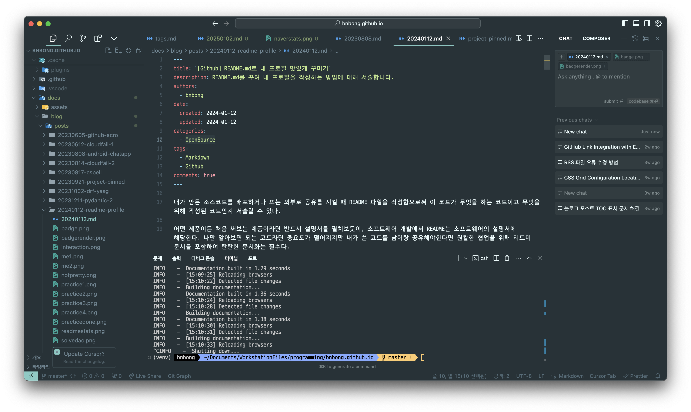

위 사진과 마찬가지로 이 포스팅도 마크다운 형식으로 작성하고 있다.

아무래도 개발 문서를 작성하다보면 마크다운 파일을 한번 쯤은 접해서 작성해보는 경험이 있을 것이다.

필자 또한 이런 마크다운 문서 작성에 익숙해졌기에 이번 블로그 프로젝트를 기획했을 때 마크다운 형식으로 블로그 포스팅을 작성할 수 있었으면 좋겠다고 생각했다.

이 기능을 추가하려면 마크다운 문서를 랜더해주는 모듈을 따로 개발해야하고 스타일시트도 신경써줘야 하나 MKDocs-materials를 도입하여 이를 정말 간단하게 해결할 수 있었다.

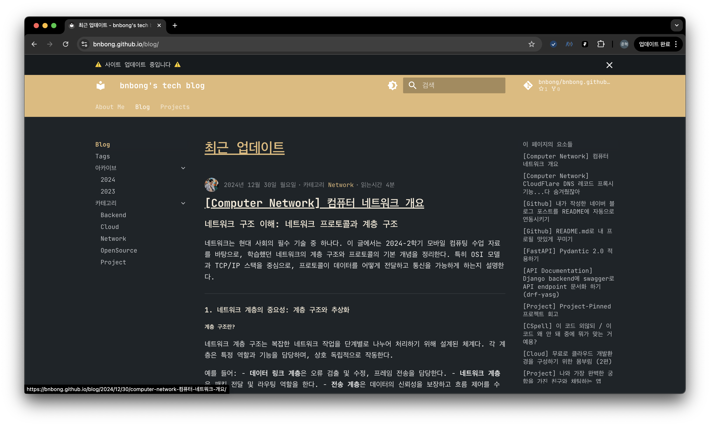

랜더링된 문서 텍스트에 원하는 색상, 글꼴을 넣을 수 있고 stylesheet 추가로 헤더나 코드 블록에 대한 스타일도 쉽게 넣어줄 수 있다.

현재 필자의 블로그 글꼴은 자주 사용하는 Jetbrains IDE의 기본 글꼴인 Jetbrains Mono를 사용하고 있다.

</br>

마크다운 랜더링 기능은 MKDocs 기본 기능인 것으로 보이고 마크다운 extension을 추가해서 좀 더 편리하게 작업이 가능한데, 설정을 추가해주려면 `mkdocs.yml` 파일에 라인들을 추가해주면 된다.

```yml
# mkdocs.yml line 129 ~
...
markdown_extensions:
  - toc:
      title: 이 페이지의 요소들
      permalink: true
  - attr_list
  - md_in_html
...
```

위 코드의 특정 라인을 설명하자면 다음과 같다:

- `toc` : table of content(toc)이며, 노션 도구를 사용해본 경험이 있는 사용자라면 문서 우측에 페이지 헤더 요소들이 목차처럼 링크로 표시되어 있는 것을 본 적이 있을 것이다.

    바로 그 기능이며 이를 통해 문서 요소들을 표시하고 각 요소에 대한 링크를 생성해준다.

    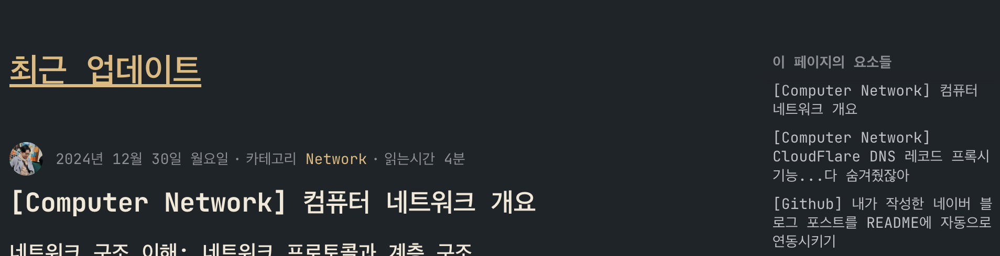
    /// caption
    필자의 블로그 포스팅 우측에서 볼 수 있는 toc, 목차의 타이틀도 yml 파일 설정에서 넣어줄 수 있다.
    ///

- `md_in_html` : 마크다운 문서에 있는 HTML 코드를 랜더링해준다.

    깃허브 마크다운에서도 HTML 코드를 넣으면 알아서 랜더링해준다. 필자의 블로그에서도 동일한 퍼포먼스가 가능하면 좋을 것 같아서 넣어줬다.

스타일시트를 넣어서 사이트 전체에 대한 스타일을 커스텀할 수 있는데, 커스텀 스타일시트를 적용하려면 마찬가지로 `mkdocs.yml` 파일에 라인들을 추가해주면 된다.

```yml
# mkdocs.yml line 154 ~
...
extra_css:
  - stylesheets/extra.css  # 스타일시트 경로
...
```

네비게이션 바 및 하이라이트 텍스트에 필자가 넣은 색은 필자의 퍼스널 컬러를 넣어줬다.

살면서 퍼스널 컬러 진단(?)을 받아본 적이 없었는데 넣어줄만한 색을 찾다가 갑자기 퍼스널컬러가 생각나서 부랴부랴 AI가 사진으로 결정해주는 퍼스널 컬러를 인터넷에서 찾아보고 넣어줬다.

</br>

또한 블로그 포스트 기능을 만들면서 고민할 수 있는 것이 있는데, 포스팅 컨텐츠에 접근하는 방법을 정하는 것이다.

URL로 컨텐츠에 조회하도록 할 때 url의 각 게시물의 유니크한 아이디로 조회할지, 날짜로 나눌지, 타이틀로 나눌지, 타이틀로 한다면 한글/영어 구분을 할지 등등 여러 가지 방법이 가능하기에 골머리를 앓을 수 있다.

이것 또한 MKDocs-materials에서 설정이 가능하며, 필자는 `{날짜}/{타이틀(특수문자 제거 및 소문자)}` 형식으로 설정해주었다.

```yml
# mkdocs.yml line 41 ~
...
plugins:
  - blog:
      blog_toc: true
      post_slugify: !!python/object/apply:pymdownx.slugs.slugify  # slug 생성 - 특수문자 제거
        kwds:
          case: lower  # slug 생성 방법 - 소문자
      draft: true
      draft_on_serve: false
      draft_if_future_date: true
      post_date_format: full
      post_url_format: "{date}/{slug}"  # 기본 포스트 url 형식
...
```

python 라이브러리인 `pymdownx`를 사용하기 때문에 블로그 프로젝트 가상환경에 `pymdownx` 라이브러리를 설치해줘야 한다.

```bash
pip install pymdown-extensions
```

그 후 yml파일에 설정들을 넣어주면 해당 블로그 포스트 제목에서 특수문자를 제거하고 소문자로 변환해서 알아서 포스트 주소를 생성해준다.

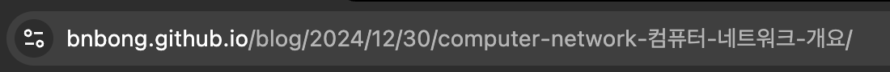
/// caption
slugify된 블로그 포스트 주소
///

블로그 포스트의 타이틀은 해당 마크다운 파일의 메타데이터의 `title` 값을 가져오기 때문에 블로그 포스팅을 작성할 때 ==상단에 메타데이터 값== 들을 넣어주어야 한다.

```markdown
---  // 메타데이터 시작
title: '[Github] README.md로 내 프로필 맛있게 꾸미기'  // 이걸 바탕으로 slug 생성
description: README.md를 꾸며 내 프로필을 작성하는 방법에 대해 서술합니다.
authors:
  - bnbong
date:
  created: 2024-01-12
  updated: 2024-01-12
categories:
  - OpenSource
tags:
  - Markdown
  - Github
comments: true
---  // 메타데이터 끝

내가 만든 소스코드를 배포하거나 또는 외부로 공유를 시킬 때 README 파일을 작성함으로써 이 코드가 무엇을 하는 코드이고 무엇을 위해 작성된 코드인지 서술할 수 있다.
...
```

메타데이터 활용 시 __주의할 점__ 은 다음과 같다:

- 포스팅의 타이틀 헤더 H1 값을 읽기 때문에 메타데이터보다 더 상단에 위치해있는 H1 태그나 다른 위치에 선언되어 있는 H1 태그가 존재하면 타이틀 값을 잘못 읽어 오류가 발생할 수 있다. ==따라서 포스팅 본문에는 H1 태그를 넣지 않는 것이 좋다.==
- ==줄바꿈을 자주 넣자.== 줄바꿈 하나 없어서 원하는 대로 마크다운 랜더링이 안될 수 있다. 그런 경우에는 단순히 줄바꿈을 넣어서 해결되는 경우가 많으므로 참고하면 좋다.
- MKDocs-materials 공식 문서에서 메타데이터를 활용한 여러 부가기능들이 존재한다. 그러나 대부분의 기능들은 스폰서 기능인 `insiders` 기능이므로 무료 사용자는 공식 문서를 잘 읽고 어떤 기능이 사용 가능한지 확인해야한다.

#### 2. 페이지네이션

블로그나 게시판을 처음 만들 때 고민하는 것 중 하나가 바로 페이지네이션이다.

컨텐츠 표시 개수를 조절하고 적절한 수를 표시하는 로직을 구현할 때 적지 않은 시간을 소요할 수 있는데, MKDocs-materials에서는 blog 플러그인에 이 기능이 잘 구현되어 있다.

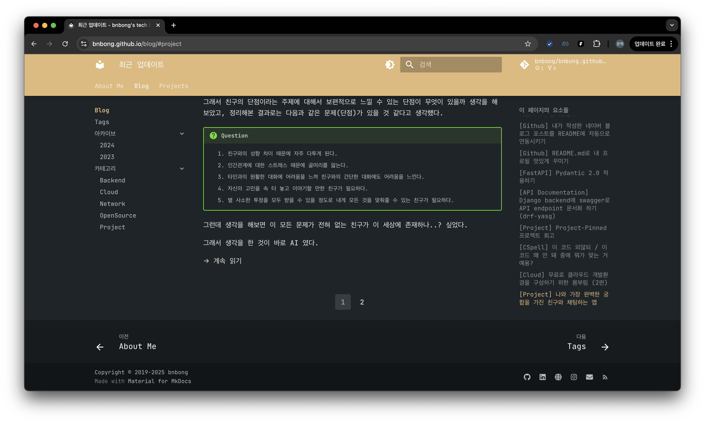

마찬가지로 적용하려면 `mkdocs.yml` 파일에 라인들을 추가해주면 된다.

```yml
# mkdocs.yml line 115 ~
...
  blog:
    dir: blog
    author: bnbong
    author_image: https://avatars.githubusercontent.com/bnbong
    words_read_per_minute: 300
    list_length: 25
    extended_preview: true
    archive_toc: true
    pagination_per_page: 10
    pagination_keep_content: true
...
```

설정값을 10개의 게시물만 한 페이지에 표시되게 설정했기 때문에 위의 사진에서도 10개의 게시물들만 표시되는 것을 볼 수 있다.

#### 3. RSS 피드

yml 설정 파일에 플러글인을 추가하여 블로그 피드를 RSS 파일로 뽑아 볼 수 있다.

```yml
# mkdocs.yml line 52 ~
...
  - rss:
      match_path: blog/posts/.*
      date_from_meta:
        as_creation: date.created
        as_update: date.updated
      comments_path: "#__comments"
...
```

RSS 피드로 뽑아낼 포스팅들의 위치도 설정이 가능하며 정렬 기준도 설정이 가능하다. 댓글 기능을 추가하였다면 댓글 내용도 RSS 피드에 추가시킬 수 있다.

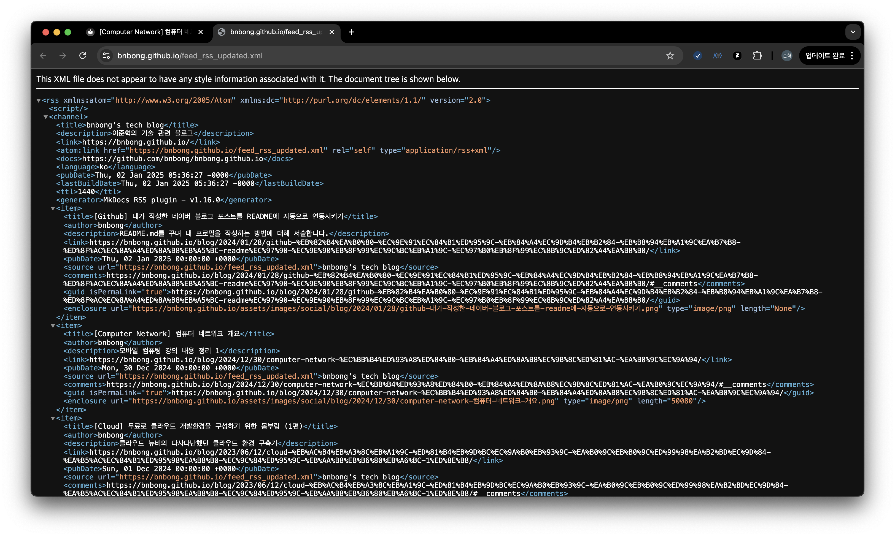

만약 RSS 플러그인에 에러가 발생한다면 블로그 포스팅 마크다운 파일의 메타데이터 문제일 가능성이 크다. 천천히 살펴보고 에러가 날만한 곳을 찾아서 수정하면 된다.

</br>

RSS 기능을 추가한 이유는 필자의 깃허브 README 프로필에 블로그 포스팅 피드를 보여주는 기능이 RSS 피드를 읽어서 동작하기 때문이다.

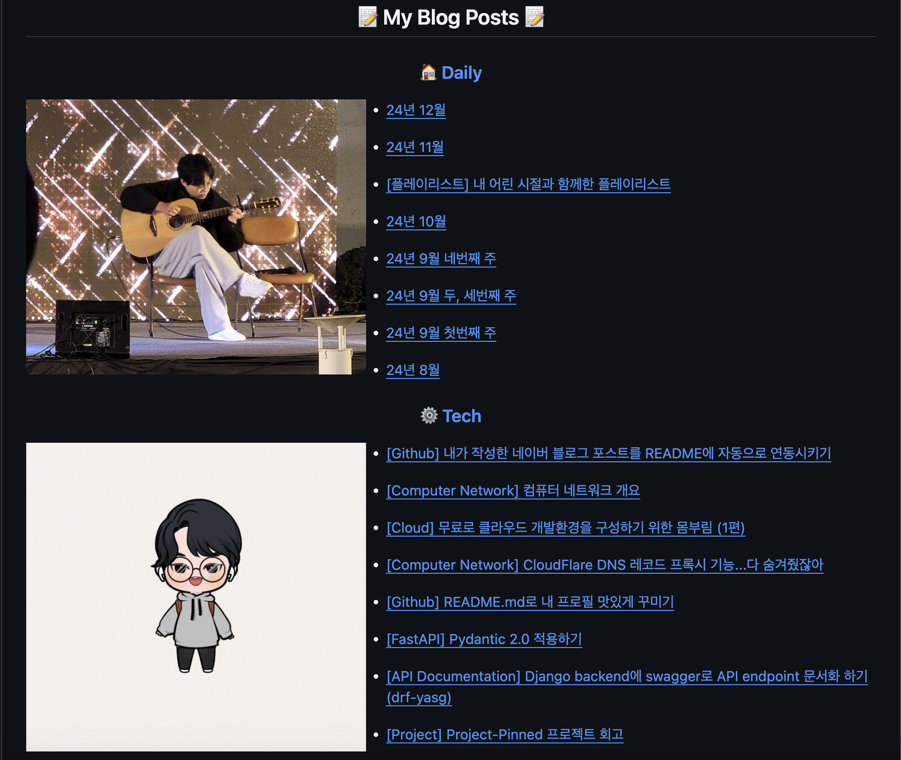

이에 대한 자세한 내용은 필자의 다른 블로그 포스팅에 설명되어 있다:

- [[Github] 내가 작성한 네이버 블로그 포스트를 README에 자동으로 연동시키기](https://bnbong.github.io/blog/2024/01/28/github-%EB%82%B4%EA%B0%80-%EC%9E%91%EC%84%B1%ED%95%9C-%EB%84%A4%EC%9D%B4%EB%B2%84-%EB%B8%94%EB%A1%9C%EA%B7%B8-%ED%8F%AC%EC%8A%A4%ED%8A%B8%EB%A5%BC-readme%EC%97%90-%EC%9E%90%EB%8F%99%EC%9C%BC%EB%A1%9C-%EC%97%B0%EB%8F%99%EC%8B%9C%ED%82%A4%EA%B8%B0/)<br>
- [[Github] README.md로 내 프로필 맛있게 꾸미기](https://bnbong.github.io/blog/2024/01/12/github-readmemd%EB%A1%9C-%EB%82%B4-%ED%94%84%EB%A1%9C%ED%95%84-%EB%A7%9B%EC%9E%88%EA%B2%8C-%EA%BE%B8%EB%AF%B8%EA%B8%B0/)

여담으로 최근 개발용 블로그와 일상용 블로그를 쪼개서 두개의 블로그 RSS 파일에서 피드를 읽어오도록 구성했다ㅎ

#### 4. 사이트 분석

사이트를 본격적으로 운영하기 시작했다면 신경쓰이는 점은 사이트 방문자 통계일 것이다.

수익을 내는 사이트라면 더더욱 방문자 유입 경로나 컨텐츠 소모 패턴을 분석하고 이를 통해 컨텐츠 전략을 수립하는 것이 중요할 것이다.

네이버에서는 블로그 기본 기능으로 방문자 통계를 확인하는 것이 가능하다:

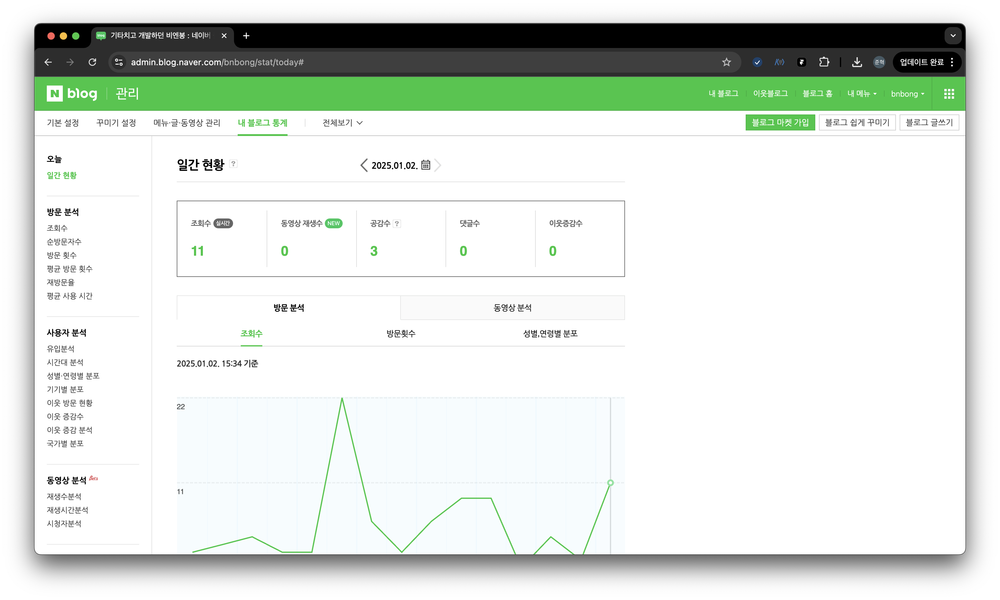

그러나 블로그 프로젝트에서는 이 기능 또한 직접 구현해야하는 과제이다.

통계치를 뽑아내는 것 조차 쉽지 않은데, 그 값을 바탕으로 대시보드를 만들어 띄우는 것은 정말 도전적인 일이다.

MKDocs-materials는 구글 애널리틱스를 사용하여 이를 해결했다.

빌트인 플러그인에 analytics를 추가하고 구글 애널리틱스 아이디를 설정에 넣으면 연동이 된다.

```yml
# mkdocs.yml line 125 ~
...
  analytics:
    provider: google
    id: G-G1E1JBX2WR
```

보다 자세한 설정 방법은 공식 문서를 참고하면 좋다:

<https://squidfunk.github.io/mkdocs-material/setup/setting-up-site-analytics/>

</br>

설정을 하고 나면 구글 애널리틱스 대시보드에 내 사이트에 대한 통계가 뜨게 된다.

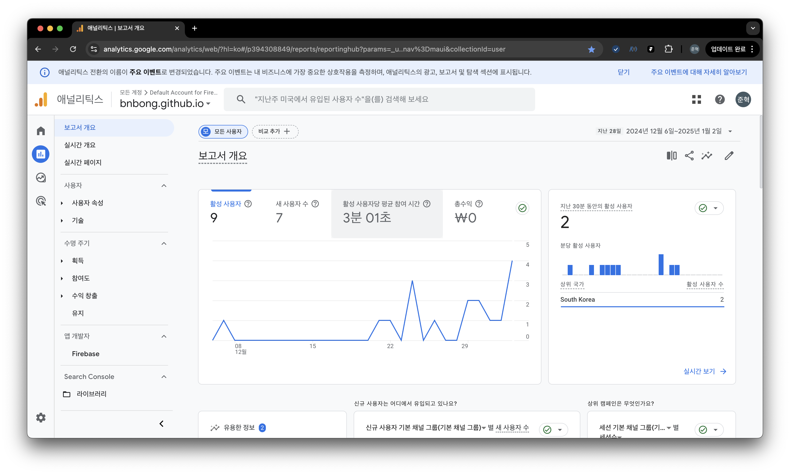

사이트를 방문한 **유저의 국가나 얼마나 오래 컨텐츠에 머물렀는지, 또한 광고를 달았다면 광고 수익은 얼마나 되는지까지** 등등 광범위하게 표시된다.

#### 5. 다크모드

21세기 컴퓨터쟁이들이라면 빼놓을 수 없는 기능인 다크모드.

다크모드 구현은 그렇게까지 어렵다고 생각되지는 않지만 문제는 다크모드 스타일과 화이트모드 스타일을 구성하는 번거로움일 것이다.

다크모드에서 흰색이었던 글씨를 화이트모드에서는 검은색으로 바꾸고 여러 색상을 좀 더 강조가 되는 색으로 설정해주는 것은 여간 귀찮은 작업이 아니다.

</br>

다행이도 이 가이드 또한 [MKDocs-materials 공식 문서](https://squidfunk.github.io/mkdocs-material/setup/changing-the-colors/)와 참고 프로젝트들에 잘 설명되어 있다.

마찬가지로 mkdocs.yml 파일 설정값만 건들여서 추가가 가능하다.

```yml
# mkdocs.yml line 6 ~
...
theme:
  custom_dir: overrides  # 커스텀 테마 레이아웃 경로
  name: material
  font:
    text: JetBrains Mono
  # Light and Dark Theme Toggle
  palette:
    - media: "(prefers-color-scheme: light)"
      scheme: default
      primary: custom  # 커스텀 색상 테마
      accent: brown
      toggle:
        icon: material/brightness-7  # current mode : light
        name: Switch to dark mode
    - media: "(prefers-color-scheme: dark)"
      scheme: slate
      primary: custom  # 커스텀 색상 테마
      accent: brown
      toggle:
        icon: material/brightness-4  # current mode : dark
        name: Switch to light mode
...
```

상단 설정의 `primary` 값에 MKDocs-materials 기본 빌트인 색상 값을 넣어줄 수 있고 스타일 시트에 따로 설정해둔 색상 값을 넣어줄 수 있다.

필자는 후자, 즉 커스텀 색상값을 넣어주는 방식을 택했는데, 커스텀 스타일시트를 설정했다면 반드시 `extra_css` 항목에 커스텀 스타일시트 파일을 명시해줘야 한다.

그 후 스타일 시트에 다크모드용 컬러 테마를 설정해주면 된다.

```css
/* stylesheets/extra.css line 67 ~ */
...
/* 다크 모드 대응 */
[data-md-color-scheme="slate"] {
    --md-hue: 210;

    .md-typeset {
        color: #eee;  /* 다크모드에서의 텍스트 색상 */

        a {
            color: var(--md-primary-fg-color--light);
        }
        ...
```

설정이 완료되면 다음 사진과 같이 다크모드 <-> 화이트모드 토글 버튼으로 정상적으로 컬러 테마가 바뀌는 것을 볼 수 있다.

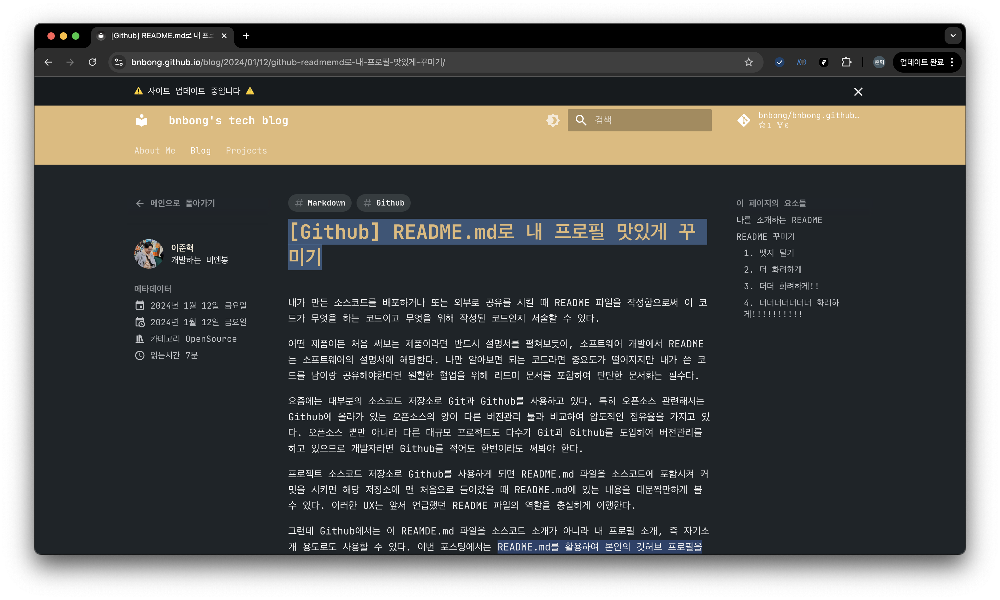
/// caption
다크모드
///

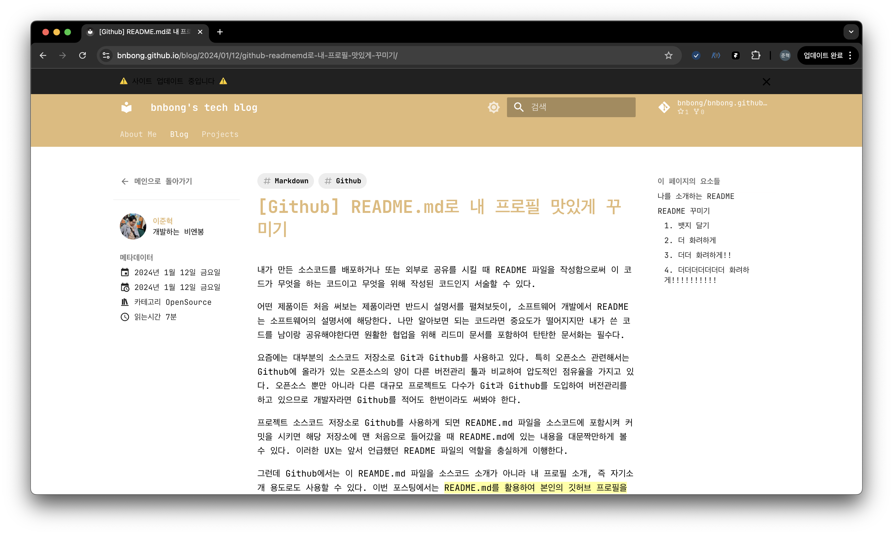
/// caption
화이트모드
///

</br>

컬러 테마 뿐만 아니라 레이아웃까지 커스텀이 가능하다.

mkdocs.yml 파일 theme 탭 상단에 custom_dir 값에 커스텀 레이아웃 파일 경로를 넣어주면 된다. 레이아웃은 HTML로 입맛대로 설정이 가능한데, MKDocs-materials에 기본 뼈대로 동작하는 빌트인 HTML 파일을 extends 해서 사용할 수 있다.

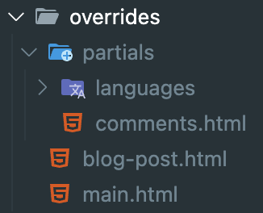
/// caption
커스텀 레이아웃 파일 경로
///

참고가 가능한 HTML 파일 뼈대 코드는 공식 Github에서 확인할 수 있다:

<https://github.com/squidfunk/mkdocs-material/blob/master/material/templates/blog.html>

#### 6. 검색

포스팅 컨텐츠가 쌓이다 보면 검색 기능 도입을 고려할만 하다.

그러나 검색 기능도 구현하려고 하면 나름 신경이 많이 쓰이는데 Elasticsearch 같은걸 도입하다보면 기능 도입을 떄려치고 싶어질 수 있다.

</br>

MKDocs-materials에서는 1초면 검색 기능 도입이 가능하다. mkdocs.yml 파일에 라인 _한 줄만_ 추가해주면 된다.

```yml
# mkdocs.yml line 58 ~
...
  - search
```

상단과 같이 플러그인을 추가하고 빌드하면 검색창이 뜨는 것을 볼 수 있다.

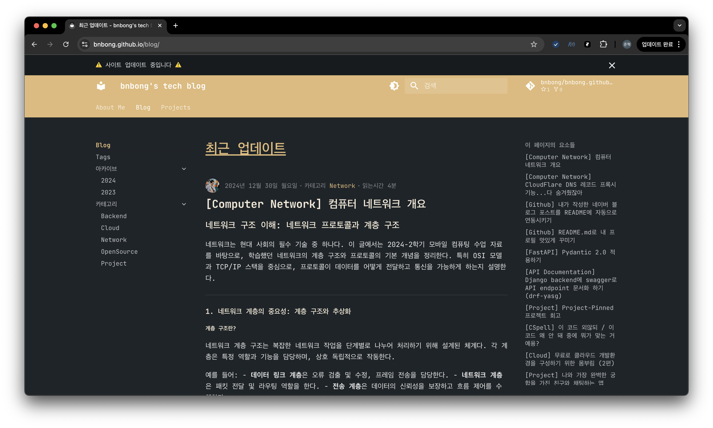

플러그인 설정을 좀 더 건들여서 검색어 추천 기능을 추가할 수 있다. 필자는 추가하지 않았다.

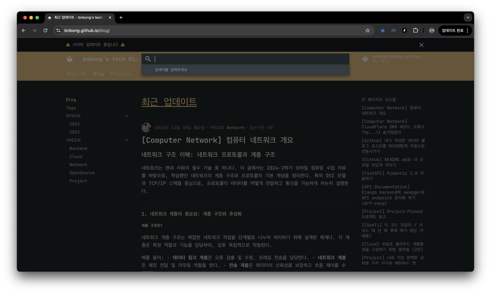

#### 7. 인터렉션

모던한 사이트들은 사이트 인터렉션이 부드럽게 이어지는 것이 특징이다.

컴포넌트들의 부드러운 인터렉션을 구현하는건 상당한 노력이 드는 작업인데, 이 기능 조차도 MKDocs-materials에서는 ==기본 제공== 기능이다.

</br>

필자의 블로그에서도 여러 부드러운 인터렉션을 볼 수 있는데 그 중 하나는 블로그 포스트 컨텐츠 스크롤을 내릴 때 포스팅 타이틀의 floating 전환 기능이다.

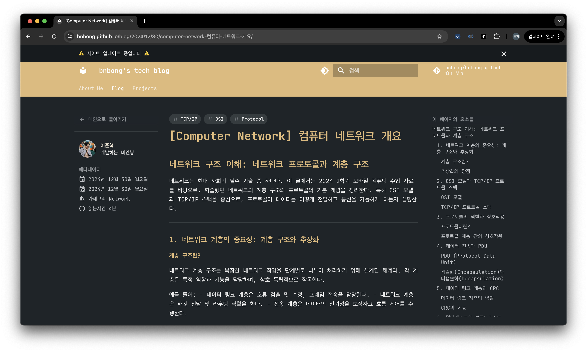
/// caption
스크롤 전
///

스크롤 이전에는 위 사진과 같이 **본문에** 포스팅 타이틀이 존재하는 것을 볼 수 있다.

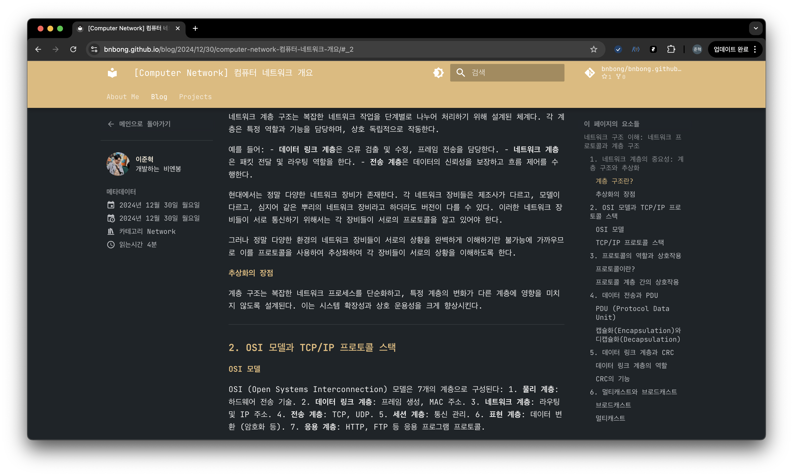
/// caption
스크롤 후
///

그러나 스크롤을 내려서 컨텐츠를 읽다 보면 상단 네비게이션 바 텍스트가 포스팅 타이틀로 자연스럽게 바뀌는 것을 볼 수 있다.

이 기능은 설정 파일 features 항목에 추가해주면 된다.

```yml
# mkdocs.yml line 27 ~
...
  features:
    - navigation.indexes
    - navigation.footer
    - navigation.top
    - navigation.tracking
    - navigation.tabs
    - navigation.tabs.sticky  # 바로 이거
    - navigation.expand
    - search.highlight
    - search.share
    - search.suggest
    - announce.dismiss
    - toc.follow
...
```

타이틀이 sticky하게 따라오는 기능인 것이다. 이 외에도 부드러운 인터렉션을 보조하는 여러 기능 추가가 가능하니 공식 문서를 자세히 참고하면 좋다.

#### 8. 댓글 및 태그

블로그 방문객과의 소통을 위한 댓글 창구는 도입할 가능성이 큰 기능이다.

그러나 이 댓글 기능도 맨땅에서 구현하려고 하면 생각을 많이 해야한다.

오픈소스를 도입하면 이 기능을 쉽게 추가할 수 있는데, 보통 사이드 블로그 프로젝트에서 많이 도입하는 오픈소스는 `Disqus` 일 것이다.

<https://disqus.com/>

물론 Disqus도 훌륭한 댓글 추가 기능을 제공한다. 그러나 Disqus 등록 작업이 살짝 귀찮다는 단점이 있다.

지금은 많이 개선되었지만 과거에는 소셜 로그인을 강제하는 단점도 있었고 가끔 Disqus 글꼴 깨짐이나 색상 오류 때문에 가독성이 떨어지는 경우가 있었다.

</br>

MKDocs-materials에서는 공식 문서에서 `giscus` 라는 오픈소스로 댓글 기능을 추가하도록 안내되어 있다.

<https://squidfunk.github.io/mkdocs-material/setup/adding-a-comment-system/>

<https://giscus.app/ko>


/// caption
giscus 공식 소개
///

giscus의 장점은 블로그 프로젝트가 github에 연동되어 있다면 특정 블로그 포스트에 달린 댓글을 github discussion 탭에서 확인이 가능하다는 점이 존재한다.

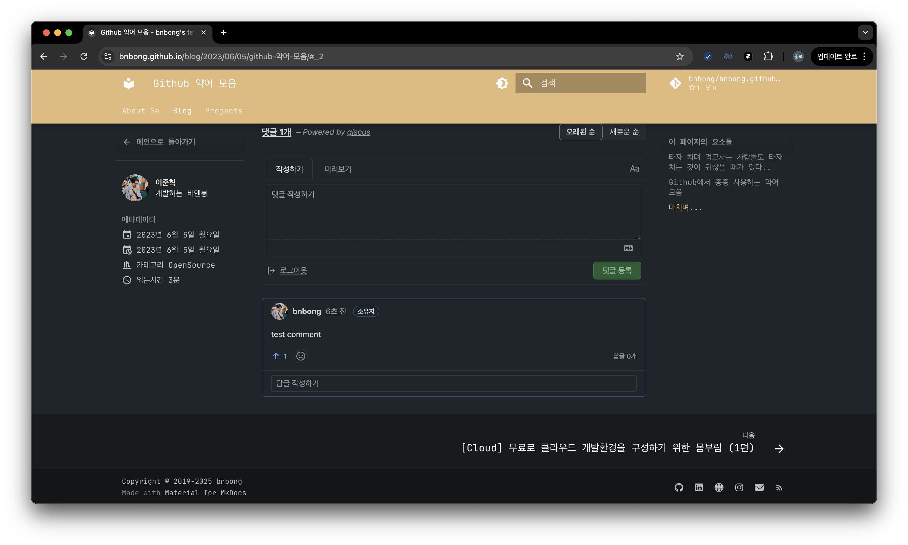
/// caption
포스팅에 댓글이 달린 모습
///

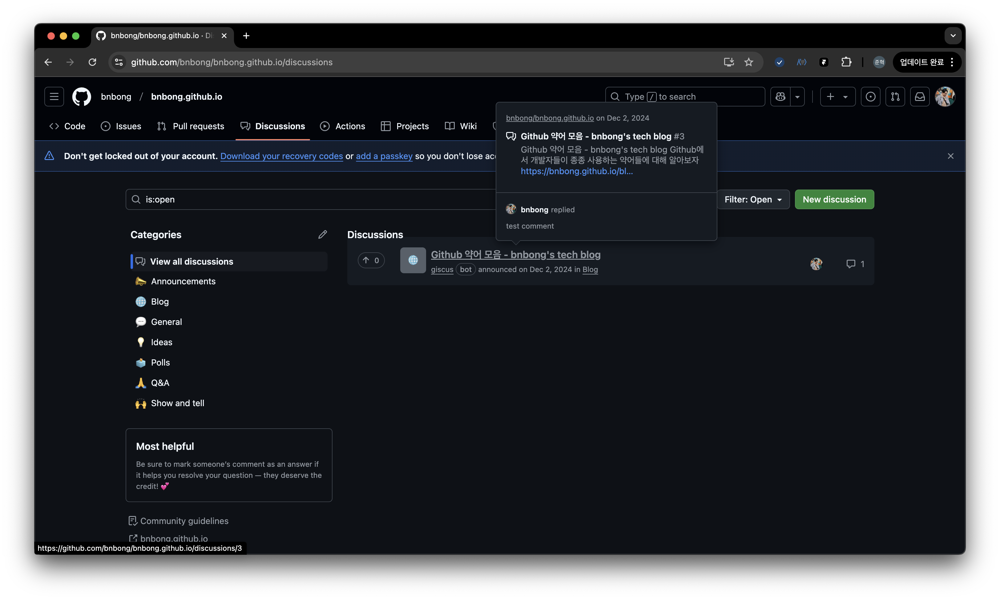
/// caption
Github 저장소 Discussion 탭에서 포스팅에 달린 댓글 확인
///

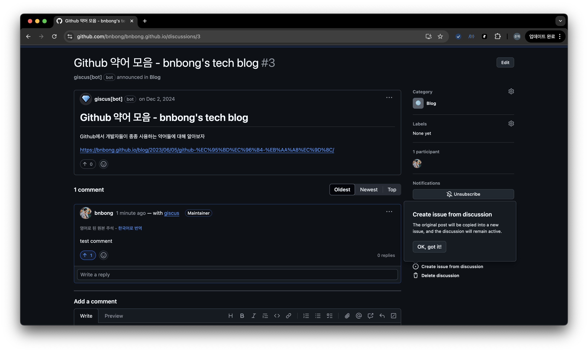
/// caption
댓글 확인
///

giscus는 Disqus와는 다르게 댓글 작성자의 github 로그인을 강제한다는 점이다.

경우에 따라서 이 점이 단점이 될 수 있으나, 필자는 이 블로그를 tech 블로그로 운영하기 때문에 개발자 시점에서의 소통이 중요하다고 생각되어 딱히 단점이라고 여기지 않아 Disqus 대신 giscus 도입이 매력적이라고 판단했다.

Disqus도 동일하게 도입이 가능하니, 만약 Disqus가 좀 더 적절하다고 생각된다면 [참고문서](https://github.com/squidfunk/mkdocs-material/discussions/2138)를 통해 도입해보길 바란다.

## 번외

만약 MKDocs-materials의 좀 더 심화적인 기능을 사용하고 싶으면 MKDocs-materials의 스폰서 신청을 하면 된다:

<https://squidfunk.github.io/mkdocs-material/insiders/>

필자는 최대한 무료로 사이트를 배포하고 운영하고 싶었기에 따로 스폰서 신청을 하지 않았으나 사용자 중에서 스폰서 신청을 한 유저가 꽤 있는 듯 하다. 한번 살펴보고 결정하는 것도 좋을 듯 하다.

필자가 정적 웹사이트 배포에 사용한 다른 환경 설정들을 살펴보고 싶다면 github 저장소를 참고하길 바란다.

<https://github.com/bnbong/bnbong.github.io>

필자는 insider 기능 중 하나인 project 기능 대신 blog 플러그인을 사용하여 프로젝트 포트폴리오 게시판 비스무리한 것을 추가했다.

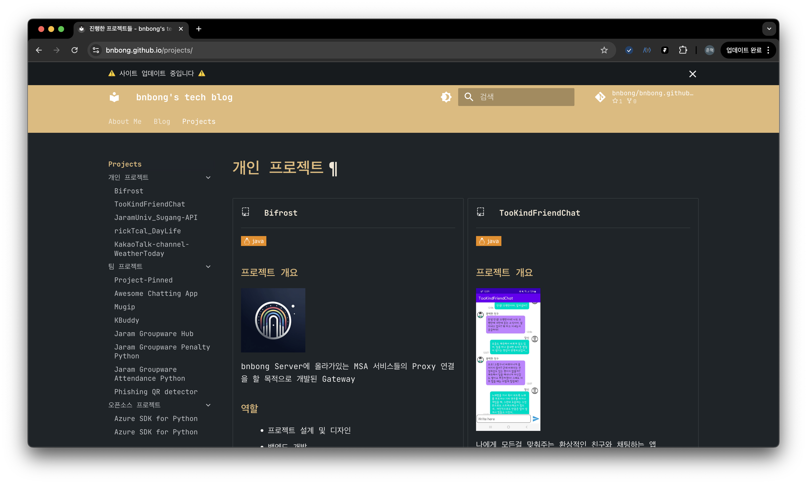
/// caption
포폴용 project 소개 게시판

<https://bnbong.github.io/projects/>
///

</br>

커밋 전, 사이트 빌드를 확인하고 싶다면 터미널에 `mkdocs serve` 명령어를 입력하면 된다.

```bash
mkdocs serve
```

명령어를 입력하면 로컬 호스트에 사이트 개발 빌드가 띄워지는 것을 볼 수 있다.

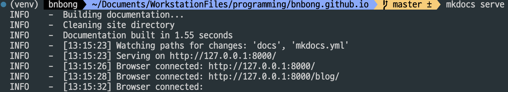

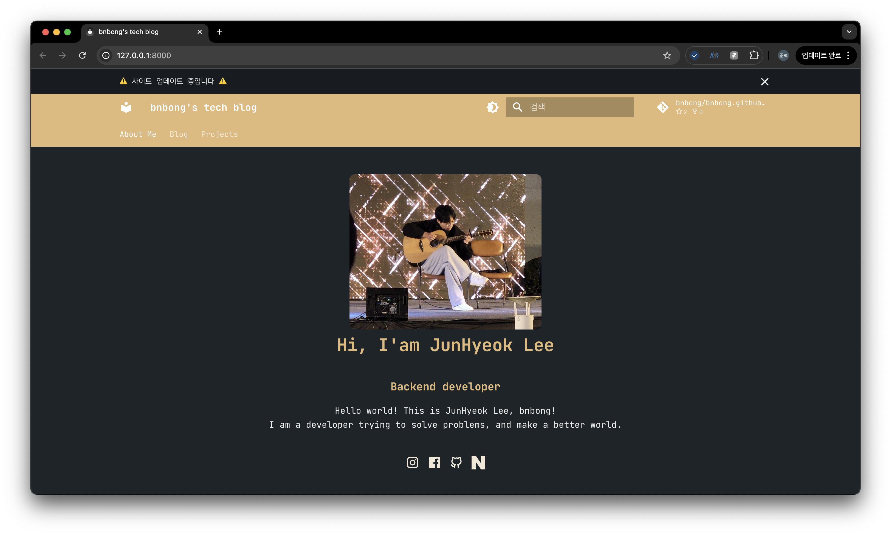
/// caption
개발 버전 빌드 결과물
///

레이아웃이나 컨텐츠 요소를 수정하면 자동으로 refresh 하여 반영되는 모습을 볼 수 있다.

---

## 마치며

이 외에도 소개할만한 MKDocs-materials의 유용한 기능들이 많다. 이 포스팅 하나에서 다루기엔 양이 너무 방대하므로 자세한 내용들은 MKDocs-materials를 직접 사용하면서 찾아보는 것을 권장한다.

필자의 작업물은 깃허브 저장소에 공개되어 있다. 많은 참고 부탁드립니당

<https://github.com/bnbong/bnbong.github.io>
