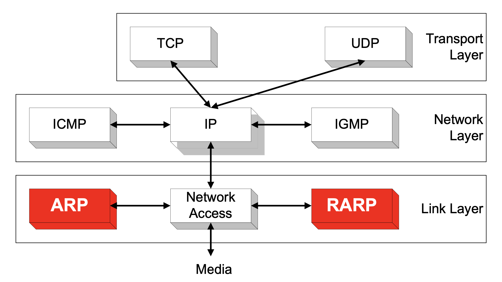
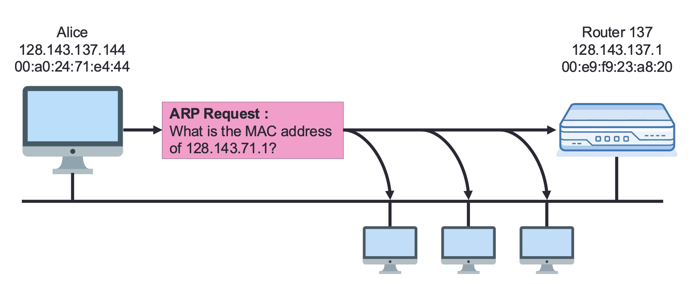
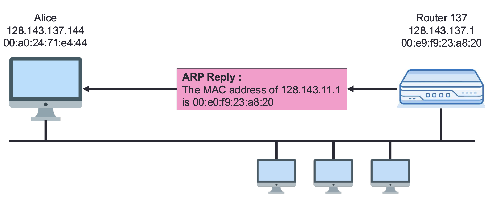
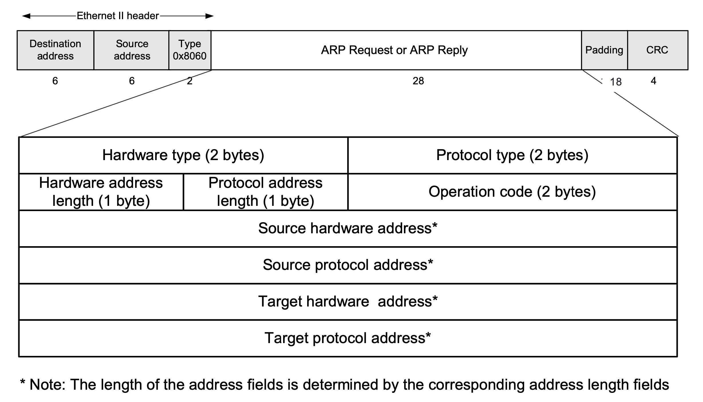
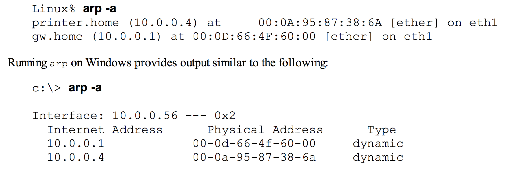
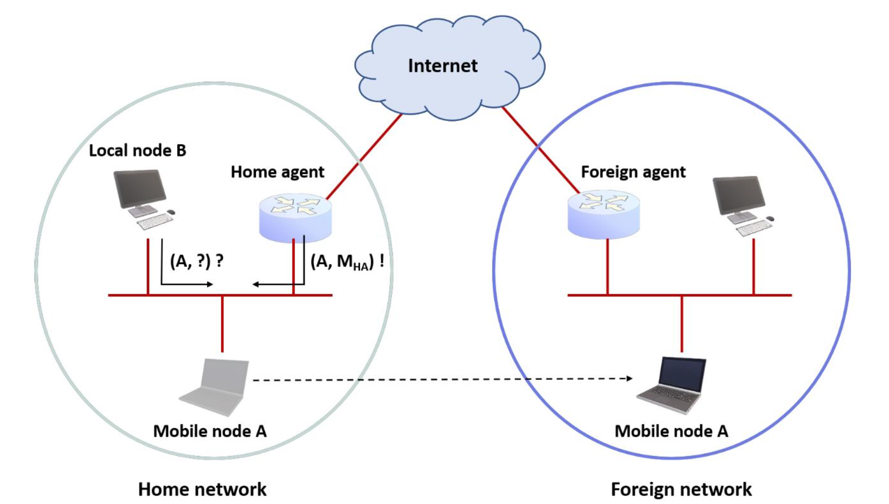

??? note "Series : Computer Network"

    [0. 컴퓨터 네트워크 개요](https://bnbong.github.io/blog/2024/12/30/computer-network-%EC%BB%B4%ED%93%A8%ED%84%B0-%EB%84%A4%ED%8A%B8%EC%9B%8C%ED%81%AC-%EA%B0%9C%EC%9A%94/)

    [1. ARP protocol](20250115.md)

## ARP (Address Resolution Protocol)

네트워크에서 장치들은 데이터를 주고받기 위해 IP 주소와 MAC 주소를 사용한다. 하지만 IP 주소만으로는 이더넷 수준의 데이터 전송이 불가능하다. 여기서 **ARP (Address Resolution Protocol)**가 중요한 역할을 한다. 이 글에서는 ARP의 원리, 동작 방식, 그리고 보안 취약점까지 설명한다.

---

### 1. ARP란?

**ARP (Address Resolution Protocol)**는 IP 주소를 MAC 주소로 변환하는 네트워크 프로토콜이다. 네트워크 계층의 IP 주소를 데이터 링크 계층에서 사용할 수 있는 물리적인 MAC 주소로 매핑하는 역할을 한다.

여기서 언급되는 MAC 주소는 네트워크 장치의 고유한 식별 번호이다. 사람을 예시로 들면, 이 글의 작성자 이름인 '이준혁'을 가지고 있는 대한민국 사람은 정말 많다.

하지만 이름이 '이준혁'이고 주민번호 000210-3XXXXXXX인 대한민국 사람은 지구상에 이 포스팅 작성자 단 한 명이다.

대한민국 국민은 주민번호로 식별이 가능하듯, 개별 네트워크 장비도 MAC 주소로 식별이 가능하다. 즉, 사람의 주민번호에 해당되는 것이 컴퓨터의 MAC 주소라고 볼 수 있다.

<br>

다시 ARP로 돌아와서, ARP 프로토콜은 링크 레이어에 위치해있는 프로토콜이다.



위 그림에서 언급된 RARP(Reverse ARP)는 ARP 프로토콜의 반대로 동작하는 프로토콜이다.

ARP는 ==IP 주소 -> MAC 주소== 변환을 수행하고 RARP는 ==MAC 주소 -> IP 주소== 변환을 수행한다고 보면 된다.

#### **왜 ARP가 필요한가?**
- IP 주소는 네트워크 계층에서 사용되며 __논리적__ 주소이다.
- MAC 주소는 데이터 링크 계층에서 사용되며 __물리적__ 주소이다.
- 데이터 프레임을 전송하기 위해서는 목적지의 IP 주소 뿐만 아니라 MAC 주소 또한 알아야 한다.

##### 왜 IP 주소 만으로는 데이터프레임을 보낼 수 없는가?

위에서 언급했듯, IP 주소는 논리적인 주소이다. 즉, IP 주소는 언제든지 바뀔 수 있는 주소이다.

데이터를 보내는 목적지의 주소가 바뀌게 되면 당연히 데이터가 정상적으로 상대방에게 전달이 되지 않기에 정확한 데이터 전달이 필요한 네트워크 동작에 심각한 오류를 일으킬 수 있다.

따라서 정확한 데이터 전달을 위해 변하지 않는 MAC 주소까지 포함하여 데이터를 보낼 상대방의 주소를 파악한다.

<br>

데이터프레임을 뜯어보면 이 원칙이 적용되어 있는 것을 알 수 있다.


/// caption
패킷의 가장 바깥을 둘러싸고 있는 이더넷 헤더에 `00:e0:~`으로 되어 있는 것이 MAC 주소이다.
///

---

### 2. ARP의 동작 방식

ARP는 ==브로드캐스트와 유니캐스트를== 활용해 MAC 주소를 조회하고 응답하는 방식으로 동작한다.

#### **ARP 요청과 응답 흐름:**
1. **ARP Request (브로드캐스트)**:
   - 송신자가 "이 IP 주소의 MAC 주소를 알고 있나요?"라는 요청을 네트워크에 __브로드캐스트__ 로 보낸다.
   - 요청 패킷의 목적지 MAC 주소는 `ff:ff:ff:ff:ff:ff` (브로드캐스트).
2. **ARP Reply (유니캐스트)**:
   - 해당 IP 주소를 가진 장치는 자신의 MAC 주소를 ARP 응답으로 송신자에게 __유니캐스트__ 로 보낸다.

브로드캐스트는 네트워크 서브넷 내에 있는 **모두**에게 발송하는 것이고 유니캐스트는 특정 장비 **한 대**에게만 발송하는 것이다.

#### **예제:**
- Alice(128.143.137.144)가 Router137(128.143.137.1)의 MAC 주소를 알아야 할 때:
   1. Alice가 브로드캐스트로 `ARP Request`를 보낸다.
   2. Router137이 `ARP Reply`로 자신의 MAC 주소를 알려준다.


/// caption
ARP request
///


/// caption
ARP reply
///

---

<!-- more -->

### 3. ARP 패킷 포맷



ARP 패킷은 다음과 같은 필드로 구성된다:

- **Hardware Type**: 2 bytes (이더넷의 경우 `0x0001`)
- **Protocol Type**: 2 bytes (IPv4의 경우 `0x0800`)
- **Hardware Address Length**: 1 byte (이더넷은 `6`)
- **Protocol Address Length**: 1 byte (IPv4는 `4`)
- **Operation**: 2 bytes (`1`은 Request, `2`는 Reply)
- **Source MAC Address**: 송신자의 MAC 주소.
- **Source IP Address**: 송신자의 IP 주소.
- **Target MAC Address**: 대상 MAC 주소 (`0`으로 초기화).
- **Target IP Address**: 대상 IP 주소.

---

### 4. ARP 캐시와 ARP 타임아웃

**ARP Cache**는 자주 사용하는 IP-MAC 매핑 정보를 일시적으로 저장하여 ARP 요청을 줄인다.

### **ARP 캐시의 특징:**
- IP와 MAC 주소의 쌍을 저장.
- 유효 시간: 일반적으로 **20분** (1,200초).
- 요청 없이도 갱신 가능 (패킷 수신 시).

### **캐시 갱신 방식:**
- 새로운 ARP 요청 수신 시 갱신.
- 일정 시간 동안 사용되지 않을 경우 만료.

<br>

내 컴퓨터에서도 캐싱되어 있는 ARP table을 볼 수 있다.

방법은 다음 명령어를 터미널에 입력하면 된다:

```bash
arp -a
```

위 명령어를 입력하면 다음과 같은 결과가 출력된다.


/// caption
MacOS 의 경우도 동일하게 입력하면 된다.
///

---

### 5. Gratuitous ARP (G-ARP)와 Duplicate Address Detection (DAD)

#### **Gratuitous ARP (G-ARP)**
- 자신의 IP를 알리기 위해 **브로드캐스트**로 ARP Request를 보내는 방식.
- IP 충돌 방지를 위해 사용.
- G-ARP 응답이 발생하면 충돌 감지. 응답이 발생했다는 얘기는 내 IP 와 동일한 IP를 가지고 있는 다른 장비가 있다는 의미이다.

#### **Duplicate Address Detection (DAD)**
- 중복된 IP를 감지하기 위해 사용.
- **G-ARP와 차이점**:
   - G-ARP는 자신의 IP를 알리기 위해 사용되며, DAD는 IP 충돌 감지를 위해 사용.

G-ARP와 DAD의 차이에 대한 추가 설명을 하자면, G-ARP는 IPv4에 주로 사용되고 DAD는 IPv6에 주로 사용되는 차이가 있다.

---

### 6. ARP의 한계와 보안 취약점

그러나 이 프로토콜에도 한계가 존재한다.

ARP 프로토콜은 컴퓨터 네트워크라는 개념이 처음 등장했을 시기에 만들어진 프로토콜이다. 그 당시에는 지금처럼 정말 다양한 네트워크 장비들이 존재하지 않았기에 설계 당시 고도화된 네트워크 통신을 염두하지 않았다고 한다.

그래서 ARP는 본질적으로 ==인증이 없고== , 신뢰 기반으로 동작하기 때문에 여러 보안 취약점을 가진다.

#### **ARP 스푸핑 (ARP Spoofing)**
- 공격자가 자신을 신뢰할 수 있는 호스트로 위장.
- 공격자가 라우터의 MAC 주소를 자신의 MAC으로 등록하여 패킷을 가로챌 수 있음.
- **MITM (Man-In-The-Middle) 공격**에서 자주 사용.

#### **ARP 캐시 포이즈닝 (ARP Cache Poisoning)**
- ARP 캐시를 의도적으로 조작하여 잘못된 MAC 주소를 등록하는 공격.
- 패킷을 공격자에게 리디렉션하거나 패킷 드랍 유발.

ARP cache를 조작하는 것이 가능한 이유는, ARP cache는 생각보다 조작이 간편하다.

캐시되어 있는 테이블의 일부 엔트리만 삭제할 수 있고, 캐시 테이블 전체를 삭제할 수 있다.

다음 명령어를 통해 전체 ARP cache table을 날릴 수 있다:

```bash
netsh interface ip delete arpcache
```

일반적인 네트워크 환경에서는, 위 명령어를 입력하면 컴퓨터에 연결되어 있는 모든 네트워크가 끊긴다.

1~2 초 후에 컴퓨터가 자동으로 연결을 재수립하거나 브라우저 새로고침 등을 사용하여 보고 있던 창을 다시 띄울 수 있다.

---

### 7. Proxy ARP와 Directed ARP

#### **Proxy ARP**
- 라우터가 다른 네트워크를 대신하여 ARP 응답을 해주는 방식.
- 모바일 환경에서 특정 장치가 다른 서브넷에 있을 때 사용.



#### **Directed ARP**
- 기존 브로드캐스트 기반 ARP 대신 유니캐스트로 MAC 주소를 조회.
- ARP 캐시를 미리 갱신하는 방식.

ARP cache entry는 보통 1200초 정도의 수명을 가지고 있다. 계속 연결되어 있는 네트워크 장비의 저장되어 있는 ARP cache 정보를 유실시키지 않기 위해 Directed ARP로 정보를 갱신하는 것이다.

---

## 마무리

ARP는 IP 주소를 물리적 MAC 주소로 변환하는 중요한 프로토콜이다. 그러나 인증 절차가 없고, 스푸핑 및 캐시 포이즈닝과 같은 보안 취약점이 존재한다.

그러나 반대로 생각하면 별 거 없기 때문에(...) 이해하기 쉬운 프로토콜 중 하나이다.
