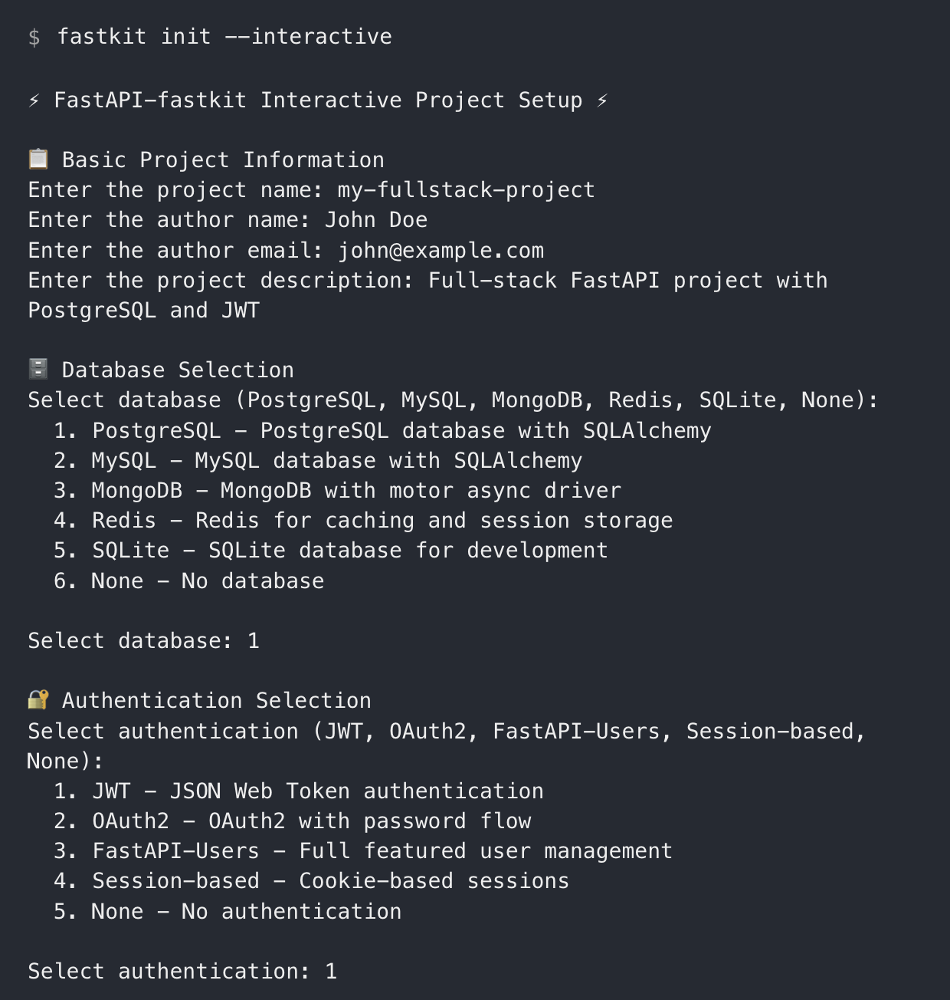
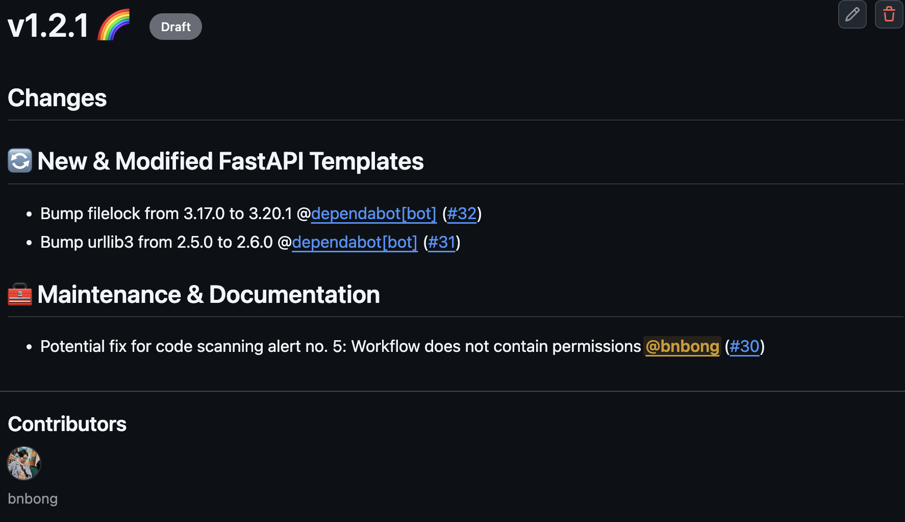

2025년 3월 1일, 내가 만든 오픈소스 프로젝트 FastAPI-fastkit의 버전 1.0.0 릴리즈를 진행했다. 이 포스팅을 작성하는 26년 1월 현재는 버전 1.2.0이 배포되어 있는 상태이고 pypi 패키지 다운로드 횟수 12k를 달성한 프로젝트가 되었다.


/// caption
프로젝트 저장소 링크 : <https://github.com/bnbong/FastAPI-fastkit>
///

이 프로젝트는 FastAPI 프로젝트를 쉽게 시작할 수 있도록 돕는 프로젝트이다. 일종의 boilerplate 기능이 포함되어 있고 CLI 명령어로 쉽게 FastAPI 프로젝트를 확장, 추가, 관리 할 수 있도록 만들었다.

## 프로젝트 탄생 배경

24년 여름 인턴을 끝내고 난 후, 나와 관심사가 맞는 인턴 동기 친구와 함께 클라우드 관련 오픈소스에 기여를 해보기로 마음을 먹었다.

특히 OpenStack의 기여를 하고 싶어서 OpenStack의 여러 오픈소스 (ironic, nova, neutron 등)을 탐색하면서 공부를 해보았는데, 프로젝트 규모가 너무 크다보니 개개인이 공부해서 부족하거나 문제 있는 부분을 고쳐서 기여하는건 굉장히 굉장히 어려운 일이라는 것을 알게 되었다.

그래서 우리는 방향성을 조금 수정해서 OpenStack에 국한하는 것이 아닌 내가 관심 있는 분야의 오픈소스에 기여를 해보는 것으로 방향을 잡았다.

<br>

그렇게 새로운 방향성으로 여러 오픈소스를 탐색하던 와중, 나는 내가 이전부터 지금까지 자주 애용하는 Backend 프레임워크인 FastAPI의 버전 업데이트 노트를 발견하게 되었다.

```preview
https://github.com/fastapi/fastapi/releases/tag/0.111.0
```

해당 업데이트 노트는 버전 0.111.0 노트인데, 이 노트에서 확인할 수 있던 특이사항 중 하나는 새로운 패키지인 'fastapi-cli' 가 추가되었다는 것이었다.

버전 노트와 관련 커뮤니티 반응을 보건데, 이 라이브러리는 FastAPI 개발자 tiangolo가 독단으로 추가한 라이브러리로 보였다.

<!-- more -->

<br>

갑작스럽게 추가된 새로운 패키지에 대해 여러 기여자들 및 FastAPI 사용자들이 패키지 필요성에 의문을 품었다.

커뮤니티는 개발자 tiangolo가 독단으로 충분한 검증 없이 패키지 추가를 강행한 행동과 해당 패키지 필요성에 대한 충분한 설명의 부재로 많은 사람들이 아쉬움을 표했으며, 일부는 이 행동이 오픈소스 생태계 발전에 반하는 행동이라며 비판하기도 했다.

추가된 fastapi-cli 패키지는 cli 기능 말고는 별 다른 핵심 기능이 없었다. 만들어진 cli 기능 마저도 이미 uvicorn 명령어를 fastapi라는 단어로 단순 wrapping한 수준이었다. 그나마 더 나아진 것은 output 가독성 정도만 좋아진 수준.

업데이트에 대한 커뮤니티 반응의 핵심을 담은 코멘트가 있었는데, 링크는 다음과 같다 :

```preview
https://github.com/fastapi/fastapi/pull/11522#issuecomment-2264639417
```

이에 tiangolo는 직접 답글로 fastapi-cli 패키지는 FastAPI를 처음 접하는 사람들의 진입 장벽을 낮추기 위한 목적으로 추가되었다고 답했다(it's extra things to have in mind, and extra things for newcomers to learn from the beginning).

<br>

여러 사람들의 반응과는 달리 나는 tiangolo의 이런 철학이 인상깊었다. 의도는 좋았지만 구현 방향이 약간 잘못된 것이라고 생각하여 이 아이디어를 좀 더 타당하게 실현 가능하도록 돕고 싶었고, 이 프로젝트를 개발하기로 마음 먹었다.

기존 fastapi-cli 에서 해결하지 못했던 문제는 다음과 같다:

### 1. FastAPI new-comer의 진입 장벽 낮추기

정작 가장 핵심 적인 문제를 해결하지 못했다는 것을 여러 FastAPI 사용자 커뮤니티에서 발견할 수 있었다. 내 주변 사람들 중에서 FastAPI를 사용해본 사람에게 왜 FastAPI에 정착하지 않았던 이유에 대해서도 조사를 해보았다.

공통적으로 FastAPI 프로젝트의 구조화에 대한 어려움을 표했다. node.js 프로젝트와 마찬가지로 FastAPI 프로젝트는 강제화된 모듈 구조가 존재하지 않는다. 이 점이 장점이자 단점으로 작용하는데, 어느정도 프레임워크에 대한 이해도가 전제되어 있으면 자신의 입맛대로 프로젝트 구조를 짤 수 있지만, 본인이 다른 FastAPI 프로젝트에 기여를 하거나 이해를 해야하는 경우에는 해당 프로젝트의 개발자의 의도를 '프로젝트 구조' 레벨 부터 파악해야한다는 난해함이 존재한다.

Python Django가 비교적 낮은 성능에도 불구하고 여전히 백엔드 입문자들에게 인기가 있는 이유는 개발자가 프로젝트 구조에 대해 신경을 덜 써도 되기 때문이다. urls.py, views.py, model.py 등 django 프레임워크 핵심 모듈들을 이해하고 있다면 개발자는 이를 활용한 단순 구현에만 집중하면 된다.

SpringBoot의 경우 dto, service, controller 등의 패턴이 best practice로 굳혀있어서 Springboot 프로젝트들은 거의 대부분 비슷한 패턴을 보이는 것을 알 수 있었다.

이를 통해 입문자들에게는 아무래도 최소한의 강제성을 주는 것이 나쁘지 않다고 생각했다.

### 2. FastAPI 커뮤니티 생태계 활성화

새로운 패키지 fastapi-cli는 FastAPI 사용자들에게 충분한 필요성을 느끼게 하지 못했다.

개발자 의도는 좋았으나, 냉담한 반응으로 결국 FastAPI 설치 시 `FastAPI[standard]`, `FastAPI[full]` 로 나뉘어진 설치 방법에서 full 버전에만 optional로 추가되는 결과로 이어졌다.

나는 개발자 tiangolo의 의도를 좀 더 사람들이 납득 할만하게 충족시키고 싶었고 더 나아가 이 프로젝트가 FastAPI 사용자 생태계를 좀 더 활성화 시켜서 더 많은 사람들이 FastAPI에 매력을 느껴 사용하도록 유도하는 촉매제로 작용하고 싶었다.

## 핵심 기능 개발

이제 문제 상황을 파악했으니 남은 건 개발 속행이었다.

최신 1.2.0 버전이 배포된 지금은 fastkit의 핵심적인 UX는 다음 링크에서 확인 가능하다 :

```preview
https://bnbong.github.io/FastAPI-fastkit/#usage
```

나는 CLI로 FastAPI 프로젝트를 손쉽게 확장하고 관리하는 기능이 있었으면 좋겠다고 생각했다. 마치 Django의 django-admin 명령어와 SpringBoot의 initializer 처럼.

여러 라이브러리와 패키지를 참고, 참조하여 구현해보았다 :

### cli 기능

핵심 cli operation 구현은 python-click 라이브러리를 활용하였다.

#### CLI 그룹 구성

프로젝트의 메인 CLI 그룹은 `@click.group()` 데코레이터를 사용하여 `fastkit_cli` 함수를 중심으로 구성했다. 이 함수는 모든 CLI 명령의 진입점 역할을 하며 공통 컨텍스트를 설정한다.

```python
# 버전 1.0.0 코드 참조

@click.group()
@click.option("--debug/--no-debug", default=False)
@click.version_option(__version__, prog_name="fastapi-fastkit")
@click.pass_context
def fastkit_cli(ctx: Context, debug: bool) -> Union["BaseCommand", None]:
    settings = FastkitConfig()
    ctx.ensure_object(dict)

    if debug:
        print_warning("running at debugging mode!!")
        settings.set_debug_mode()

    ctx.obj["settings"] = settings
    setup_logging(settings=settings)

    return None
```

이 코드를 통해 `--debug` 플래그와 버전 정보를 표시하는 옵션을 구현했으며, 설정 객체를 컨텍스트에 저장하여 하위 명령에서 접근할 수 있게 했다.

디버그 플래그를 CLI 명령어에 추가하게 되면 패키지 내부 로거에서 stack trace까지 수집되어 로그가 저장된다. 플래그를 명시하지 않으면 별 다른 로그가 수집되지 않는다.

#### 명령어 구현

각 명령어는 @fastkit_cli.command() 데코레이터를 사용하여 기본 그룹에 추가했다. 예를 들어, 프로젝트 정보를 보여주는 `echo` 명령은 다음과 같이 구현했다:

```python
# 버전 1.0.0 코드 참조

@fastkit_cli.command()
@click.pass_context
def echo(ctx: Context) -> None:
    fastkit_info = f"""
    ⚡️ FastAPI fastkit - fastest [bold]FastAPI[/bold] initializer. ⚡️

    Deploy FastAPI app foundation instantly at your local!

    ---
    - Project Maintainer : [link=mailto:bbbong9@gmail.com]bnbong(JunHyeok Lee)[/link]
    - Current Version : {__version__}
    - Github : [link]https://github.com/bnbong/FastAPI-fastkit[/link]
    """
    settings = ctx.obj["settings"]
    description_panel = Panel(fastkit_info, title="About FastAPI-fastkit")
    click.echo(print(description_panel))
```

#### 인자와 옵션 처리

Click을 사용하여 다양한 명령어 인자와 옵션을 처리하였다. 예를 들어, `startdemo` 명령은 템플릿 인자와 여러 프로젝트 메타데이터 옵션을 받는다:

```python
# 버전 1.0.0 코드 참조

@fastkit_cli.command(context_settings={"ignore_unknown_options": True})
@click.argument("template", default="fastapi-default")
@click.option(
    "--project-name",
    prompt="Enter the project name",
    help="The name of the new FastAPI project.",
)
@click.option(
    "--author", prompt="Enter the author name", help="The name of the project author."
)
@click.option(
    "--author-email",
    prompt="Enter the author email",
    help="The email of the project author.",
    type=str,
    callback=validate_email,
)
@click.option(
    "--description",
    prompt="Enter the project description",
    help="The description of the new FastAPI project.",
)
@click.pass_context
def startdemo(
    ctx: Context,
    template: str,
    project_name: str,
    author: str,
    author_email: str,
    description: str,
) -> None:
    # 함수 구현...
```

위 코드에서 validate_email 콜백을 통해 이메일 형식을 검증하는 기능도 구현했다.

#### 대화형 프롬프트

Click의 대화형 기능을 활용하여 사용자에게 추가 정보를 요청했다. `init` 명령어에서는 프로젝트 스택을 선택하는 프롬프트를 구현했다:

```python
...
stack = click.prompt(
    "Select stack",
    type=click.Choice(list(settings.PROJECT_STACKS.keys())),
    show_choices=True,
)
...
```

또한 click.confirm()을 사용하여 중요한 작업 실행 전에 사용자 확인을 받았다:

```python
...
confirm = click.confirm(
    "\nDo you want to proceed with project creation?", default=False
)
if not confirm:
    print_error("Project creation aborted!")
    return
...
```

### 가독성 향상

CLI 기능은 GUI 보다는 사용성이 떨어지는 면이 있지만 익숙해지면 편리하다고 생각한다. 거기에 초보자들을 위해 자신의 명령어 입력 결과가 직관적이고 예쁘게 보이면 금상첨화일 것이라고 생각해서 rich 라이브러리로 output을 꾸며보았다.

rich 라이브러리는 `fastapi-cli` 에도 포함되어 있는 라이브러리이다.

#### 기본 콘솔 설정

프로젝트의 루트 모듈에서는 Rich의 Console 객체를 초기화하여 전체 애플리케이션에서 사용할 수 있게 했다.

```python
# src/fastapi_fastkit/__init__.py
from rich.console import Console

if "PYTEST_CURRENT_TEST" in os.environ:
    console = Console(no_color=True)
else:
    console = Console()
```

테스트 환경에서는 색상 출력을 비활성화하여 테스트 결과의 일관성을 유지했다.

#### 메시지 유형별 스타일링

사용자에게 전달하는 메시지 유형에 따라 다른 스타일을 적용하여 시각적으로 구분이 쉽게 했다. 각 메시지 유형은 고유한 색상과 아이콘으로 구분했다.

##### 오류 메시지

```python
# 버전 1.0.0 코드 참조

def print_error(
    message: str,
    title: str = "Error",
    console: Console = console,
    show_traceback: bool = False,
) -> None:
    error_text = Text()
    error_text.append("❌ ", style="bold red")
    error_text.append(message)
    console.print(Panel(error_text, border_style="red", title=title))

    if show_traceback and settings.DEBUG_MODE:
        console.print("[bold yellow]Stack trace:[/bold yellow]")
        console.print(traceback.format_exc())
```

오류 메시지는 빨간색 테두리의 패널로 표시했으며, 디버그 모드에서는 스택 트레이스도 함께 보여주도록 구현했다.

##### 성공 메시지

```python
# 버전 1.0.0 코드 참조

def print_success(
    message: str, title: str = "Success", console: Console = console
) -> None:
    success_text = Text()
    success_text.append("✨ ", style="bold yellow")
    success_text.append(message, style="bold green")
    console.print(Panel(success_text, border_style="green", title=title))
```

성공 메시지는 초록색 테두리와 함께 메시지 본문도 굵은 초록색으로 강조했다.

<br>

이런 식으로 rich 라이브러리를 활용하여 경고, 성공, 오류, 정보 메시지들의 출력을 꾸미고 click 라이브러리의 기능을 활용하여 기본 기능들을 개발했다.

### `fastkit init --interactive` 모드 개발

이 기능은 버전 1.2.0에 추가된 핵심 기능이다. 후술하겠지만 이 패키지의 버저닝 전략 중에 하나로, 완전히 breaking change 수준의(패키지 구조가 거의 완전히 갈아엎어질 정도) 업데이트가 아닌 CLI 관련 기능 추가로 인한 업데이트는 minor 버전이 업데이트 되도록 구성했다.

1.1.5 버전에서 1.2.0 버전으로 바로 버전업이 된 요인이 바로 full, minimal, standard 프로젝트 형식으로만 배치할 수 있던 기존 `fastkit init` 기능에 `--interactive` 플래그 옵션을 달아 사용자가 직접 추가하고 싶은 외부 라이브러리를 탐색, 설정하여 프로젝트를 생성할 수 있도록 추가한 것이다.

```preview
https://bnbong.github.io/FastAPI-fastkit/#create-a-project-with-interactive-mode-new
```

이 기능을 개발할 초반에는 패키지 내부에서 pypi API를 호출하여 대화형 프롬프트 세션에서 실시간으로 실제 pypi에 등록된 라이브러리들 정보를 불러와 고를 수 있도록 구현하고자 했다.

그러나 공식 pypi API 문서에서는 특정 카테고리의 패키지들을 필터링해서 확인할 수 있는 endpoint가 없는 것으로 확인했고, best practice로 굳혀진 특정 stack이 아닌 다르게 개발 stack을 설정하게 되면 FastAPI 사용자 경험에 악영향이 끼칠 것을 우려하여 다음과 같이 best stack들을 나열해주고 고르게 하고 사용자 본인이 직접 추가하고 싶은 stack이 있다면 마지막에 optional로 입력받아 프로젝트에 추가할 수 있도록 구현했다.


/// caption
FastAPI와 가장 좋은 궁합을 보이는 stack들을 선택할 수 있도록 표시
///


/// caption
사용자가 직접 추가하고 싶은 라이브러리를 입력받는 프롬프트. pypi에서 확인 불가한 패키지는 찾을 수 없다는 에러와 함께 프로젝트 배치가 취소된다.
///

### 테스트 검증

단순한 stdout 출력을 검증하는 것이 아닌, rich 라이브러리의 출력을 사용하는 부분 때문에 테스트 코드를 구현하는 데 애를 먹었다.

rich의 출력은 다음과 같은데,

```bash
╭──────────────── Success ─────────────────╮
│ ✨ Dependencies installed successfully    │
╰──────────────────────────────────────────╯
```

이런 식으로 강조하고자 하는 string을 감싸주는 box가 출력이 되는 식이다.

그런데, 같은 콘솔에서 출력된 string이라고 하더라도 testcase 내에서는 여기에 찍인 string을 제대로 assert 할 수 없었다.

그래서 초기에는 string을 엄격하게 판단하는 테스트코드를 짜지 않고 성공, 실패 정도만 판단하는 테스트케이스를 짜다가 공식 문서를 참고하여 string을 뽑아 판단하는 방법을 찾아냈다.

해답은 다음과 같다:

```python
output = console.file.getvalue()
```

이런 식으로 콘솔 객체의 file 속성에서 getvalue() 메서드로 stdout string을 가져와서 assert 하도록 구현했다.

```python
def test_success_message(self, console) -> None:
    # given
    from src.fastapi_fastkit.utils.main import print_success

    test_message = "this is success test"

    # when
    print_success(message=test_message, console=console)
    output = console.file.getvalue()

    # then
    assert "Success" in output and test_message in output
```

### pdm

이번 프로젝트에서 pdm을 처음 사용해봤는데, 사용성이 굉장히 좋았다.

꽤 오랬동안 단순 pip을 사용했었고 직전 프로젝트까지 poetry를 사용했었는데, pdm을 사용하니 패키지 관리에 대한 불편함이 많이 줄어들었다.

특히 패키지 관리 외에도 프로젝트 구조 관리 등에서 많은 이점을 주었다.

pdm init 명령어를 통해 어느정도 구조 있는 python 프로젝트를 initialize 하는 점도 편했고 dev, prod 환경을 구분해서 deps를 설치하여 프로덕션 빌드에서는 필요 없는 패키지들을 명시적으로 구분이 가능하다는 점도 좋았다.

```toml
[project]
name = "FastAPI-fastkit"
dynamic = ["version"]
description = "Fast, easy-to-use starter kit for new users of Python and FastAPI"
authors = [
    {name = "bnbong", email = "bbbong9@gmail.com"},
]
dependencies = [
    "click>=8.1.7",
    "rich>=13.9.2",
]
requires-python = ">=3.12"
readme = "README.md"
license = {text = "MIT"}

[project.optional-dependencies]
dev = [
    "pytest>=8.3.3",
    "pytest-cov>=5.0.0",
    "black>=24.10.0",
    "pre-commit>=4.0.1",
    "mypy>=1.12.0",
    "isort>=5.13.2",
]
```

또 공식 문서에서 소개하는 pdm은 PEP를 매우 엄격하게 준수한다는 점이 정말로 사실인지는 모르겠지만 내가 standard를 준수한다는 느낌도 받아서 편안했다ㅋㅋ

<br>

나름 안정화 버전에 접어들었나본지 github actions 에서도 pdm 훅을 적용할 수 있었는데, 로컬에서 사용하던 pdm 명령어를 그대로 dev, prod 환경을 나눠서 같은 환경에서 워크플로우를 돌릴 수 있다는 점도 괜찮았다.

추가로 이 프로젝트는 '패키지' 이기 때문에 python 버전 별 호환되는 버전을 체크하는 것도 중요했다. 이는 `matrix` 를 활용하여 `fail-fast: false` 옵션을 줘서 실패하는 python 버전이 있더라도 모든 python 버전에 대해 테스트를 진행하도록 구성했다. 즉, 여기서 실패하는 버전이 호환이 불가능한 버전이기에 패키지 문서에서도 호환 가능 Python 버전을 검증하여 표현할 수 있었다.

```yaml
jobs:
  test-fastapi-fastkit-sources:
    runs-on: ubuntu-latest
    strategy:
      matrix:
        python-version:
          - "3.13"  # max
          - "3.12"
          - "3.11"
          - "3.10"
          - "3.9"
          - "3.8"  # min
      fail-fast: false
    steps:
      - name: Checkout code
        uses: actions/checkout@v4
      - name: Set up Python
        uses: actions/setup-python@v4
        with:
          python-version: ${{ matrix.python-version }}
      - name: Setup PDM
        uses: pdm-project/setup-pdm@v4
      - name: Install dependencies
        run: pdm install -G dev
      - name: Run tests
        run: pdm run pytest
```

당연히 pdm은 패키지 빌드 기능도 지원한다. `pdm build` 명령어로 바로 빌드를 뽑을 수 있고, 나는 FastAPI-fastkit 레포 자체를 pypi에 등록하여 pypa/gh-action-pypi-publish 훅을 활용하여 빌드 및 업로드를 진행했다.

```yaml
    steps:
      - uses: actions/checkout@v4

      - uses: pdm-project/setup-pdm@v4

      - name: Install dependencies
        run: pdm install

      - name: Extract tag name
        id: tag
        run: echo "TAG_NAME=${GITHUB_REF#refs/tags/}" >> $GITHUB_OUTPUT

      - name: Update version in __init__.py
        run: |
          echo "__version__ = '${{ steps.tag.outputs.TAG_NAME }}'" > src/fastapi_fastkit/__init__.py

      - name: Build package
        run: pdm build

      - name: Publish package distributions to PyPI
        uses: pypa/gh-action-pypi-publish@release/v1
```

현재는 pdm뿐만 아니라 uv로도 패키지 개발 setup을 할 수 있도록 구성했다. 성능면에서는 uv가 pdm 보다 훨씬 빠르기에 추후 배포 워크플로우를 포함하여 개발 flow를 pdm이 아니라 uv를 활용하도록 마이그레이션하는 것을 고려중에 있다.

### template 관련

FastAPI-fastkit의 가장 핵심 기능 중 하나인 boilderplate 기능과 직접적인 관련이 있는 template 폴더이다.

src/fastapi_fastkit/fastapi_project_template 폴더에 종류별로 boilder template를 구성하고 CLI 명령어로 유저의 메타데이터를 주입하여 유저 워크스페이스에 프로젝트 구조 째로 배치하도록 구현했다.


/// caption
fastapi_project_template 폴더 구조(1.0.0 기준)
///

template 폴더 내 base 파일들은 모두 확장자가 `-tpl` 로 끝나도록 했다. 이런 파일 구조는 django의 형식을 참고해서 구현했다.

<br>

CLI endpoint에서 boilderplate를 배치하도록 하는 명령어는 `fastkit startdemo <배치할_template_이름>` 이다. 배치가능한 template 종류는 `fastkit list-templates`로 확인할 수 있다.

click endpoint가 명령어를 받으면 해당 template이 배치 가능한 존재하는 template 인지 확인하고, 존재하면 유저의 메타데이터를 주입하여 배치한다.

이후 유저의 허가 action이 떨어지면 호출하는 `copy_and_convert_template` 함수가 해당하는 template 폴더에 있는 파일들의 `-tpl` 확장자를 제거하고 유저 워크스페이스에 배치한다.

해당 기능이 들어있는 모듈은 `transducer.py` 에 정의했다 :

```preview
https://github.com/bnbong/FastAPI-fastkit/blob/main/src/fastapi_fastkit/backend/transducer.py
```

### 로고


로고는 대학 후배에게 외주아닌 외주를 주어서 만들었다.

결과물을 보니 디자인 감각이 매말라버린 내가 로고를 만드는것 보단 역시 디자인대학 재학생에게 맡긴 것이 최고였다. 시간적으로든 감각적으로든 모든 면에서 이득이었다.

서로 프젝에 시달린 와중에 클라이언트에게 스트레스를 받지 않고 오로지 재미로만 작업해서 서로의 만족도 또한 높았던 것이 좋았다ㅋㅋ

## 오픈소스 요소

### 문서

오픈소스 프로젝트에 가장 기본 정보를 제공해주는 것이 바로 문서라고 생각한다.

오픈소스 기여를 하고자 할 때 가장 먼저 일종의 랜딩 페이지 역할을 하는 README.md를 확인하고, CONTRIBUTING.md에서 기여 방법에 대한 가이드를 확인한다.

코드 기여의 경우에는 CODE_OF_CONDUCT.md, SECURITY.md 등을 확인하는 등 오픈소스 문서를 제대로 정의 하는 것이 협업 프로젝트에 가장 핵심이라고 생각한다.

<br>

이번 프로젝트는 여러 오픈소스의 문서들을 참고해서 작성했는데, 완성한 오픈소스 문서들은 다음 링크에서 확인할 수 있다:

[README.md](https://github.com/bnbong/FastAPI-fastkit/blob/main/README.md), [CONTRIBUTING.md](https://github.com/bnbong/FastAPI-fastkit/blob/main/CONTRIBUTING.md), [CODE_OF_CONDUCT.md](https://github.com/bnbong/FastAPI-fastkit/blob/main/CODE_OF_CONDUCT.md), [SECURITY.md](https://github.com/bnbong/FastAPI-fastkit/blob/main/SECURITY.md), [LICENSE](https://github.com/bnbong/FastAPI-fastkit/blob/main/LICENSE)

각 문서의 역할에 충실하도록 구성을 했고, Fastkit 프로젝트에 대한 핵심 정보를 습득할 수 있도록 중요한 내용들을 위주로 작성했다.

<br>

라이선스는 LICENSE로 MIT 라이선스를 적용했다.

MIT 라이선스는 상업적 사용이 가능하다는 점이 있는데, FastAPI를 활용하여 수익을 내고자 하는 사용자들이 내 프로젝트인 Fastkit을 활용해서 빠르게 서비스를 구현하도록 의도하고 싶어서 적용했다.

<br>

Issue와 PR에도 템플릿을 구성했고 PR의 태그를 바탕으로 릴리즈 노트에 자동으로 기여 및 변경 내용을 분류해주는 pr-labeler 시스템을 도입했다.


/// caption
closed 된 PR에 라벨을 붙으면 새로 작성될 release 노트에 위 사진과 같이 자동으로 변경 사항이 카테고리 별로 분류되어 추가된다.
///

<br>

내 프로젝트 기여자를 위한 문서 뿐만 아니라 내 프로젝트로 FastAPI를 시작하는 초보자를 위한 가이드도 작성했다. 내 프로젝트에서 제공하는 여러 template들로 각 유즈케이스에 맞는 프로젝트 구성 및 개발을 하는 가이드를 작성했다.

기본 언어는 영어로 작성되었고 각종 언어로(한국어 포함) LLM 기반의 문서 번역을 수행하는 flow까지 구현하였으나 token call 개수 제한으로 자동화 워크플로우를 구축하진 못했다(역시 무료 plan에서는 제한이 크다..).

## Release

### Release note

자동화된 릴리즈 노트 생성을 위해 `release-drafter` GitHub Action을 도입했다.

**Release Drafter 활용**:

- PR의 레이블을 기반으로 자동으로 릴리즈 노트를 분류
- `feature`, `enhancement`, `bugfix`, `documentation` 등의 레이블에 따라 섹션별로 정리
- 각 릴리즈마다 무엇이 추가되고 변경되었는지 한눈에 파악 가능
- 수동으로 릴리즈 노트를 작성하는 시간과 노력을 대폭 절약

**릴리즈 노트 구성**:

```yaml
categories:
  - title: '🚀 Features'
    labels:
      - 'feature'
      - 'enhancement'
  - title: '🐛 Bug Fixes'
    labels:
      - 'fix'
      - 'bugfix'
  - title: '🔄 New & Modified FastAPI Templates'
    labels:
      - 'template'
  - title: '🧰 Maintenance & Documentation'
    labels:
      - 'chore'
      - 'documentation'
change-template: '- $TITLE @$AUTHOR (#$NUMBER)'
change-title-escapes: '\<*_&'
template: |
  ## Changes

  $CHANGES
```

이를 통해 사용자들이 각 버전의 변경사항을 쉽게 이해할 수 있도록 했다.

### Python compatible 버전 체크

**Matrix Strategy를 통한 다중 버전 테스트**:

앞서 언급했던 Github Actions의 matrix 전략을 FastAPI와 Python 생태계의 다양한 버전 환경에서 프로젝트가 정상 동작하는지 보장하기 위해 활용했다.

**테스트 범위**:

- Python 3.9부터 3.14까지의 모든 메이저 버전 지원
- 각 환경에서의 의존성 설치 및 기본 기능 테스트 수행 (with pytest)

이를 통해 다양한 개발 환경의 사용자들이 안정적으로 fastkit을 사용할 수 있도록 보장했다.

26년 현재 Python 3.8은 검증 대상에서 제외했다. 모체가 되는 프로젝트인 FastAPI에서도 tiangolo가 FastAPI 기반의 컨테이너 이미지 검증 대상 Python 버전 중에 3.8 버전을 모두 제외하였기에 나도 이를 채용했다.

### Pypi 업로더

Semantic Versioning을 따르는 Git 태그 기반의 자동 배포 파이프라인을 구축했다.

**배포 워크플로우**:

1. **태그 생성 시 트리거**: `v*.*.*` 패턴의 태그가 생성되면 자동으로 배포 프로세스 시작
2. **자동 빌드**: PDM을 활용하여 wheel과 source distribution 생성
3. **테스트 실행**: 모든 테스트 통과 확인 후 배포 진행
4. **PyPI 업로드**: GitHub Secrets에 저장된 PyPI API 토큰을 사용하여 자동 업로드

**버전 관리 전략**:

- `v1.0.0`: 메이저 업데이트 (Breaking changes)
- `v1.1.0`: 마이너 업데이트 (새로운 기능 추가)
- `v1.1.1`: 패치 업데이트 (버그 수정)

```yaml
on:
  push:
    tags:
      - 'v*.*.*'
```

버전 태그가 붙여지면 `pypa/gh-action-pypi-publish@release/v1` 액션을 통해 PyPI에 배포된다.

이를 통해 개발자가 태그만 생성하면 자동으로 PyPI에 새 버전이 배포되어, 사용자들이 `pip install fastapi-fastkit`으로 최신 버전을 즉시 사용할 수 있도록 했다.

## 이후 버전 개선점

**템플릿 확장 계획**:

현재는 기본적인 FastAPI 템플릿만 제공하고 있지만, 향후 다양한 아키텍처 패턴과 사용 사례를 지원하는 템플릿들을 추가할 예정이다.

후속 버전 개발 마일스톤은 다음 링크에 정리해두었다 :

```preview
https://github.com/bnbong/FastAPI-fastkit/discussions/8
```

<br>

**홍보 및 커뮤니티 확장**:

시험대에 직접 제 발로 올라간다는 것에 대한 두려움이 있었지만, 오픈소스 프로젝트의 성공을 위해서는 적극적인 홍보가 필요하다는 것을 깨달았다.

**홍보 계획**:

- Python 커뮤니티 (Reddit, Discord 등)에서 적극적인 프로젝트 소개
- 기술 블로그에 관련 글 지속적 업로드
- 튜토리얼 가이드 개선
- 다른 FastAPI 관련 프로젝트와의 협업

<br>

**유사 프로젝트 분석 및 차별화**:

개발 과정에서 유사한 프로젝트들을 발견했다.

대표적으로 <https://github.com/s3rius/FastAPI-template> 프로젝트가 있는데, 이 프로젝트는 cookiecutter 라이브러리를 활용하였다.

내 프로젝트 Fastkit과 비교하여 차별화 포인트를 간단하게 비교해보았는데,

**차별화 포인트**:

- **Rich CLI**: 더 예쁜 터미널 출력과 사용자 친화적인 인터페이스
- **Metadata Injection**: 프로젝트 생성 시 사용자 정보를 자동으로 주입

말고는 없는 것 같다... Metadata 주입의 경우에는 cookiecutter 가 좀 더 유동적으로 주입을 할 수 있는 것 같아서 좀 더 고민해봐야할 것 같다.

앞으로는 cookiecutter와의 호환성도 고려해볼 수 있을 것 같다. cookiecutter 생태계의 풍부한 템플릿들을 fastkit에서도 활용할 수 있다면 더욱 강력한 도구가 될 것이다. 2.X.X 버전에는 이 방식을 사용하여 개발이 되지 않을까 싶다.


## 개발 느낀점

처음으로 오픈소스 프로젝트를 개발하고 운영해보았는데, 오픈소스 프로젝트 기여가 아닌 개발에는 기존보다 다른 부분으로 신경 쓸 부분이 많다는 것을 느꼈다.

**오픈소스 프로젝트의 특별함**

일반적인 개발 프로젝트와 달리 오픈소스는 불특정 다수의 개발자들이 사용하고 기여할 수 있는 환경이기 때문에, 코드 품질뿐만 아니라 문서화, 테스트, 배포 자동화 등 모든 측면에서 높은 수준을 유지해야 한다는 책임감을 느꼈다.

**문서화의 중요성**

코드를 작성하는 것보다 때로는 문서를 작성하는 것이 더 어려웠다. README, CONTRIBUTING 등 다양한 형태의 문서를 작성하면서, 사용자의 관점에서 생각하고 설명하는 능력의 중요성을 깨달았다.

오픈소스 기여를 원하는 개발자들을 위한 가이드라인 작성도 까다로웠는데, 진입 장벽을 낮추면서도 프로젝트의 일관성을 유지할 수 있는 균형점을 찾는 것이 중요했다.

**자동화의 필요성**

CI/CD 파이프라인, 자동 테스트, 코드 포맷팅 등의 자동화가 오픈소스 프로젝트에서는 필수라는 것을 배웠다. 수동으로 관리하기에는 너무 많은 요소들이 있고, 기여자들이 늘어날수록 일관성을 유지하기 어려워진다.

처음 프로젝트를 구상하던 단계에서는 프로젝트 규모가 그렇게까지 크지 않아서 작업을 빠르게 진행할 수 있을 줄 알았는데 신경 쓸 부분이 많다보니 생각보다 오랜 시간이 걸렸다.

**커뮤니티 관리**

기술적인 부분뿐만 아니라 커뮤니티를 관리하는 소프트 스킬도 중요하다는 것을 느꼈다.
아직은 별 다른 기여가 올라와 있진 않지만 이슈에 답변하고, PR을 리뷰하며, 새로운 기여자들을 환영하는 과정들을 생각하면서 개발자로서뿐만 아니라 메인테이너로서의 역할은 다르다라는 것을 느꼈다.

국내에서 자신이 만든 프로젝트나 유용한 프로젝트들을 공유하는 사이트로 [긱뉴스](https://news.hada.io/show)를 사용하던데 조만간 조심스럽게 나도 홍보글을 업로드할 생각이다ㅎ..

**지속적인 개선의 마인드**

프로젝트를 "완성"했다고 생각하는 순간, 그 프로젝트는 정체되기 시작한다는 것을 깨달았다. 사용자 피드백을 받고, 새로운 기능을 추가하며, 기존 기능을 개선하는 지속적인 과정이 오픈소스 프로젝트의 핵심이라고 생각한다.

이건 내가 진행했던 다른 프로젝트들을 완성 단계까지 올려 두면서 항상 생각해왔던 것이었다. 사이드 프로젝트들이 보통 최종 버전을 배포하고 나면 그 이후 유지보수나 업데이트를 소홀히 하는 경향이 있는데, 이번 프로젝트는 정말 오랜만에 애정과 많은 노력을 쏟은 프로젝트라서 그런지 좀 더 신경을 써보고자 한다.

**개인적 성장**

FastAPI-fastkit 프로젝트를 통해 단순히 코딩 실력뿐만 아니라 프로젝트 관리, 문서화, 커뮤니케이션 등 다양한 영역에서 성장할 수 있었다. 특히 사용자 중심적 사고와 장기적 관점에서의 프로젝트 설계 능력을 기를 수 있었다.

앞으로도 더욱 오픈소스에 관심을 가지며 개발 커뮤니티에 기여하고, 동시에 개발자로서 계속 성장해나가고자 한다.
