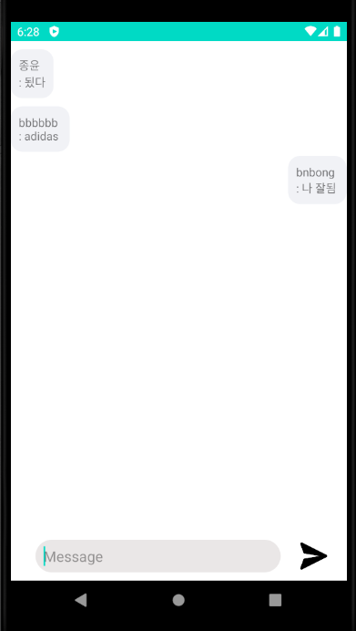

# Awesome Chatting App

## 개요

Firebase를 활용한 채팅앱

2020년 오픈소스 SW 수업 팀 프로젝트 과제로 진행했던 프로젝트이다.

### 저장소

<https://github.com/bnbong/Awesome_ChattingApp>

### 팀원 Info

#### Team 두둥등장

- 백앤드 개발 (Back-end) : [JJongmen](https://github.com/JJongmen/JJongmen.github.io)
- db 및 이슈관리 (db & Issue tracking) : [namHG](https://github.com/namHG/namHG.github.io)
- 프론트앤드 개발 (front-end) : [GoodTY](https://github.com/GoodTY/GoodTY.github.io)
- 프로젝트 관련 디렉팅 및 문서화 (directing & document) : [bnbong](https://github.com/bnbong/bnbong.github.io)

## 소개

Awesome_ChattingApp은 익명성이 보장되는 누구나 빠르고 쉽게 다수의 사람들과 채팅을 할 수 있는 채팅앱입니다. 이 앱은 번거로운 로그인 절차 없이 빠르게 채팅을 하기 위해 개발되었습니다. firebase에서 제공하는 실시간으로 데이터 입출력을 가능하게 해주는 서비스를 이용하여 채팅기능을 구현했습니다.

## Stack

- Android Studio 3.6.3
- Build #AI-192.7142.36.36.6392135, built on April 14, 2020
- Runtime version: 1.8.0_212-release-1586-b04 amd64
- VM: OpenJDK 64-Bit Server VM by JetBrains s.r.o
- Windows 10 10.0
- GC: ParNew, ConcurrentMarkSweep
- Memory: 1237M
- Cores: 12
- SDK : Android API 29

## 역할

- 프로젝트 설계 및 디자인
- 스프린트 매니징
- 이슈 관리
- 테스트 코드 작성
- 문서화
