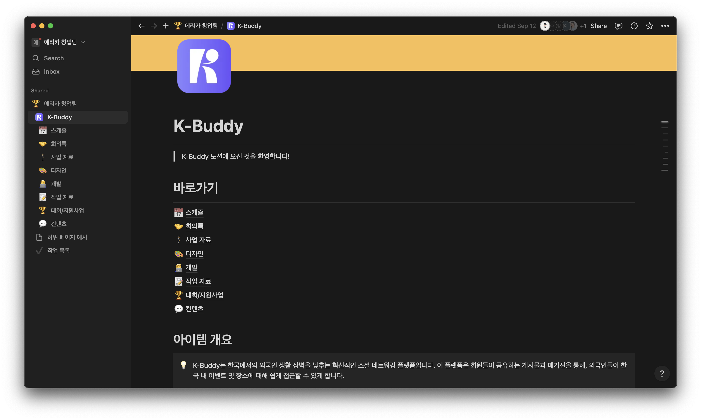
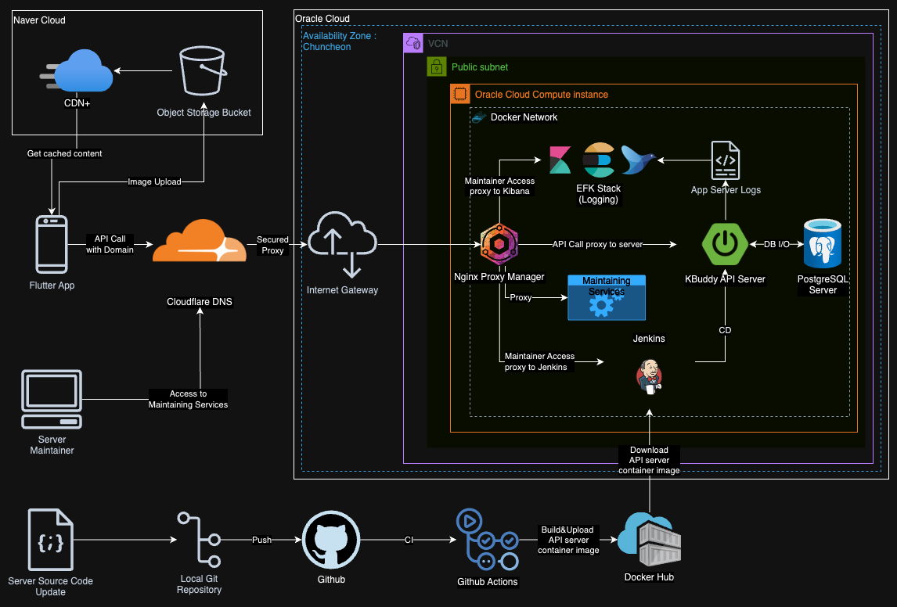
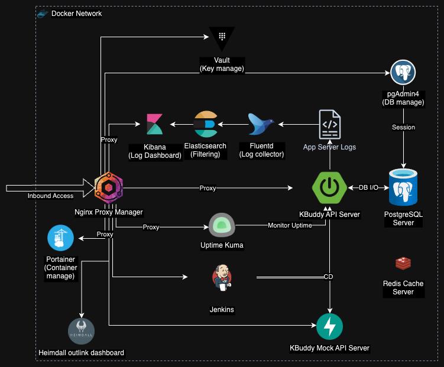

# K-Buddy

## 개요

!!! tip "아이템 한줄 설명"
    외국인의 진정한 로컬 경험을 위한 한국 길라잡이

창업팀 K-Buddy 프로젝트이다.

### 저장소

Server Source : <https://github.com/KBuddy-devs/KBuddy-Server>
Mocking Server Source : <https://github.com/KBuddy-devs/KBudddy-MockAPI>

## 소개

다음 문제 상황을 해결하는 애플리케이션을 기획하였다.

!!! warning
    - 방한 외국인들의 한국 체류 중 생기는 한국 생활(한국 명소, 맛집 등)의 정보 비대칭 문제
    - 한국 생활의 도움이 되는 정보들의 접근성이 좋지 못하며(지도 application 사용 문제, 언어 문제), 이를 공유할만한 외국인 커뮤니티의 부재.

창업팀 초기 멤버로 참여하였으며 아이템 기획, 백엔드 개발, 클라우드 아키텍처 설계 및 구축, 문서화 등의 역할을 수행하였다.

Front-end <-> Back-end 통신을 위한 Mocking Server를 구축하였다.

Confluence wiki 페이지에 서비스 관리자를 위한 관리자 도구 사용법, API 문서 등을 작성하였다 : <https://kbuddytest.atlassian.net/wiki/spaces/KBuddy/overview>

Notion에 프로젝트 기획 및 개발 협업 문서를 작성, 정리하는 작업을 수행하였다.

Oracle Cloud에 클라우드 기반 서버 인프라를 구축하였으며, 컨테이너 기반 MSA 환경을 채택하여 모니터링 시스템과 모바일 클라이언트와의 통신을 수행하는 API endpoint를 구축하였다.
<figure markdown="span">
    
    <figcaption>클라우드 아키텍처 구조도</figcaption>
</figure>

<figure markdown="span">
    
    <figcaption>2024.08 기준 서비스 컨테이너 구조도</figcaption>
</figure>

## 역할

- 백엔드 개발
- 문서화
- 테스트 코드 작성
- 배포 자동화
- 이슈 관리

## Stack

### Back-end Server

- Java 17
- Spring Boot + JPA
- PostgreSQL
- Docker

### Mocking Server

- Python 3.11.1
- FastAPI + Pydantic
- Docker
