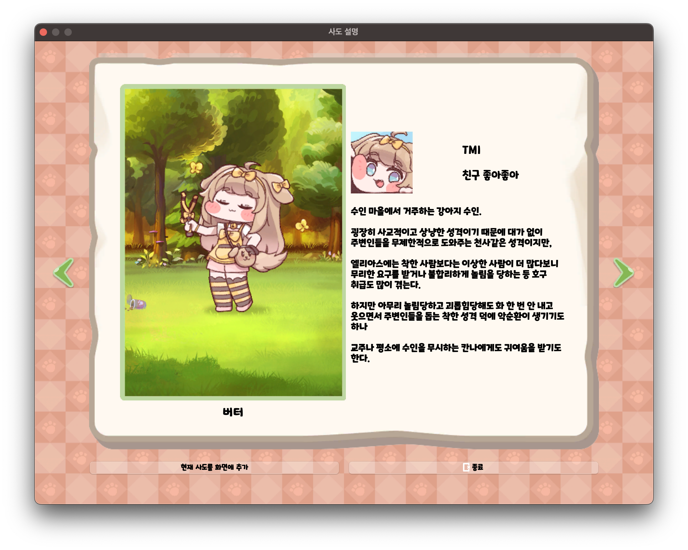

# rickTcal_DayLife

## 개요

릭트컬 데이라이프 - 볼따구 라이프로 스트레스를 줄여주는 데스크톱 앱

한양대학교 ERICA 소프트웨어융합대학 전공 학회 Jaram 2024 1학기 워크샵 대체 과제 프로젝트로 진행한 개인 프로젝트이다.

### 저장소

<https://github.com/bnbong/rickTcal_DayLife>

## 소개

!!! quote "소개"

    릭트컬 데이라이프 - 볼따구 라이프로 스트레스를 줄여주는 데스크톱 앱

    본 프로젝트는 한양대학교 ERICA 소프트웨어융합대학 학회 Jaram 2024 1학기 워크샵 대체 과제 프로젝트로 진행되었습니다.

    현 프로젝트 아이디어의 출처는 2023년에 출시한 에피드 게임즈의 트릭컬 리바이브 에 있습니다.

    릭트컬 데이라이프 프로젝트는 트릭컬 리바이브 게임의 2차 창작 프로젝트이며, 비영리&비상업 용도로 제작된 개인 프로젝트 입니다. 프로젝트 내에 어떠한 수익창출 모델이 존재하지 않습니다.

    ❗ 해당 프로젝트는 오픈소스 프로젝트로 소스코드 및 사용된 이미지가 공개되어 있는 상태입니다. 외부 요청에 따라 프로젝트가 비공개로 전환되거나 삭제될 수 있습니다.

에피드게임즈가 2023년 런칭한 트릭컬 리바이브 게임의 2차 창작 프로젝트이다.

데스크톱 애플리케이션 개발이라는 주제로 학회 워크샵에 참여, 제출하였다.

### 학회 워크샵 주제

- 프로젝트 주제 : 자신의 개발에 도움이 될 데스크탑 애플리케이션 개발
- 사용할 도구 : PyQt6(Python 3.11)
- 요구 기술 : 볼따구 잡아 당기고 놓는 기능(메인 feature), 캐릭터 선택 기능(사이드 feature), 크로스 플랫폼(Windows, Mac, Linux) 지원
- 담당자 : 이준혁(자람 39기, bnbong) - 기획, 개발

### 프로젝트 기능

1. **볼따구 잡아당기는 기능**

| 인게임 (트릭컬 리바이브) | 릭트컬 - 데이라이프 |
|---|---|
| {: width=200px} | {: width=200px} |

핵심 기능인 사도의 볼따구를 잡아당기는 기능.

볼따구를 잡아당길 때와 놓을 때 효과음이 재생됨.

트릭컬 리바이브 인게임에서는 사도들의 볼따구를 잡아당기면 볼따구가 찹쌀떡 마냥 손가락을 따라 늘어나는 기능이 있지만,

릭트컬 - 데이라이프에서는 개발자 본인의 역량의 한계(...)로 볼따구가 커서를 따라 늘어나는 기능이 없음.

2. **사도(캐릭터)에 대한 정보 열람 및 바탕화면에 사도 추가**

우측 하단의 캐릭터 아이콘 버튼을 클릭하면 사도 설명과 설명을 보고 있는 사도를 바탕화면에 추가하는 다이얼로그가 표시됨.

## Stack

- Python 3.11.1
- PyQt6

## 역할

- 프로젝트 기획
- 데스크톱 앱 개발
- 문서화 + 오픈소스 가이드라인 작성
- 테스트코드 작성
