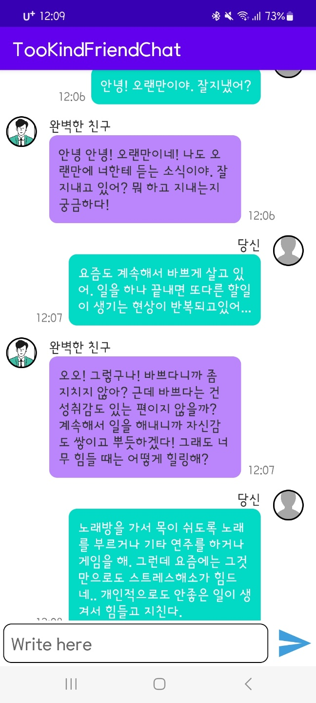

# TooKindFriendChat

나에게 모든걸 맞춰주는 환상적인 친구와 채팅하는 앱

해당 프로젝트는 한양대학교 ERICA 소프트웨어융합대학 소속 학회 자람 워크샵의 대체과제로 제출하기 위해 진행했던 프로젝트이다.

### 저장소

<https://github.com/bnbong/TooKindFriendChat>

## 소개

- `TooKindFriendChattingApp`은 친구와 함께하는 채팅 앱입니다.
- 이런 고민을 가지신 분에게 추천드립니다:
    1. 친구와의 성향 차이 때문에 자주 다투는 것에 지치신 분
    2. 인간관계에 대한 스트레스 때문에 고민이 많으신 분
    3. 타인과의 원활한 대화에 어려움을 느끼시는 분
    4. 자신의 고민을 속 터 놓고 이야기할 만한 친구가 필요하신 분
    5. 내게 모든 것을 맞춰줄 수 있는 친구가 필요한 분
- `TooKindFriendChattingApp`은 위의 고민 사항을 모두 해결할 수 있는 완벽한 친구와의 채팅을 통해 그동안 가지고 있던 친구와의 관계에 대한 고민을 해소해드립니다.

## Stack

- Android Studio Flamingo | 2022.2.1 Patch 2
- Java8 version 1.8
- VM: OpenJDK 64-Bit Server VM by JetBrains s.r.o.
- macOS 13.4.1 (M1 processor)
- Gradle Version 8.0
- AI Model GPT 3.5 turbo (API)

## 역할

- 프로젝트 설계 및 디자인
- 프론트엔드 개발

## 비고

- 채팅 응답은 OpenAI API 응답 속도에 영향을 받으므로, 채팅 전송에 실패하거나 응답이 늦어질 수 있습니다.
- 채팅 응답은 Text 기반 AI 모델인 GPT 3.5 turbo를 사용하였습니다(Reference : <https://platform.openai.com/docs/guides/gpt/function-calling>).
- 채팅에 작성한 단어 수가 너무 많을 때(4096 tokens 이상) 채팅 전송이 실패할 수 있습니다.
